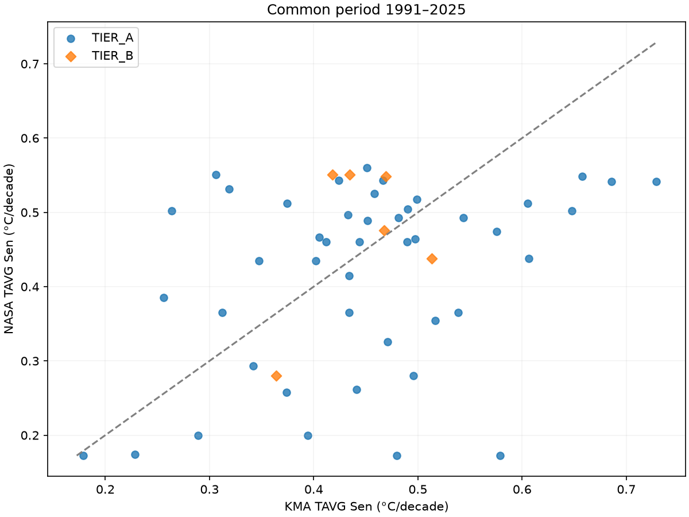
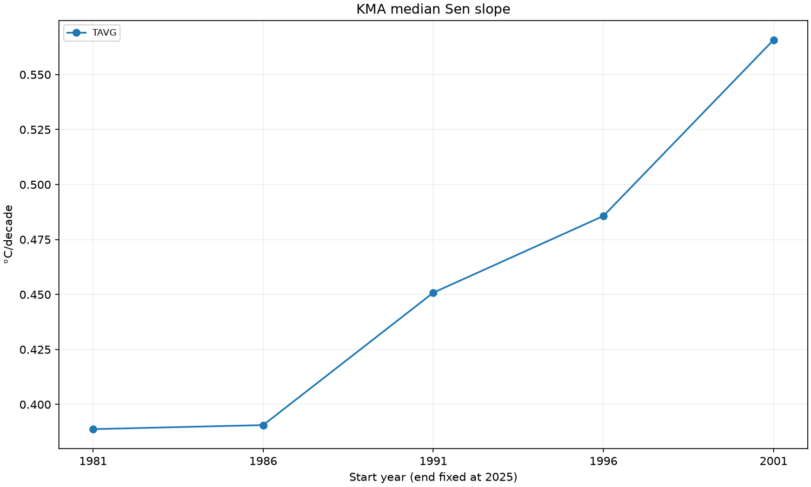
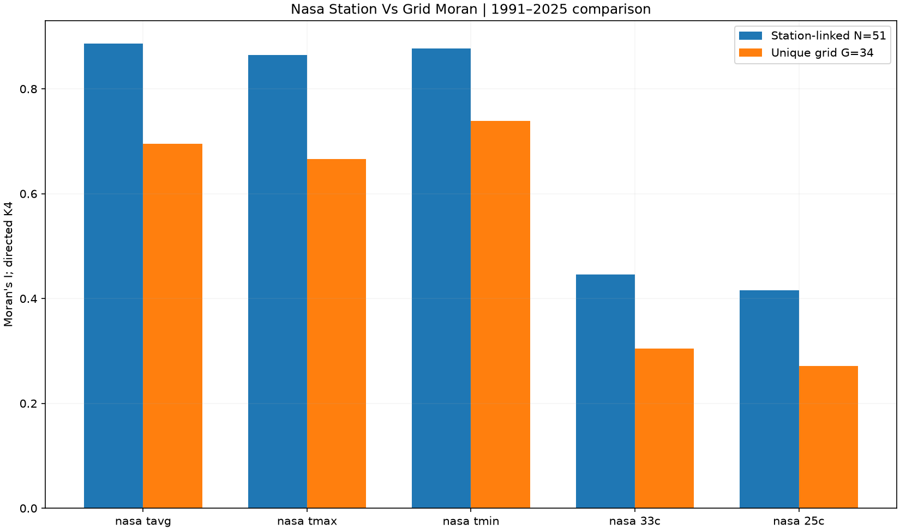
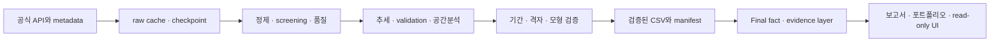

# NASA POWER Korea Climate Explorer

**v1.1.0 · Code License: [MIT License](LICENSE)**

Data: KMA ASOS, NASA POWER, KHOA source data remain subject to the respective providers' terms and attribution requirements. 코드의 MIT License는 원자료의 이용조건을 변경하지 않습니다.

## 한눈에 보기

전국 장기 기온변화의 강건한 발견과 조건부 발견을 구분하는 NASA POWER × KMA ASOS 연구 플랫폼.

## Live Demo

🌐 **[Streamlit Dashboard 바로 열기](https://korea-climate-explorer.streamlit.app/)** · [v1.1.0 Release](https://github.com/huasar4880/NASA_POWER_Korea_Climate_Explorer/releases/tag/v1.1.0) · [공개 링크 모음](docs/PUBLIC_PORTFOLIO_LINKS.md)

The public dashboard presents validated precomputed outputs and does not require API keys or local raw-data caches. 로그인 없이 7개 핵심 화면을 열람할 수 있으며, 전체 연구 파이프라인과 18-page 연구 모드는 저장소에 유지합니다.

## Quick Start

설치 없이 위 Live Demo를 열거나, Python 환경에서 공개 데모를 실행하세요.

```bash
python -m pip install -r public_app/requirements.txt
streamlit run public_app/streamlit_app.py
```

[가상환경 설치·테스트·전체 연구 모드](#로컬-설치와-전체-연구-모드) · [Final Research Report](output/public_demo/deployment/Final_Research_Report.html) — 보고서는 Live Demo에서 다운로드 후 브라우저로 열 수 있습니다.

## 연구 범위

공식 inventory 105 <!-- fact:inventory_n -->개, Tier A 45 <!-- fact:tier_a -->개, Tier B 6 <!-- fact:tier_b -->개, 공통기간 51 <!-- fact:common_n -->개 지점 및 NASA 고유 격자 34 <!-- fact:grid_n -->개. 장기 1981-01-01~2025-12-31 <!-- fact:long_period -->, 공통기간 1991-01-01–2025-12-31 <!-- fact:common_period -->, normal 1991–2020 <!-- fact:normal -->.

19단계 기준 전체 pytest: 711/711 통과. 역사적 근거: `output/final/final_test_summary.csv`(로컬 연구 아카이브). 현재 릴리스 검증은 [공개 점검표](docs/RELEASE_CHECKLIST.md)를 따릅니다.

v1.0.0은 초기 stable 8개 도시 분석입니다. v1.1.0은 전국 ASOS screening, Tier A/B·51개 공통기간, NASA grid sharing, 공간·해안·기간 민감성 및 최종 연구 포트폴리오까지 포함합니다. 과거 산출물의 1.0.0 표기는 생성 당시 버전이며 변경하지 않았습니다.

## 핵심 결과

- 고정 Tier A의 모든 시작기간에서 TAVG가 증가한 지점은 45 <!-- fact:stability_TAVG_positive_all_count -->개입니다. 공통기간에서는 51 <!-- fact:common_KMA_TAVG_positive -->/51 <!-- fact:common_n -->개 지점이 증가하고 모두 원 MK의 BH-FDR 기준을 충족했습니다.

- 공통기간 TMIN–TMAX 기울기 차이의 중앙값은 0.1470 <!-- fact:contrast_median --> °C/decade이며, TMIN 상승이 더 큰 지점은 40 <!-- fact:contrast_positive -->개입니다. KMA DTR 기울기 중앙값은 -0.1776 <!-- fact:common_KMA_dtr --> °C/decade입니다.

- 공통기간 TAVG의 NASA–KMA 추세 방향 일치는 51 <!-- fact:agreement_TAVG -->/51 <!-- fact:common_n -->개 지점입니다. 그러나 Bias 중앙값 -1.0155 <!-- fact:validation_TAVG_bias --> °C와 RMSE 중앙값 1.9028 <!-- fact:validation_TAVG_rmse --> °C는 절대 수준의 차이를 보여줍니다.

- NASA TAVG의 공간구조는 station-linked에서 고유 격자로 바꿔도 양의 유의성이 유지됩니다. 대표 가중치 Moran I는 0.8860 <!-- fact:spatial_nasa_tavg_sen_slope_STATION_LINKED_Moran_I -->에서 0.6957 <!-- fact:spatial_nasa_tavg_sen_slope_UNIQUE_GRID_Moran_I -->로 달라지므로 중복의 크기 효과는 무시할 수 없습니다.

- Bias·RMSE의 공간구조는 저장된 기간·가중치 검토에서 반복됩니다. 해안거리와의 연관도 반복되지만, 지형·고도·격자 대표성과 분리된 인과효과를 입증한 것은 아닙니다.

- KMA TAVG 공간군집은 DIRECTION_SENSITIVE <!-- fact:trajectory_kma_tavg_sen_slope_STATION_LINKED_period_robustness -->로 분류됩니다. 고정 Tier A의 가장 긴 기간과 가장 짧은 기간 기울기 중앙값은 각각 0.3888 <!-- fact:window_1981_KMA_TAVG_median -->, 0.5658 <!-- fact:window_2001_KMA_TAVG_median --> °C/decade로 다릅니다. 이를 가속화로 단정하지 않습니다.

## 미리보기







## 구조



최종 통합 경로는 저장된 CSV에서 시작합니다. 앞 단계 API·추정 경로는 다시 실행하지 않습니다.

## 데이터와 방법

NASA POWER: NASA Langley Research Center의 POWER 프로젝트(Earth Science Division 지원), Daily Point 서비스. 기온 변수 T2M/T2M_MAX/T2M_MIN, 단위 °C, 요청 시간기준 LST. KMA ASOS: 기상청 지상(종관, ASOS) 일자료 조회서비스, 지점 일평균·최고·최저기온(°C). KHOA coastline: 해양수산부 국립해양조사원 해안선. 해안거리 단위 km. 데이터의 서비스 버전·취득일은 보존된 원본 metadata/manifest를 기준으로 하며 누락 정보는 추정하지 않습니다.

Sen/MK/BH-FDR, normal/anomaly, 계절·threshold proxy, Bias/MAE/RMSE·상관, Global/Local Moran, 격자·해안·모형·기간 검증. [최종 방법](docs/FINAL_METHODS_SUMMARY.md).

## 로컬 설치와 전체 연구 모드

공개 데모는 Python 3.13에서 별도 설치 검증했습니다. GitHub 소스 폴더에서:

```bash
python -m venv .venv
source .venv/bin/activate
python -m pip install -r public_app/requirements.txt
python -m pip install pytest
python -m pytest tests/test_public_demo.py -q
streamlit run streamlit_app.py
```

공개 UI는 API를 호출하지 않습니다. 환경변수 없이도 안전한 public mode로 시작하며 Home, Nationwide Trends, NASA × KMA Validation, Spatial Patterns, Period Sensitivity, Methods / Limitations, Research Report의 7개 view를 제공합니다. 검증된 요약 CSV, 대표 PNG 5개, 자체 포함형 HTML 보고서만 읽으며 `.env`와 `data/`는 필요 없습니다.

기존 18-page 연구 UI는 전체 `requirements.txt`와 별도 연구 archive를 준비한 뒤 `APP_MODE=full streamlit run streamlit_app.py`로 실행합니다. 전체 테스트와 기존 `tests/test_public_release.py`는 연구용 의존성을 사용합니다. [재현 가이드](docs/REPRODUCIBILITY.md) · [공개 데모 배포 설정](docs/PUBLIC_DEMO_DEPLOYMENT.md).

## 결과물

[Executive Summary](output/public_demo/EXECUTIVE_SUMMARY.md) · [Fact layer](output/public_demo/final_research_fact_layer.csv) · [증거표](output/public_demo/final_evidence_matrix.csv) · [사본 무결성](output/public_demo/public_demo_manifest.json).

기존 최종 보고서는 `output/final/report/`에 그대로 보존합니다. 공개용 [HTML 보고서 사본](output/public_demo/deployment/Final_Research_Report.html)은 데모에서 다운로드 후 브라우저로 열 수 있습니다. 추가 그림·보고서와 기존 요약의 무결성은 [배포 asset manifest](output/public_demo/deployment/manifest.json)로 확인합니다. 연구 cache 없이 제공되는 demo는 연구 전체 재현을 대신하지 않습니다.

## 해석의 한계

관측소 중앙값은 면적가중 전국 평균이 아닙니다. NASA 격자와 ASOS 지점의 공간대표성이 다릅니다. 상관은 정확도 또는 인과성을 뜻하지 않습니다. 고온일수는 공식 폭염·열대야 통계가 아닌 threshold proxy입니다. 분석기간·관측소 집합·공간가중치를 함께 확인해야 합니다. [전체 한계](docs/FINAL_LIMITATIONS.md).

## 재현성과 공개 정책

[문서 색인](docs/INDEX.md) · [원래 CLI/단계 기록](docs/STAGE_HISTORY.md) · [공개 계획](docs/GITHUB_PUBLICATION_PLAN.md) · [데이터 정책](docs/GITHUB_DATA_POLICY.md). raw/processed와 이전 대용량 결과는 기본 공개 대상이 아닙니다. [공개 저장소](https://github.com/huasar4880/NASA_POWER_Korea_Climate_Explorer), [v1.1.0 Release](https://github.com/huasar4880/NASA_POWER_Korea_Climate_Explorer/releases/tag/v1.1.0), [Streamlit 공개 데모](https://korea-climate-explorer.streamlit.app/)가 발행되어 있습니다. 후속 문서 변경은 main에 추가하며 기존 v1.1.0 tag를 이동하지 않습니다. 이번 링크 통합에서는 버전 변경이나 v1.1.1 발행을 하지 않습니다.

## 포트폴리오

[전체 설명](docs/FINAL_PORTFOLIO.md) · [기술 요약](docs/TECHNICAL_PORTFOLIO_SUMMARY.md) · [이력서 bullet](docs/RESUME_BULLETS.md) · [면접 질문](docs/INTERVIEW_NOTES.md) · [짧은 pitch](docs/PROJECT_PITCH_60SEC.md).
