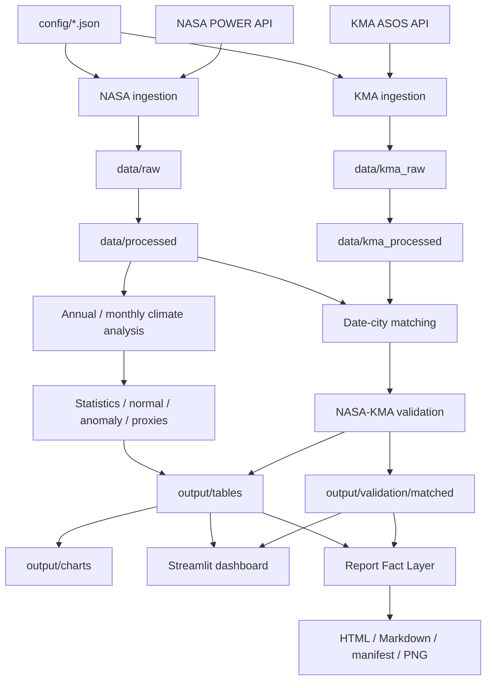

# Architecture

## 1. System Overview

NASA POWER Korea Climate Explorer v1.0은 설정 기반 batch ETL, 통계 분석, 교차검증,
읽기 전용 presentation을 분리한 로컬 Python 시스템이다. `main.py`가 workflow를
조정하지만 수집·정제·분석·시각화는 각각 독립 모듈이다. Dashboard와 report는 저장된
결과만 읽으며 upstream workflow나 API를 호출하지 않는다.

## 2. Data Ingestion

### NASA POWER

`src/nasa_power.py`가 Daily Point 요청 URL·parameter, timeout, HTTP 오류, 429 재시도와
응답 스키마를 담당한다. 도시 좌표와 공통 설정은 `config/locations.json`과
`src/config.py`에서 읽는다.

### KMA ASOS

`src/kma_asos.py`는 공식 일자료 endpoint에 디코딩된 ServiceKey를 URL query에 한 번만
삽입해 이중 encoding을 피한다. 10년 이하 chunk, pagination, 요청 간격, 429/5xx와
공공데이터포털 코드 05·22·23을 구분한다. 관측소는 `config/kma_stations.json`에서 관리한다.

## 3. Raw Data Layer

`data/raw`과 `data/kma_raw`은 API에서 받은 원자료 cache다. downstream 처리는 raw를
수정하지 않는다. 완전한 도시 cache가 있으면 기본 실행에서 다시 호출하지 않는다.

## 4. Processed Data Layer

`src/preprocess.py`, `src/kma_preprocess.py`, `src/climate_analysis.py`가 날짜 parsing,
numeric conversion, fill-value/결측 보존, 정렬, 파생 날짜열과 품질 요약을 수행한다.
NASA와 KMA 결과는 서로 다른 processed 폴더에 저장된다.

## 5. Climate Analysis Layer

`src/analysis.py`, `src/city_analysis.py`, `src/climate_analysis.py`,
`src/climatology.py`, `src/climate_indices.py`가 연·월·계절 집계, 이동평균,
climatology, threshold 및 연속일수 proxy를 모든 도시에 같은 규칙으로 적용한다.

## 6. Statistical Analysis Layer

`src/statistical_analysis.py`와 `src/stage5_analysis.py`가 선형회귀, MK,
lag-1 진단, Modified MK, Sen's slope·95% CI, BH-FDR, normal/anomaly와 지표별
순위를 계산한다. 서로 다른 단위의 지표를 합산한 종합점수는 없다.

## 7. Validation Layer

`src/validation.py`는 도시와 날짜의 one-to-one inner join 후 변수별 유효 pair에서
Bias, MAE, RMSE, Pearson, Spearman을 계산한다. 강수는 POD/FAR/CSI를 추가한다.
강릉 104/105 중첩 비교는 별도 결과이며 primary series에 병합하지 않는다.

## 8. Visualization Layer

`src/visualization.py`와 `src/validation_visualization.py`는 정적 PNG를 생성한다.
`dashboard/charts.py`는 저장된 표를 Plotly로 표현하며 분석 결과를 다시 정의하지 않는다.

## 9. Dashboard Layer

`streamlit_app.py`와 `dashboard/pages`의 9개 페이지는 read-only다.
`dashboard/data_loader.py`가 schema를 검사하고 `st.cache_data`로 파일 읽기를
캐시한다. 필터는 화면과 다운로드 사본에만 적용된다.

## 10. Report Layer

`reporting/data_provider.py`가 각 값에 source file, row key, column을 붙인다.
`reporting/narrative.py`는 보수적 규칙 문장만 만들고 `report_builder.py`가 Jinja2
HTML/Markdown을 staging 후 검증·게시한다. manifest는 source/generator/chart SHA-256,
mtime, 행주소와 validation 결과를 기록한다. API와 LLM을 사용하지 않는다.

## 11. Testing Layer

`tests/`는 순수 계산, schema, mock API, 오류/재시도, 결측, 통계, 대시보드 smoke,
보고서 source consistency 및 release safety를 검사한다. 실제 API를 단위시험에서
반복 호출하지 않는다.

## 12. Dependency Flow

의존 방향은 `config → ingestion → raw → processed → analysis/validation → output → presentation`이다.
Dashboard/report에서 ingestion으로 향하는 역방향 의존은 금지한다. 보고서는
`src.validation_visualization`의 기존 그림 함수만 재사용하지만 network workflow는 import하지 않는다.

## 13. Cache Strategy

- 도시·기간별 완전한 raw CSV가 있으면 재사용한다.
- `--force-download`만 cache 무시를 허용한다.
- KMA는 chunk 성공 결과를 보존하고 실패 도시 때문에 다른 성공 cache를 삭제하지 않는다.
- Streamlit은 CSV 읽기만 session cache한다.
- 보고서는 source hash를 생성 전후 비교하고 임시 staging이 성공한 뒤 교체한다.

## 14. API Key Handling

`KMA_API_KEY`는 환경변수 또는 gitignored `.env`에서만 읽는다. NASA는 key가 없다.
KMA 요청·오류·보고서·manifest에는 key를 출력하지 않는다. `.env.example`은 placeholder다.
`scripts/check_release_safety.py`는 실제 로컬 key와 같은 문자열이 공개 후보 파일에
복사됐는지 값 자체를 출력하지 않고 검사한다.

## 15. Failure Recovery

HTTP timeout·429·5xx·제공기관 오류는 원인이 구분된 예외와 제한된 backoff로 처리한다.
일일 한도(code 22)는 우회하지 않는다. 유효 cache는 유지하고 다음 실행이 미완료 도시부터
재사용할 수 있다. 필수 result CSV가 없으면 Dashboard/report는 임의 값을 만들거나
분석을 자동 실행하지 않고 선행 CLI를 안내한다.

## Architectural Boundaries

- raw/processed/result의 책임을 섞지 않는다.
- 결측을 임의 보간·0 변환하지 않는다.
- 보고서가 새 통계값이나 인과·위험도 결론을 만들지 않는다.
- 전국 station 확대는 v1.0 범위가 아니며 [ROADMAP](ROADMAP.md)에서 별도로 관리한다.
