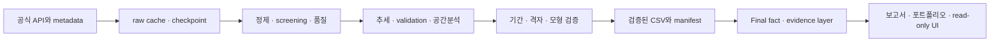

# Final Portfolio

## 프로젝트 한 줄

자료 수집부터 검정·강건성 검증·전달까지 출처를 추적하는 전국 기온 연구 플랫폼.

## 문제

기관·도시·기간마다 다른 데이터 처리와 검정이 결과 비교를 어렵게 만듭니다.

## 선정 이유

공공 관측자료와 접근 가능한 과학 격자자료를 연결해 동조성과 차이를 함께 검증할 수 있습니다.

## 데이터

공식 inventory 105 <!-- fact:inventory_n -->개, Tier A 45 <!-- fact:tier_a -->개, Tier B 6 <!-- fact:tier_b -->개, 공통기간 51 <!-- fact:common_n -->개 지점 및 NASA 고유 격자 34 <!-- fact:grid_n -->개. 장기 1981-01-01~2025-12-31 <!-- fact:long_period -->, 공통기간 1991-01-01–2025-12-31 <!-- fact:common_period -->, normal 1991–2020 <!-- fact:normal -->.

NASA POWER: NASA Langley Research Center의 POWER 프로젝트(Earth Science Division 지원), Daily Point 서비스. 기온 변수 T2M/T2M_MAX/T2M_MIN, 단위 °C, 요청 시간기준 LST. KMA ASOS: 기상청 지상(종관, ASOS) 일자료 조회서비스, 지점 일평균·최고·최저기온(°C). KHOA coastline: 해양수산부 국립해양조사원 해안선. 해안거리 단위 km. 데이터의 서비스 버전·취득일은 보존된 원본 metadata/manifest를 기준으로 하며 누락 정보는 추정하지 않습니다.

## 시스템

최종 통합 경로는 저장된 CSV에서 시작합니다. 앞 단계 API·추정 경로는 다시 실행하지 않습니다.

## 기술

Python, pandas, NumPy, SciPy, statsmodels, pymannkendall로 정제·기술통계·검정을 구성하고 requests로 API cache/retry/오류 응답을 처리했습니다. Shapely·PyProj·PyShp와 libpysal/spreg는 해안거리 및 공간 진단에, matplotlib·Plotly는 저장 차트에, Streamlit은 읽기 전용 UI에 사용됩니다. pytest mock, SHA256, mtime, manifest, deterministic fact layer로 재현성과 변경 탐지를 분리합니다.

## 진행 과정

단일 도시 MVP → 다도시·기후통계 → KMA validation → 전국 screening → Tier별 공통기간 → 공간·해안·모형 진단 → 기간 민감성 → 최종 fact 기반 통합. 기존 기능과 cache를 단계별 회귀 테스트로 보호했습니다.

## 주요 발견

- 고정 Tier A의 모든 시작기간에서 TAVG가 증가한 지점은 45 <!-- fact:stability_TAVG_positive_all_count -->개입니다. 공통기간에서는 51 <!-- fact:common_KMA_TAVG_positive -->/51 <!-- fact:common_n -->개 지점이 증가하고 모두 원 MK의 BH-FDR 기준을 충족했습니다.

- 공통기간 TMIN–TMAX 기울기 차이의 중앙값은 0.1470 <!-- fact:contrast_median --> °C/decade이며, TMIN 상승이 더 큰 지점은 40 <!-- fact:contrast_positive -->개입니다. KMA DTR 기울기 중앙값은 -0.1776 <!-- fact:common_KMA_dtr --> °C/decade입니다.

- 공통기간 TAVG의 NASA–KMA 추세 방향 일치는 51 <!-- fact:agreement_TAVG -->/51 <!-- fact:common_n -->개 지점입니다. 그러나 Bias 중앙값 -1.0155 <!-- fact:validation_TAVG_bias --> °C와 RMSE 중앙값 1.9028 <!-- fact:validation_TAVG_rmse --> °C는 절대 수준의 차이를 보여줍니다.

- NASA TAVG의 공간구조는 station-linked에서 고유 격자로 바꿔도 양의 유의성이 유지됩니다. 대표 가중치 Moran I는 0.8860 <!-- fact:spatial_nasa_tavg_sen_slope_STATION_LINKED_Moran_I -->에서 0.6957 <!-- fact:spatial_nasa_tavg_sen_slope_UNIQUE_GRID_Moran_I -->로 달라지므로 중복의 크기 효과는 무시할 수 없습니다.

- Bias·RMSE의 공간구조는 저장된 기간·가중치 검토에서 반복됩니다. 해안거리와의 연관도 반복되지만, 지형·고도·격자 대표성과 분리된 인과효과를 입증한 것은 아닙니다.

- KMA TAVG 공간군집은 DIRECTION_SENSITIVE <!-- fact:trajectory_kma_tavg_sen_slope_STATION_LINKED_period_robustness -->로 분류됩니다. 고정 Tier A의 가장 긴 기간과 가장 짧은 기간 기울기 중앙값은 각각 0.3888 <!-- fact:window_1981_KMA_TAVG_median -->, 0.5658 <!-- fact:window_2001_KMA_TAVG_median --> °C/decade로 다릅니다. 이를 가속화로 단정하지 않습니다.

## 실패와 비유의 결과

공간모형 수치 불안정 13 <!-- fact:model_count_NUMERICALLY_UNSTABLE -->개 조합과 실패 1 <!-- fact:model_count_FAILED -->개 조합을 보존했습니다. classical p와 HC3의 해석 차이도 숨기지 않았습니다.

## 기술적 과제

격자 중복, 기간·집합 교란, 공간모형 수치 불안정, 제한된 API 예산과 안전한 cache 재사용.

## 해결 사례 — STAR

### 격자 중복

**Situation:** 여러 관측소가 같은 NASA 격자와 연결되어 공간구조를 독립 관측소 결과처럼 해석할 위험이 있었습니다.

**Task:** 관측소 연결과 고유 격자 표현의 차이를 분리해야 했습니다.

**Action:** native 중심 추정과 같은 일시계열 검증을 거쳐 두 공간표현의 저장 결과를 비교하고 표본수와 해시를 기록했습니다.

**Result:** 공통기간 51 <!-- fact:common_n -->개 지점은 34 <!-- fact:grid_n -->개 NASA 격자에 연결됐습니다. 양의 공간구조는 유지되지만 Moran 크기는 달라졌습니다.

### 기간 민감성

**Situation:** 장기 분석의 공간군집을 공통기간으로 옮기자 같은 결론이 유지되지 않았습니다.

**Task:** 관측소 집합 변화와 기간 변화가 뒤섞이지 않도록 검증해야 했습니다.

**Action:** Tier A 집합과 종료연도를 고정한 시작기간 비교를 별도 namespace에서 수행하고 이전 결과를 보호했습니다.

**Result:** TAVG 상승 방향은 45 <!-- fact:stability_TAVG_positive_all_count -->개 Tier A 지점에서 모든 기간에 유지됐지만 군집 방향과 기울기 크기는 민감했습니다.

### 수치 불안정

**Situation:** 공간모형에서 라이브러리의 수렴 표시만으로 신뢰하기 어려운 경계·solver 차이가 발견됐습니다.

**Task:** 좋은 결과만 선택하지 않고 기존 결론의 사용 가능 범위를 분류해야 했습니다.

**Action:** 관측소 정렬, 스펙트럼 허용구간, likelihood, solver와 잔차를 검토하고 HC3를 별도 추론으로 유지했습니다.

**Result:** 수치 불안정 13 <!-- fact:model_count_NUMERICALLY_UNSTABLE -->개 및 실패 1 <!-- fact:model_count_FAILED -->개 조합을 명시적으로 남겨 핵심결론에서 제외했습니다.

## 재현성

실제 결과는 [재현 가이드](REPRODUCIBILITY.md)와 final manifest에서 확인합니다. 코드가 존재한다는 것과 전체 실행이 성공했다는 것을 구분합니다.

## 결과물

[연구결과 요약](FINAL_RESULTS_SUMMARY.md), [방법](FINAL_METHODS_SUMMARY.md), [Executive Summary](../output/public_demo/EXECUTIVE_SUMMARY.md), 로컬 `output/final/report/`의 전체 보고서(선택 공개), Streamlit Home·Reports 및 기존 분석 페이지.

## 한계

- 전국으로 분포한 관측소 집합이지 면적가중 대한민국 평균이나 균등한 공간표본이 아닙니다.

- NASA 격자의 지형·고도·해안 대표성과 ASOS 지점관측, 시간기준 및 관측소 이력이 차이를 만들 수 있습니다.

- 격자 공유는 관측소 간 독립성을 약화시킵니다. 고유 격자 비교는 공간구조의 크기 민감성을 없애지 않습니다.

- Tier B는 소표본입니다. Tier A의 공통기간 재분석과 전체 공통기간 집합은 관측소 수가 다릅니다.

- 기간 중첩, 잔여 결측, 연 completeness, 자기상관, 다중검정은 유의성과 크기 해석에 영향을 줍니다.

- 공간가중치와 Local Moran의 다중검정 결과에 민감한 패턴을 확정 군집으로 부르지 않습니다.

- 해안거리 상관은 관측적 연관입니다. HC3·모형·numerical review에서 비유의·실패인 결과는 핵심 인과결론이 아닙니다.

- 고온 threshold는 분석 proxy입니다. 강수·습도·풍속·일사는 기존 기능으로 보존하되 최종 전국 기온 연구의 범위를 넓히지 않습니다.

- 종료연도 민감성, 인과귀속, 미래 시나리오·예측은 검증하지 않았습니다. 상승 크기의 기간 차이는 가속화의 증거가 아닙니다.

## 다음 단계

사용자 검토 후 코드 라이선스·공개 범위·release 버전을 결정합니다. 미래예측이나 인과모형은 이번 결과에서 수행했다고 주장하지 않습니다.
