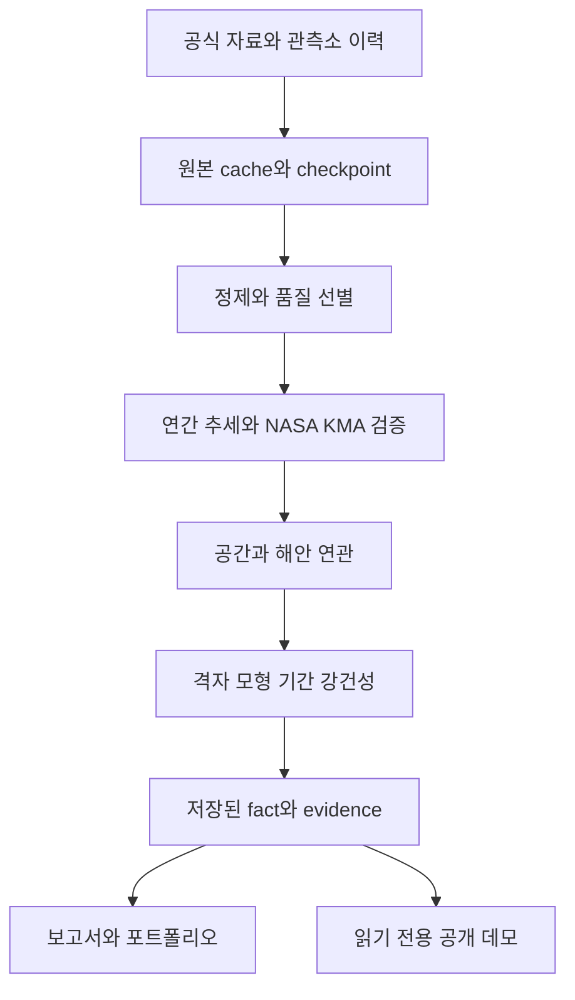

# NASA POWER Korea Climate Explorer
## 구축·해석·운영·활용 통합 가이드
### Project Owner Handbook

문서 확인 기준일: 2026-09-12. 대상 소프트웨어: v1.1.0과 그 이후 main의 공개 데모·문서 개선본. 이 책은 코드를 처음부터 작성하는 교재가 아니라, 완성된 프로젝트의 소유자가 결과를 이해하고 안전하게 운영하며 자신의 경험으로 설명하도록 돕는 안내서입니다. 이번 작성에서는 관측값·통계량을 새로 계산하지 않았습니다.

지금 보고 싶은 것에 따라 [한 장 시작 안내](PROJECT_OWNER_QUICKSTART.md), [용어사전](PROJECT_OWNER_GLOSSARY.md), [증상별 문제 해결](PROJECT_OWNER_TROUBLESHOOTING.md), [핵심표 모음](PROJECT_OWNER_CHEATSHEET.md)을 함께 사용하세요. 낯선 단어 때문에 본문 읽기를 멈출 필요는 없습니다. 먼저 쉬운 설명을 읽고, 실제 의미와 주의점을 확인하면 됩니다.

**공개 입구:** [Live Demo](https://korea-climate-explorer.streamlit.app/) · [GitHub](https://github.com/huasar4880/NASA_POWER_Korea_Climate_Explorer) · [공식 v1.1.0 Release](https://github.com/huasar4880/NASA_POWER_Korea_Climate_Explorer/releases/tag/v1.1.0).

> 가장 중요한 구분: 이 프로젝트는 과거 자료를 분석한 연구입니다. 미래 기온 예측기나 기상청 공식 통계 서비스가 아닙니다. 결과를 읽기 위해 API를 다시 호출할 필요도 없습니다.

### 이 책을 읽는 지도

| 부분 | 해결할 질문 | 처음 읽을 때 |
|---|---|---|
| Part I–II | 무엇을 왜 만들었고 어떤 문제를 해결했나? | 전체 읽기 |
| Part III–V | 데이터·통계·연구결론을 어떻게 해석하나? | 표와 주의점부터 |
| Part VI | 공개 7화면과 로컬 18화면에서 무엇을 보나? | 데모와 나란히 읽기 |
| Part VII–IX | Mac에서 다시 켜고 GitHub·Cloud를 관리하려면? | 필요한 작업만 순서대로 |
| Part X–XII | 고장·보안·업데이트·백업은 어떻게 다루나? | 문제 전 한 번, 발생 시 다시 |
| Part XIII | 이력서·면접·발표에서 무엇을 말할 수 있나? | 자기 역할에 맞춰 연습 |
| Part XIV·부록 | 어디까지가 한계이고 원래 근거는 어디인가? | 발표 전 확인 |

## Part I — 프로젝트를 이해하기

### 1. 한 문장으로 설명하면

비전공자에게는 “한국 여러 관측소의 과거 기온변화를 살펴보고, NASA 자료와 기상청 자료가 어디까지 같은 이야기를 하는지 검증해 누구나 볼 수 있게 만든 프로젝트”라고 설명할 수 있습니다.

기술적으로는 “설정 기반 수집·정제·품질 선별, 추세와 교차검증, 공간·기간 강건성 검토, 출처 추적형 보고서와 읽기 전용 UI를 연결한 재현 가능한 Python 연구 파이프라인”입니다.

면접에서는 “숫자를 만드는 데서 끝내지 않고, 어떤 결론이 조건을 바꿔도 유지되는지 확인하고 실패와 한계를 공개한 데이터 프로젝트”라는 점을 먼저 말하면 좋습니다. 어려운 통계 이름을 모두 나열하는 것보다 목적이 먼저 전달됩니다.

### 2. 출발 질문이 어떻게 깊어졌는가

처음 질문은 서울의 연평균 기온이 어떻게 변했는가였습니다. NASA POWER는 여러 위치에 같은 방식으로 접근할 수 있어 다도시 비교로 확장하기에 적합했습니다. 그러나 내려받기 쉬운 자료가 관측소의 실제 기온과 같다는 보장은 없습니다. 그래서 ASOS와 날짜를 맞춰 비교했습니다.

도시 몇 곳에서 비슷한 결과가 나왔다고 한국 전체를 설명할 수는 없었습니다. 공식 관측소 목록과 실제 가용기간을 확인하고, 장기 분석에 적합한 관측소를 선별했습니다. 그다음 질문은 “어느 지역에서 비슷한 변화가 나타나는가”로 이어졌습니다. 공간군집이 보이자 이웃 정의, 해안거리, NASA 격자 공유, 관측기간에 따라 군집이 달라지는지도 확인해야 했습니다.

따라서 최종 목적은 하나의 강한 문장을 만드는 것이 아닙니다. **반복 확인되는 사실, 조건을 붙여야 하는 사실, 아직 답하지 못한 질문을 구분하는 것**입니다. 예상과 다른 결과는 프로젝트 실패가 아니라, 주장 범위를 좁혀 주는 근거입니다.

### 3. 단순 그래프 프로그램보다 넓은 이유

시스템에는 데이터 공학, 통계, 검증, 공간분석, 운영, 전달이라는 서로 다른 책임이 있습니다. 다운로드 성공은 관측품질 보증이 아니고, 테스트 통과는 과학적 인과성 보증이 아닙니다. 각 층을 따로 검증해야 전체 결과를 믿고 사용할 수 있습니다.



화살표는 책임의 흐름입니다. 화면을 열었다고 원본 수집으로 되돌아가지 않습니다. 공개 화면은 마지막 층의 선택된 파일만 읽습니다. 이것이 API 키 없이 서비스할 수 있고, 연구 결과를 보존할 수 있는 이유입니다.

### 4. 이 프로젝트가 하지 않은 일

| 하지 않은 것 | 혼동하기 쉬운 이유 | 대신 실제로 한 일 |
|---|---|---|
| CMIP6·미래 시나리오 | 장기 기후라는 이름 | 2025년까지의 과거 자료 분석 |
| 머신러닝·미래 예측 | 회귀선이 있음 | 과거 추세의 요약과 불확실성 검토 |
| 공식 폭염·열대야 통계 | 33°C·25°C 문턱 사용 | 일자료 기반 threshold proxy |
| 면적가중 전국 평균 | 전국에 관측소가 분포 | 선별 관측소의 비가중 요약 |
| 해안성의 인과효과 입증 | 해안거리와 오차 상관 | 관측적 연관과 모형 민감도 검토 |
| 완전한 동질화 보정 | 관측소 이력을 검사 | 위험 선별·보존, 자동 접합 금지 |
| 전 기간 모든 변수 완전 검증 | 초기 다변수 기능 존재 | 최종 전국 연구의 중심은 기온 |

## Part II — 문제 해결로 읽는 구축 과정

단계 번호 대신 의사결정의 흐름으로 읽으세요. 아래 Phase는 이해를 위한 묶음이며 실제 단계 번호와 일대일 대응하지 않습니다. 상세 연혁은 부록과 [단계 기록](STAGE_HISTORY.md)에 있습니다.

### Phase 1 — NASA POWER와 8개 도시

**문제:** 긴 일자료를 손으로 내려받으면 기간·단위·파일명이 어긋나기 쉽습니다. **판단:** 서울에서 연결을 확인한 뒤 동일 함수에 도시 설정을 넣는 구조를 택했습니다. **해결:** URL·파라미터·시간 제한을 한 곳에서 관리하고 raw/processed를 분리했습니다. **결과:** 서울·부산·대전·대구·광주·강릉·제주·전주가 같은 정제·집계·그림 규칙을 사용합니다. 배운 점은 확장이 복사 코드 증가를 의미하지 않아야 한다는 것입니다.

### Phase 2 — KMA ASOS 연결과 장애 처리

**문제:** 키가 있어도 HTTP 요청이 실패하고, 전체 도시는 호출 제한에 걸릴 수 있었습니다. **판단:** 인증키 존재, 요청 형식, HTTP 상태, 제공기관 오류코드를 분리했습니다. **해결:** URL-encoded 키를 한 번 정상화한 뒤 요청 인코딩을 적용하고, 10년 이하 기간분할·999행 pagination·간격·backoff·cache를 사용했습니다. **결과:** 성공한 자료를 버리지 않고 이어서 진행할 수 있는 경로와, 일일 제한은 우회하지 않는 경계를 마련했습니다. 키를 로그로 출력하는 디버깅은 하지 않습니다.

### Phase 3 — 105개 inventory와 실제 screening

**문제:** 공식 목록에 있다는 사실만으로 45년 자료가 있는 것은 아닙니다. **판단:** metadata 후보와 일자료 품질 통과 집합을 구분했습니다. **해결:** 관측 시작·종료, 날짜, 변수별 결측, 연 completeness, 장기 공백과 이력을 검사했습니다. **결과:** 105는 확인한 목록의 규모이며, 전부 최종 추세에 투입했다는 뜻이 아닙니다. 배제 이유와 검토 필요 상태도 남겼습니다.

### Phase 4 — Tier A 45개 장기 분석

**문제:** 서로 다른 관측기간을 한데 비교하면 지역차와 기간차가 섞입니다. **판단:** 1981–2025를 분석할 장기 집합을 고정했습니다. **해결:** 연평균·OLS·Sen/MK·FDR·normal/anomaly·계절·고온 proxy·NASA 검증에 동일한 기준을 적용했습니다. **결과:** 이후 민감성 검토의 기준선이 되는 45개 지점 결과를 확보했습니다. 선별 기준을 통과해도 결측이 완전히 없다는 의미는 아닙니다.

### Phase 5 — 공간군집을 묻기

**문제:** 지도의 비슷한 색만 보고 군집을 확정할 수 없습니다. **판단:** 공간 이웃의 정의를 드러내는 통계가 필요했습니다. **해결:** Global/Local Moran과 여러 공간가중치를 비교했습니다. **결과:** 지도는 탐색 입구이며 유의성·다중검정·가중치에 따라 해석이 달라진다는 점을 확인했습니다. 한 장의 색상지도를 최종 결론으로 삼지 않습니다.

### Phase 6 — 공식 해안선과 해안거리

**문제:** 해안/내륙을 도시 이름으로 분류하면 모호합니다. **판단:** 공식 KHOA geometry와 거리 기준을 사용했습니다. **해결:** 좌표계·길이 단위·해안선 처리와 분류 문턱을 기록했습니다. **결과:** 거리와 Bias/RMSE 등의 연관을 검토할 수 있었지만, 고도·지형·관측환경을 모두 통제한 인과효과로 확대하지 않았습니다.

### Phase 7 — 공간모형과 수치 실패

**문제:** SAR/SEM의 일부 결과가 경계에 걸리거나 반환에 실패했습니다. **판단:** 라이브러리의 성공 표시만으로 유효한 추정이라고 할 수 없었습니다. **해결:** OLS/HC3를 구분하고, 이웃행렬·관측소 정렬·고유값·solver 경계·재현성을 점검했습니다. **결과:** 54개 수치 조합 중 STABLE 34, 경계 근접 6, NUMERICALLY_UNSTABLE 13, FAILED 1을 보존했습니다. 실패를 정상 계수로 바꾸지 않은 것이 중요한 성과입니다.

### Phase 8 — Tier B 6개와 공통기간 51개

**문제:** 1981년부터 분석할 수 없는 지점을 모두 버리면 1991년 이후의 유효 자료도 활용하지 못합니다. **판단:** 짧은 자료를 장기 자료에 이어 붙이지 않고 독립 cohort로 다뤘습니다. **해결:** Tier B를 1991–2025에 분석하고 Tier A도 같은 기간으로 다시 맞춘 저장 결과를 만들었습니다. **결과:** 45+6=51의 공통기간 비교가 가능해졌습니다. Tier A 장기 결과와 Tier B 결과를 기간 설명 없이 직접 비교하면 안 됩니다.

### Phase 9 — 51개 위치와 34개 NASA 격자

**문제:** 다른 관측소 좌표로 요청해도 동일 NASA 시계열이 반환될 수 있었습니다. **판단:** 요청점 수를 독립 격자 수로 간주하지 않았습니다. **해결:** native 중심 추정과 기온 일시계열·NaN 위치 일치를 확인한 뒤 station-linked와 unique-grid를 분리했습니다. **결과:** 공간구조의 양의 유의성은 남았지만 Moran I의 크기가 낮아졌습니다. 격자 중복이 전부의 원인은 아니어도 크기에 영향을 준다는 조건을 남겼습니다.

### Phase 10 — 시작연도 민감성

**문제:** 관측기간을 바꾸면 군집 해석도 바뀌었습니다. **판단:** 관측소와 종료연도를 고정해야 기간 효과를 더 분명히 볼 수 있습니다. **해결:** 고정 Tier A에서 1981·1986·1991·1996·2001 시작, 2025 종료를 비교했습니다. **결과:** 평균기온 상승 방향은 유지되지만 기울기 크기와 KMA 군집은 민감했습니다. 중첩기간 비교를 온난화 가속도의 검정으로 부르지 않습니다.

### Phase 11 — fact·evidence·보고서 통합

**문제:** 문서·화면에 숫자를 각각 옮겨 적으면 출처와 수치가 어긋날 수 있습니다. **판단:** 주장과 근거 행·열을 연결해야 합니다. **해결:** final fact layer와 evidence matrix를 중심으로 보고서·요약·포트폴리오를 정리했습니다. **결과:** 지표명·값·단위·기간·source_file·행/key·column을 따라갈 수 있습니다. 실패·비유의 결과도 증거의 일부로 남깁니다.

### Phase 12 — 공개 저장소와 경량 데모

**문제:** 연구 archive 전체를 올리면 대용량·인증정보·재현 환경 문제가 생깁니다. **판단:** 연구 재현과 결과 열람을 분리했습니다. **해결:** MIT 코드, 선택된 검증 결과, 7-view 공개 UI를 제공하고 18-page full mode는 별도 보존했습니다. **결과:** 키 없는 Live Demo, 고정 v1.1.0 Release, 최신 문서가 이어지는 main을 갖췄습니다. 공개 저장소는 로컬 raw 백업을 대신하지 않습니다.

## Part III — 데이터와 품질을 이해하기

### 1. 관측소와 격자는 무엇이 다른가

쉬운 설명: ASOS는 특정 장소의 관측 기록이고 NASA POWER는 공간 격자로 표현되는 자료입니다. 한 학교 운동장의 온도계와 넓은 구역을 대표하는 자료가 같은 숫자일 필요는 없습니다.

프로젝트 의미: ASOS 일평균·최고·최저기온과 NASA T2M 계열을 날짜별로 맞춰 비교합니다. ASOS는 검증의 **reference**이지만 오류 없는 ground truth라고 선언하지 않습니다. 관측소 이동, 환경 변화, 잔여 결측과 관측방식 차이가 있습니다. NASA의 격자 대표성·고도·해안 영향과 LST 시간 기준도 차이의 후보입니다.

주의점: 서로 다른 관측소가 같은 NASA 격자에 연결될 수 있습니다. 51개 관측소를 대상으로 요청했다는 사실은 NASA 독립 표본 51개를 뜻하지 않습니다. 여기의 grid 중심은 기존 방법에 따른 추정 표현이며 API가 모든 요청에서 직접 반환한 확정 native metadata라고 과장하지 않습니다.

### 2. 105·45·6·51·34·33의 구분

| 숫자 | 무엇을 센 것인가 | 기간·용도 | 하면 안 되는 해석 |
|---:|---|---|---|
| 105 | 공식 metadata snapshot의 ASOS inventory | 선별 출발 목록 | 105개 모두 최종 연구에 사용 |
| 45 | Final Tier A 관측소 | 1981–2025 장기, 고정 시작기간 검토 | 기상청 공식 A등급 |
| 6 | Final Tier B 관측소 | 1991–2025 독립 집합 | 1981년 이전을 보간해 붙인 자료 |
| 51 | Tier A+B 공통기간 관측소 | 1991–2025 | Tier A 45개 결과와 같은 표본 |
| 34 | 공통기간 NASA 고유 격자 | station-linked 51개와 대조 | 한국 전역 전체 격자 수 |
| 33 | 고정 Tier A의 NASA 고유 격자 | 시작기간 검토 | 34에서 오류로 한 개 누락 |

Tier B의 저장 목록은 철원(95), 안동(136), 고산(185), 태백(216), 장수(248), 봉화(271)입니다. 관측소 이름보다 ID·기간·cohort를 함께 확인하세요. 도시 8개 분석의 도시 좌표와 전국 ASOS station 좌표는 같은 설정 체계가 아닙니다.

### 3. 초기 8개 도시 설정

이 표는 `config/locations.json`을 읽어 확인한 값입니다. 기상청 관측소를 대표하는 좌표라고 바꿔 부르지 않습니다.

| 도시 | 위도 | 경도 |
|---|---:|---:|
| Seoul | 37.5665 | 126.9780 |
| Busan | 35.1796 | 129.0756 |
| Daejeon | 36.3504 | 127.3845 |
| Daegu | 35.8714 | 128.6014 |
| Gwangju | 35.1595 | 126.8526 |
| Gangneung | 37.7519 | 128.8761 |
| Jeju | 33.4996 | 126.5312 |
| Jeonju | 35.8242 | 127.1480 |

도시를 추가하려면 이름·좌표뿐 아니라 관련 KMA 매핑, 결과 파일, 품질·테스트 범위도 검토해야 합니다. 지금은 완성본 운영 단계이므로 목록을 임의로 늘리지 않습니다.

### 4. 주요 변수와 단위

| 공통 의미 | NASA POWER | KMA ASOS | 공통 표시 단위 | 사용·주의 |
|---|---|---|---|---|
| 평균기온 TAVG | T2M | avgTa | °C | 일평균을 연간 등으로 집계 |
| 최고기온 TMAX | T2M_MAX | maxTa | °C | 연평균 TMAX는 연중 최고 기록 한 개가 아님 |
| 최저기온 TMIN | T2M_MIN | minTa | °C | 연평균 TMIN은 연중 최저 기록 한 개가 아님 |
| 강수 | PRECTOTCORR | sumRn | mm/day | 일합계, 공란 의미 미확정 |
| 상대습도 | RH2M | avgRhm | % | 10% 상대 증가와 10%p 차이를 구분 |
| 풍속 | WS2M | avgWs | m/s | NASA 2m 풍속과 ASOS 관측높이 차이 주의 |
| 일사 | ALLSKY_SFC_SW_DWN | sumGsr | kWh/m²/day | KMA MJ/m²/day를 3.6으로 나눔 |
| 일교차 DTR | TMAX−TMIN | 최고−최저 | °C | 추세는 별도 DTR 시계열에 적합 |

일사량은 일조시간과 다릅니다. 일조시간은 시간이고 일사는 면적당 에너지입니다. 일사 결측이 많은 지점의 작은 유효 pair 수는 비교가 특정 시기에 집중됐을 가능성을 뜻합니다. 초기 다변수 결과를 최종 전국 기온 연구의 검증 수준과 동일시하지 마세요.

### 5. 정상기후값과 anomaly

Climate Normal은 기준기간의 전형적인 수준을 정하는 기준선입니다. 이 프로젝트의 기준기간은 1991–2020입니다. 연간 anomaly는 그해 연평균에서 해당 기준값을 뺀 차이(°C)입니다. 양수는 기준보다 따뜻하다는 뜻이지 측정 오류나 곧바로 위험 상태라는 뜻은 아닙니다.

정상값의 평균 방식도 문서를 따라야 합니다. 전국 Tier B 등의 normal은 30개 연평균의 산술평균으로 연도에 같은 가중치를 줍니다. 모든 일자료를 한 번에 평균하면 윤년·결측의 영향이 달라질 수 있으므로 같은 숫자라고 추측하지 않습니다. 월 climatology는 “보통 1월·2월은 어느 정도인가”를 나타내는 달별 평균이며 추세선이 아닙니다.

### 6. 결측·이상값·중복을 다르게 다루는 이유

NaN은 아직 알 수 없는 수치입니다. 0°C는 유효한 기온이고 강수 0은 명시된 무강수 수치입니다. 둘을 같게 처리하면 평균과 사건 수가 바뀝니다. NASA fill code −999를 온도로 평균내면 터무니없는 냉각이 생깁니다. 따라서 raw를 그대로 두고 정제·검증 층에서 결측코드와 비정상 범위를 다룹니다.

중복 날짜는 한 날을 두 번 세게 합니다. 서로 다른 station ID를 이름이 비슷하다고 합치는 것도 같은 문제를 만들 수 있습니다. 전국 pipeline은 중복·ID 불일치를 조용히 평균하거나 임의 선택하지 않고 검토가 필요하다고 멈춥니다. 넓은 sanity 범위는 코딩 오류를 잡는 방어선이지 제공기관의 정밀 QC 규칙을 대체하지 않습니다.

screening의 주요 기준은 기온 변수별 결측률 5% 이하, 연도의 90% 이상이 core completeness 90% 이상, 세 기온 중 하나라도 빠진 연속 구간 90일 미만입니다. core completeness의 분자는 세 기온이 **같은 날 모두 유효한 일수**, 분모는 윤년을 포함한 실제 달력일수입니다. 관측소의 전체 결측률 하나만 보는 것보다 장기 공백을 함께 보는 이유입니다.

### 7. 강수 공란에 관해 반드시 기억할 것

**현재 판정은 강수 공란 의미 미확정입니다.** `src/kma_preprocess.py`는 blank/null을 NaN으로 보존하고 명시적 0·강수량을 유지합니다. 다른 기상필드가 정상이라는 이유만으로 강수센서나 일합계도 정상이라고 가정하지 않습니다.

기존 기술검증 기록에서 서울 16,436행 중 공란 10,005행, 명시적 0은 1,538행입니다. 공란이면서 눈이나 비 현상이 기록된 사례도 있습니다. 이는 단순한 “맑은 날=공란=0” 규칙을 사용할 수 없다는 근거이지, 모든 공란이 관측장애라는 증거도 아닙니다. 이번 설명서에서는 API를 재호출하거나 강수를 재분석하지 않았습니다.

> `missing_precipitation`은 사용 가능한 수치가 없는 행 수입니다. 확정된 관측장애 일수라고 보고하지 마세요. 강수 validation은 숫자가 있는 날짜의 부분집합 결과이며 전체 날씨의 성능으로 확대하지 않습니다.

상세 날짜·공식 자료 검토 경위는 [기술 참고서](PROJECT_TECHNICAL_REFERENCE.md)의 강수 공란 부분에 있습니다. 향후 규칙을 바꾸려면 제공기관의 서비스·기간별 null/미량강수/QC 정의가 필요합니다. 원본 유지와 별도 processed, 변환 전후 품질·오차 비교를 새로운 작업으로 승인받아야 합니다.

### 8. Gangneung 105/104와 관측 이력

같은 도시 이름은 같은 관측장소의 연속 관측을 보장하지 않습니다. 기존 시스템은 105/104 중첩기간 비교를 별도로 보존하고 primary series에 자동 병합하지 않습니다. 전국 선별에서도 unresolved high/manual continuity 위험은 해결 전 장기 집합에 넣지 않습니다.

이것은 모든 관측소 이질성을 보정했다는 뜻이 아닙니다. 이동·주변 토지이용·기기 변화의 영향은 잔여 한계입니다. “가까우니까 연결”, “빈 기간만 다른 지점으로 채우기”는 겉으로 행 수를 맞출 뿐 자료의 의미를 바꿀 수 있어 금지합니다.

## Part IV — 통계량을 자신의 말로 설명하기

### 1. 선형 추세와 10년당 변화량

쉬운 설명: 울퉁불퉁한 연평균 값 사이에 전체 방향을 대표하는 직선을 놓는 것입니다. 회귀식은 `temperature = intercept + slope × year`입니다. 이때 연간 slope에 10을 곱하면 °C/decade입니다.

프로젝트 의미: 초기 분석에는 OLS 직선, 5년·10년 후행 이동평균이 있습니다. 이동평균은 최근 여러 해를 부드럽게 보는 표시용 값입니다. 충분한 연수가 모이지 않은 첫 4년·9년은 NaN이 정상입니다. 전국 추세 적합에서는 이동평균을 원래 연간 자료 대신 넣지 않습니다.

주의점: 예를 들어 0.45°C/decade는 해당 기간의 요약 상승 기울기입니다. 매 10년 정확히 0.45°C씩 오른다는 뜻도, 앞으로 같은 속도로 오른다는 예측도 아닙니다. 기울기로 추정한 전체 변화는 `slope_per_year × (마지막 연도−첫 연도)`입니다. 첫 관측값과 마지막 관측값의 단순 차이, 과거/최근 10년 평균 차이와 다른 양입니다. 연도 수 45와 연도 간격 44도 구분해야 합니다.

### 2. Mann–Kendall과 modified MK

Mann–Kendall(MK)은 시간상 뒤의 값이 앞의 값보다 대체로 커지는지 작아지는지를 따져 단조 추세의 근거를 평가합니다. 증가가 반드시 완벽한 직선일 필요는 없습니다. p값은 변화량이 아니므로 크기를 말할 때는 Sen slope를 함께 봅니다.

일련의 연간 값끼리 상관이 있으면 독립 관측을 전제로 한 검정 해석에 영향을 줍니다. 프로젝트는 lag-1 진단과 필요한 경우 Hamed–Rao modified MK를 보조 민감도 결과로 둡니다. 최종 주요 유의 지점수는 **original MK의 raw p를 정해진 family에서 BH-FDR 보정한 값**입니다. modified MK에서 유의한 것만 골라 주 결과를 바꾸지 않습니다.

### 3. Sen slope / Theil–Sen

쉬운 설명: 연도 두 개를 고르는 모든 가능한 조합에서 기울기를 구하고 그 가운데 값을 택합니다. 일부 튀는 해의 영향에 OLS보다 덜 민감할 수 있습니다.

프로젝트 의미: 실제 연도 차이를 분모에 쓰고, °C/year와 °C/decade를 구분합니다. 95% 기울기 신뢰구간도 동일 단위로 제공합니다. [SciPy의 정의](https://docs.scipy.org/doc/scipy/reference/generated/scipy.stats.theilslopes.html)는 이 쌍별 기울기의 중앙값을 확인하는 구현 참고입니다.

주의점: 이상값·결측·자기상관의 문제가 모두 사라지는 만능 방법은 아닙니다. OLS와 Sen 값이 다르다면 어느 것이 “정답”인지 임의 선택하지 말고 추정법을 붙여 말하세요. 지점별 Sen의 중앙값은 전국 하나의 시계열에 적합한 Sen이 아닙니다.

### 4. 신뢰구간·p값·BH-FDR

| 개념 | 쉬운 설명 | 이 프로젝트에서 읽는 법 | 흔한 오해 |
|---|---|---|---|
| 95% CI | 같은 절차를 반복할 때 범위의 포괄 성질 | 효과크기 주변의 불확실성 | 이번 고정 구간 안에 모수가 95% 확률로 있다는 단순 단정 |
| p-value | 귀무가설과 검정 가정 아래 이런 통계량 이상이 나올 정도 | raw p와 어떤 검정인지 함께 | 귀무가설이 참일 확률, 효과크기 |
| q / BH-FDR | 여러 검정에서 거짓 발견 비율을 관리하는 보정 | family와 기준을 함께 확인 | 각 결과가 거짓일 확률, 모든 오류를 없앤 보증 |

45개나 51개 관측소를 각각 검정하면 우연히 작은 p값도 나옵니다. BH-FDR는 그 다중검정 문제를 다루기 위한 선택입니다. window×source×metric 등 사전에 정한 비교군 안에서 보정합니다. 계절·threshold에는 해당 차원을 더합니다. 45개 family의 q를 51개에 그대로 복사하지 않습니다.

FDR 0.05는 개별 지점이 95% 확실하다는 뜻이 아닙니다. 적용 가정 아래 발견 집합의 기대 오류 비율을 제어하는 기준입니다. 공간의존이나 검정 설계의 한계까지 한 숫자로 해결하지 못합니다. Global Moran·해안 연관의 탐색적 raw p와 기온추세 FDR q를 혼용하지 마세요.

### 5. validation 지표

모든 차이는 NASA−KMA입니다. 같은 도시/관측소·같은 날짜에서 두 값이 유효한 pair만 사용합니다. 한 변수의 결측 때문에 다른 변수의 정상 관측까지 버리지는 않습니다.

| 지표 | 계산 의미 | 좋은 방향·읽을 때 주의 |
|---|---|---|
| Bias | 차이의 평균 | 0 가까움은 평균 치우침 작음; 양·음 상쇄 가능 |
| MAE | 절대차의 평균 | 작을수록 전형적 절대오차 작음 |
| RMSE | 제곱차 평균의 제곱근 | 큰 오차에 더 민감; 같은 pair에서는 RMSE≥MAE |
| Pearson r | 선형 동조성 | −1~1; 높아도 일정한 편향이 남을 수 있음 |
| Spearman rho | 순위의 동조성 | −1~1; 크기 자체의 동일성을 평가하지 않음 |
| n_pairs | 해당 변수의 유효 관측쌍 수 | 클수록 무조건 대표적이지 않음; 어떤 날이 빠졌는지 중요 |
| R² | 회귀가 변동을 얼마나 설명하는지 | 높은 값도 인과·미래 예측 성능 보증 아님 |

프로젝트의 OLS 추세 R²와 NASA/KMA의 r을 같은 숫자로 취급하지 않습니다. 단순회귀의 특정 조건에서 R²=r² 관계가 성립하지만, 임의 예측 평가에서는 R²가 음수일 수도 있습니다. 그림의 축과 사용 함수부터 확인하세요.

강수 wet day는 `>= 1 mm/day`입니다. hit는 양쪽 wet, miss는 KMA wet/NASA dry, false alarm은 NASA wet/KMA dry입니다. POD=hit/(hit+miss), FAR=false alarm/(hit+false alarm), CSI=hit/(hit+miss+false alarm)입니다. POD·CSI는 클수록, FAR는 작을수록 좋으며 분모 0은 정의 불가입니다. 공란을 dry로 만들면 이 표 자체가 달라집니다.

### 6. Moran's I: 지도에서 비슷한 값이 모이는가

쉬운 설명: 값이 큰 곳 옆에도 큰 값이, 작은 곳 옆에도 작은 값이 모이는지 보는 통계입니다. 양의 I는 비슷한 값의 인접, 음의 I는 서로 다른 값의 인접 경향을 나타냅니다. 0 부근이라고 곧바로 무작위가 확정되지는 않습니다.

프로젝트 의미: 관측소 추세, NASA 추세, Bias, RMSE 각각의 공간구조를 이웃행렬 W와 순열검정으로 검사했습니다. 무작위 배치 기대값은 보통 `−1/(n−1)`이며 0과 정확히 같지 않습니다. 저장된 expected_I와 p를 읽습니다. [PySAL 설명](https://pysal.org/esda/stable/user-guide/global_morans_i.html)도 유한 표본의 기대값을 구분합니다.

주의점: Moran I는 Pearson r처럼 언제나 −1~1로 제한되는 상관계수가 아닙니다. 가능한 범위와 분포는 W와 자료 구성에 영향을 받습니다. I가 큰 그림 하나만으로 유의성·인과성을 말할 수 없고, n과 공간단위가 다르면 크기의 단순 비교도 조심해야 합니다.

### 7. Local Moran: HH·LL·HL·LH

| 유형 | 자신과 이웃의 상대 수준 | 해석 예시 |
|---|---|---|
| HH | 높음·높음 | 비교 집합에서 높은 기울기끼리 이웃 |
| LL | 낮음·낮음 | 낮은 기울기끼리 이웃; 반드시 기온 하강은 아님 |
| HL | 높음·낮음 | 주변과 다른 높은 값 |
| LH | 낮음·높음 | 주변과 다른 낮은 값 |

여기서 높고 낮음은 분석 중인 변수의 상대 수준입니다. 기울기의 LL도 모두 양수일 수 있습니다. 날짜별 더위나 행정구역 전체의 위험등급이 아닙니다. 각 지점에서 검정하므로 raw p 지도와 BH-FDR 지도는 다를 수 있습니다. raw에서만 보이는 색을 “확정 hotspot”이라고 부르지 않습니다. 기간과 W를 바꿔도 유지되는지까지 봐야 합니다.

### 8. 공간가중치의 선택

W는 누구를 이웃으로 얼마나 볼지를 숫자로 적은 표입니다. directed KNN k=4는 각 지점이 가까운 네 곳을 고르며, A가 B를 골라도 B가 A를 고를 필요는 없습니다. symmetric union KNN은 양방향 중 하나라도 연결되면 이웃으로 봅니다. IDW는 거리가 멀수록 작은 비중을 주며 p=2는 p=1보다 가까운 곳을 더 강조합니다. distance-band는 정한 거리 안의 연결을 사용합니다.

행표준화는 각 지점의 이웃 가중치 합을 1로 맞춥니다. 원래 대칭인 거리행렬도 행합이 다르면 표준화 뒤 수치적으로 비대칭일 수 있습니다. “이웃 네 곳”, “일정 km”, “모든 다른 곳”은 서로 다른 질문입니다. 여러 정의를 비교하는 것은 유의한 결과를 고르는 절차가 아니라, 결론이 이웃 정의에 얼마나 의존하는지 밝히는 절차입니다.

### 9. OLS·HC3·SAR·SEM을 함께 둔 이유

OLS는 결과와 설명변수의 평균적 직선 관계를 추정합니다. HC3는 이분산에 견디도록 표준오차를 보정하며 보통 같은 OLS 계수에 다른 불확실성을 제공합니다. 공간상관까지 자동 보정하지 않습니다. SAR는 이웃 결과의 공간적 연결을 모형에 넣고 SEM은 오차의 공간구조를 모형화합니다. 둘의 계수와 작동 방식은 같지 않습니다.

이 프로젝트는 해안거리 연관을 보되 위도·고도 등과 모형 조건을 함께 검토했습니다. HC3를 주요 비공간 추론으로 두고, SAR/SEM은 수렴·경계·수치 안정성을 통과한 범위에서 보조적으로 해석합니다. 좋은 적합도나 작은 p값만으로 해안이 변화의 원인이라고 말하지 않습니다.

IDW p=1의 일부 실패는 구체적인 자료·행렬·고정 solver 창에서 발생했습니다. solver 경계, 행렬의 특이점, 급수 수렴 조건은 서로 다릅니다. `optimizer success` 뒤에도 후속 계산이 실패할 수 있습니다. p=2나 cutoff에서 안정적이라고 그 방법을 사후에 주 모형으로 승격하지 않았습니다. **계산 실패는 기후현상이 없다는 증거가 아니며, 계산 성공도 과학적으로 옳다는 증거는 아닙니다.**

### 10. threshold와 DTR의 미묘한 차이

TMAX≥30°C, TMAX≥33°C, TMIN≥25°C는 경계를 포함한 일자료 proxy입니다. 유효 pair가 있고 사건이 없으면 count=0, 유효 pair 자체가 없으면 NaN입니다. 희소한 사건에서 0과 동률이 많으면 Sen slope가 0인데 MK가 유의할 수 있습니다. “FDR 유의 지점수”와 “양의 Sen이면서 FDR 유의 지점수”를 분리해야 합니다.

contrast는 지점별 `Sen(TMIN)−Sen(TMAX)`입니다. DTR 추세는 연도별 `연평균 TMAX−연평균 TMIN`이라는 시계열에 직접 Sen을 적합한 것입니다. 중앙값을 취하는 비선형 연산 때문에 `Sen(A−B)`와 `Sen(A)−Sen(B)`가 일반적으로 같지 않습니다. 마찬가지로 지점별 차이의 중앙값은 두 지점 중앙값의 차이와 다를 수 있습니다. 저장 결과의 0.1470과 −0.1776이 정확한 반대수가 아닌 것은 이 정의 차이와 일치합니다.

## Part V — 실제 발견과 주장할 수 있는 범위

### 1. 공통기간 기온추세: KMA 51개, 1991–2025

아래 값은 final fact layer의 저장값을 반올림해 옮겼습니다. 새 통계 적합이 아니며 지점별 Sen 기울기의 **중앙값**입니다.

| 기온 | Sen 중앙값 °C/decade | 양수 지점 | original MK의 BH-FDR 유의 지점 |
|---|---:|---:|---:|
| TAVG | 0.4508 | 51/51 | 51/51 |
| TMAX | 0.3741 | 50/51 | 46/51 |
| TMIN | 0.5097 | 51/51 | 49/51 |

핵심은 공통기간 평균기온 증가 방향이 일관되었다는 점입니다. “전국 어느 장소나 매년 상승했다” 또는 “면적가중 국가 평균이 매 10년 0.4508°C 상승했다”는 다른 주장입니다. 고정 Tier A 45개에서도 검토한 모든 시작기간에 TAVG 양의 기울기가 유지됐지만, 이를 전국 모든 관측소·모든 시작연도로 확대하지 않습니다.

### 2. TMIN 상승과 DTR 감소

공통기간 KMA에서 TMIN 기울기가 TMAX보다 큰 곳은 40/51개입니다. 지점별 기울기 차이 중앙값은 0.1470°C/decade, 직접 계산된 DTR 기울기 중앙값은 −0.1776°C/decade이고 DTR 음수 지점은 42개입니다. “최저기온 상승이 더 큰 경향”은 말할 수 있지만 모든 지점의 보편 법칙은 아닙니다. 두 결과를 도시열섬이나 특정 원인의 확정 증거로 사용하지 않습니다.

### 3. NASA와 KMA: 방향과 수준을 나누어 보기

TAVG 장기 방향 일치는 공통기간 51/51입니다. 한편 같은 기간 일별 validation의 지점 지표 중앙값은 다음과 같습니다.

| 변수 | Bias °C | MAE °C | RMSE °C | Pearson r | Spearman rho | n_pairs 중앙값 |
|---|---:|---:|---:|---:|---:|---:|
| TAVG | −1.0155 | 1.5357 | 1.9028 | 0.9907 | 0.9909 | 12,780 |
| TMAX | −1.9873 | 2.3481 | 2.7291 | 0.9828 | 0.9802 | 12,783 |
| TMIN | −0.0805 | 1.9294 | 2.3809 | 0.9817 | 0.9818 | 12,784 |

상관이 높다는 것은 날씨의 계절적·일별 움직임이 비슷하다는 뜻입니다. 기온의 절대 수준까지 동일하다는 뜻은 아닙니다. TMIN의 Bias는 작지만 RMSE는 2°C를 넘습니다. 양·음 오차가 상쇄될 수 있기 때문입니다. 지점별 지표 중앙값을 전체 51개 일자료를 합친 pooled 오차로 바꾸어 부르면 안 됩니다.

### 4. KMA 공간군집은 고정 결론이 아니다

공통기간 51개·대표 directed KNN k4에서 KMA TAVG Moran I는 0.1098, 순열 p는 0.1330입니다. 고정 Tier A 45개의 시작기간 검토는 다음과 같습니다. 같은 1991 시작이라도 45개와 51개의 공간구조는 다릅니다.

| 고정 45개 시작연도 | 종료연도 | Moran I | 탐색적 raw 순열 p |
|---:|---:|---:|---:|
| 1981 | 2025 | 0.1576 | 0.043 |
| 1986 | 2025 | 0.1300 | 0.091 |
| 1991 | 2025 | 0.0372 | 0.542 |
| 1996 | 2025 | −0.0915 | 0.436 |
| 2001 | 2025 | −0.0971 | 0.411 |

부호 전환 때문에 저장 분류는 DIRECTION_SENSITIVE입니다. 음수인 최근 두 행은 유의한 음의 군집이 확인됐다는 뜻이 아닙니다. “기온 상승 방향은 일관적이지만 상승률의 고정된 전국 공간군집은 주장할 수 없다”가 적절한 설명입니다.

### 5. NASA 격자 중복과 공간구조

대표 directed KNN k4에서 NASA TAVG Moran I는 station-linked 51개에서 0.8860, unique-grid 34개에서 0.6957입니다. 양쪽 순열 p는 0.0010입니다. 양의 공간구조는 반복되지만 크기는 달라집니다. 중복이 공간구조를 전부 만들어냈다고도, 제거 후 똑같으니 영향이 없다고도 말하지 않습니다. 공간단위 수·geometry·W의 달라짐을 함께 기록합니다.

### 6. 오차의 공간구조와 해안 연관

공통기간 대표 W에서 TAVG Bias Moran I=0.3048(p=0.0010), RMSE I=0.2461(p=0.0030)입니다. 저장된 기간·가중치 검토에서 이 오차의 양의 공간구조가 반복됐습니다. 따라서 오차를 모든 위치에 동일한 잡음으로 간주하기 어렵다는 시사점이 있습니다.

공통기간 해안거리 Spearman rho는 TAVG 기울기 0.3938, Bias −0.5930, RMSE 0.3746입니다. 장기 Tier A의 HC3 p는 각각 0.1117, 0.0004, 0.2026으로, 단순 연관과 통제모형의 유의성을 동일하게 부를 수 없습니다. 특히 앞의 rho와 뒤의 p는 **기간·집합·방법이 다른 표**입니다. “해안과의 관련성이 반복된다”에는 근거가 있지만 “해안이 오차의 원인이다”에는 인과 설계가 필요합니다.

### 7. 시작연도가 바뀌면 기울기 크기도 바뀐다

| 고정 Tier A 45개 시작연도 | KMA TAVG Sen 중앙값 °C/decade |
|---:|---:|
| 1981 | 0.3888 |
| 1986 | 0.3906 |
| 1991 | 0.4508 |
| 1996 | 0.4857 |
| 2001 | 0.5658 |

종료연도는 모두 2025입니다. 후기로 시작할수록 이 요약 기울기가 커지는 저장 결과가 있지만, 분석기간 길이도 동시에 바뀌고 자료가 중첩됩니다. 별도 변화점·가속도 모형을 적합하지 않았습니다. 따라서 “시작기간에 따라 기울기 크기가 달랐다”라고 말하고 “가속화됐다”고 단정하지 않습니다. 1991의 반올림 값이 51개 결과와 같더라도 표본이 같다는 뜻은 아닙니다.

### 8. 증거 등급별 말하기

| 저장 등급 | 결론 ID | 말해도 되는 핵심 | 붙일 조건 |
|---|---|---|---|
| ROBUST | A | TAVG 상승 방향 반복 | 검토한 지점·기간 안에서 |
| ROBUST | C | NASA/KMA 방향 일치와 수준 차이 | 일별 오차와 추세 구분 |
| ROBUST | E | 고유 격자에서도 NASA 양의 공간구조 | Moran 크기·n은 달라짐 |
| ROBUST | F | Bias/RMSE 공간구조 반복 | 저장된 기간·W 범위 |
| MODERATELY_ROBUST | B | TMIN 우세·DTR 감소 경향 | 모든 지점의 법칙 아님 |
| MODERATELY_ROBUST | G | 해안 연관 반복 | RMSE 통제모형까지 강건하지 않음 |
| SENSITIVE | D, H | KMA 군집·기울기는 조건 민감 | 영구 hotspot·가속도 단정 금지 |
| DESCRIPTIVE_ONLY / 탐색 | 개별 기술표·보조 모형 | 표에 기록된 관측·수치 상태 | 미검증 축을 통과로 세지 않음 |

이 등급은 프로젝트의 운영 기준이지 학계가 인증한 등급이 아닙니다. ROBUST도 모든 조건에서 같은 숫자라는 뜻은 아닙니다. 면접에서 자신 있게 말할 부분은 검증 범위를 명시한 반복 결과와 추적·보존 구조입니다. 단서를 붙일 부분은 공간 hotspot, 해안 인과, 기간별 속도 차이, 강수 공란, 수치 실패 모델의 계수입니다.

## Part VI — 대시보드 사용 설명서

### 1. 공개 모드와 full mode

| 구분 | Public | Full research |
|---|---|---|
| 대상 | 방문자·면접관·소유자의 빠른 확인 | 로컬 연구 archive를 가진 사용자 |
| 화면 수 | 7개 view | 18개 page |
| 입력 | 선택된 facts·evidence·PNG·보고서 | 단계별 저장 CSV·geometry·보고서 |
| 원자료·키 | 필요 없음 | 열람은 저장 archive 사용; 수집은 별도 권한 |
| 실행 입구 | `public_app/streamlit_app.py` | 루트 `streamlit_app.py`, APP_MODE=full |
| 자료 부재 | 안내 후 멈춤, private fallback 없음 | 부족한 결과 안내, 자동 수집 없음 |
| 주요 목적 | 결론과 한계를 이해 | 상세 근거·필터·연구 조건 탐색 |

공개 화면은 새 지도를 만들거나 통계를 적합하지 않습니다. 현재 배포 bundle은 11개 payload에 대해 SHA256을 검사합니다. 그림 5개, fact/evidence CSV 2개, 요약 1개, 방법·한계 2개, 자체 포함 HTML 1개입니다. 선택 메뉴는 해당 값을 보여 주는 장치이며 모든 그림이 동적으로 바뀌는 것은 아닙니다.

### Home

#### 이 화면의 목적

프로젝트 범위와 반복 확인된 발견을 먼저 이해합니다. 처음 방문한 사람에게 보여 줄 시작 화면입니다.

#### 처음 들어가면 무엇이 보이는가

제목, 1981–2025 장기/1991–2025 공통기간 설명, 105·45·51·34 네 카드, ROBUST 문장과 경고, 보고서 다운로드, NASA/KMA 추세 산점도가 보입니다.

#### 사용자가 무엇을 눌러볼 수 있는가

왼쪽 Explore research에서 화면을 고릅니다. GitHub·Release·방법·한계 링크와 Download Final Research Report를 사용할 수 있습니다. 도시를 새로 다운로드하는 버튼은 없습니다.

#### 그래프 X축/Y축/색상 의미

X축은 KMA TAVG Sen, Y축은 NASA TAVG Sen(모두 °C/decade)입니다. 파란 원은 Tier A 출신, 주황 마름모는 Tier B 출신입니다. 회색 점선은 두 기울기가 같은 선이지 적합 회귀선이 아닙니다.

#### 어떤 숫자를 먼저 봐야 하는가

51은 공통기간 관측소, 34는 NASA 고유 격자라는 차이부터 읽습니다.

#### 올바른 해석 예시

“두 자료의 증가 방향은 일치하지만 지점별 기울기 크기는 점선에서 벗어납니다.”

#### 잘못된 해석 예시

“105개 지점 모두에서 NASA가 관측을 완전히 재현했습니다.”

#### 관련 연구결론

Part V의 A·C·E·F, 즉 상승 방향·검증 차이·격자·오차 공간구조입니다.

#### 관련 상세문서

[최종 결과](FINAL_RESULTS_SUMMARY.md), [Executive Summary](../output/public_demo/EXECUTIVE_SUMMARY.md).

### Nationwide Trends

#### 이 화면의 목적

공통기간 KMA 기온 세 변수의 상승 규모와 유의 지점수를 비교합니다.

#### 처음 들어가면 무엇이 보이는가

Temperature variable 선택기(TAVG 기본), Sen 중앙값·양수 지점·BH-FDR 유의 지점 카드, TMAX/TMIN 지점별 막대, 출처 펼침이 보입니다.

#### 사용자가 무엇을 눌러볼 수 있는가

TAVG/TMAX/TMIN을 바꾸면 세 카드와 Values & provenance 표가 바뀝니다. 출처를 펼쳐 fact_id·원본 경로·단위를 확인할 수 있습니다.

#### 그래프 X축/Y축/색상 의미

고정 PNG의 X축은 °C/decade, Y축은 station ID와 [A]/[B] 출신입니다. 파란 막대는 TMAX, 주황은 TMIN입니다. **이 그림은 선택 변수를 바꿔도 항상 TMAX/TMIN 비교입니다.**

#### 어떤 숫자를 먼저 봐야 하는가

TAVG 0.4508과 51/51을 읽고 TMAX·TMIN 카드를 비교합니다. 크기와 유의 수는 다른 정보입니다.

#### 올바른 해석 예시

“선정 51개 지점의 TMIN 기울기 중앙값이 TMAX보다 큽니다. 개별 지점 차이는 별도 표로 확인합니다.”

#### 잘못된 해석 예시

“드롭다운을 TAVG로 바꿨으니 아래 두 막대도 TAVG입니다.”

#### 관련 연구결론

A·B, 특히 상승 방향과 TMIN/TMAX·DTR의 구분입니다.

#### 관련 상세문서

[공통기간 분석](COMMON_PERIOD_51_STATION_ANALYSIS.md), [최종 방법](FINAL_METHODS_SUMMARY.md).

### NASA × KMA Validation

#### 이 화면의 목적

높은 상관과 실제 기온 오차가 함께 존재함을 확인합니다.

#### 처음 들어가면 무엇이 보이는가

TAVG의 Bias·MAE·RMSE·Pearson·Spearman 지점 중앙값 표, 지점별 Bias/RMSE 고정 그림, provenance 펼침이 보입니다. 공개 화면은 TAVG 중심이며 모든 변수 선택기는 없습니다.

#### 사용자가 무엇을 눌러볼 수 있는가

원본 근거를 펼치고 다른 view로 이동합니다. 전체 변수·월·계절 필터는 로컬 NASA–KMA 검증 페이지에서 다룹니다.

#### 그래프 X축/Y축/색상 의미

X축은 °C, Y축은 station ID와 cohort 출신입니다. 파란 막대는 NASA−KMA Bias, 주황은 RMSE입니다. 음의 Bias는 NASA가 평균적으로 낮음을 뜻하며 RMSE에는 음수가 없습니다.

#### 어떤 숫자를 먼저 봐야 하는가

Bias −1.0155°C와 RMSE 1.9028°C를 상관 0.9907과 함께 봅니다.

#### 올바른 해석 예시

“일별 움직임은 비슷하지만 평균적 수준 차이와 개별 일 오차가 남습니다.”

#### 잘못된 해석 예시

“상관 0.99이므로 99% 정확합니다.”

#### 관련 연구결론

C·F, 추세 방향 일치와 절대 수준 차이, 오차의 위치별 구조입니다.

#### 관련 상세문서

[방법론](METHODOLOGY.md), [최종 결과](FINAL_RESULTS_SUMMARY.md).

### Spatial Patterns

#### 이 화면의 목적

공간구조와 격자 중복의 영향을 보되 민감한 결론을 구별합니다.

#### 처음 들어가면 무엇이 보이는가

D·E·F·G 증거 등급·문장, station-linked/unique-grid Moran 비교, full 전용 지도·모형 안내가 있습니다.

#### 사용자가 무엇을 눌러볼 수 있는가

공개 view 이동만 가능합니다. 이 화면에는 전체 지점 지도나 해안거리 필터가 없습니다. 없는 기능을 켜기 위해 API 키를 넣을 필요가 없습니다.

#### 그래프 X축/Y축/색상 의미

X축은 NASA TAVG·TMAX·TMIN·33°C·25°C proxy 추세 변수, Y축은 directed K4 Moran I입니다. 파랑은 station-linked N=51, 주황은 unique-grid G=34입니다. 지도 색이나 기온 자체의 높이가 아닙니다.

#### 어떤 숫자를 먼저 봐야 하는가

TAVG의 0.8860→0.6957을 보되 유의성은 저장 표와 함께 확인합니다.

#### 올바른 해석 예시

“고유 격자로 바꾸면 크기는 작아져도 양의 공간구조는 유지됩니다.”

#### 잘못된 해석 예시

“NASA가 만든 이 지도는 한국의 고정된 위험지역을 보여 줍니다.”

#### 관련 연구결론

D·E·F·G, 공간군집의 조건과 해안 연관의 한계입니다.

#### 관련 상세문서

[51개 공간 재분석](COMMON_PERIOD_51_STATION_SPATIAL_REANALYSIS.md), [공간 강건성](SPATIAL_ROBUSTNESS_AND_COASTAL_ANALYSIS.md).

### Period Sensitivity

#### 이 화면의 목적

기간을 정하는 선택이 추세 크기에 영향을 준다는 사실을 이해합니다.

#### 처음 들어가면 무엇이 보이는가

변수 선택기, 다섯 시작연도와 고정 종료연도 2025의 표, 중첩기간 경고, TAVG 고정 선그림이 보입니다.

#### 사용자가 무엇을 눌러볼 수 있는가

TAVG/TMAX/TMIN을 바꾸어 저장된 표를 비교하고 provenance를 펼칠 수 있습니다. 시작·종료를 자유롭게 입력해 새 분석하는 기능은 아닙니다.

#### 그래프 X축/Y축/색상 의미

X축은 관측연도 자체가 아니라 **분석 시작연도**, Y축은 Sen 기울기 지점 중앙값 °C/decade입니다. 파란 점·선은 KMA TAVG입니다. 변수 선택과 관계없이 PNG는 TAVG만 보여 줍니다.

#### 어떤 숫자를 먼저 봐야 하는가

1981 시작 0.3888과 2001 시작 0.5658, 그리고 두 행의 종료가 같다는 사실입니다.

#### 올바른 해석 예시

“고정 관측소에서 시작기간에 따라 추세 추정치가 달라집니다.”

#### 잘못된 해석 예시

“선이 위로 굽으니 온난화 가속도가 입증됐습니다.”

#### 관련 연구결론

H 및 A, 크기의 민감성과 방향의 반복입니다.

#### 관련 상세문서

[기간 민감성 분석](TREND_PERIOD_SENSITIVITY_ANALYSIS.md).

### Methods / Limitations

#### 이 화면의 목적

결과를 설명하기 전에 자료·추정법·한계를 확인합니다.

#### 처음 들어가면 무엇이 보이는가

핵심 주의 문장, 열린 Methods 영역, 접힌 Full limitations 영역과 라이선스 안내가 있습니다.

#### 사용자가 무엇을 눌러볼 수 있는가

두 설명 영역을 접거나 펼칩니다. 방법을 선택해 계산을 바꾸는 화면은 아닙니다.

#### 그래프 X축/Y축/색상 의미

이 페이지에는 해석 대상 그래프가 없습니다. 텍스트의 기간·표본·단위를 읽습니다.

#### 어떤 숫자를 먼저 봐야 하는가

normal 1991–2020, threshold 33°C·25°C를 실제 관측·공식 통계 정의와 구분합니다.

#### 올바른 해석 예시

“이 결론의 표본·가중치·검정 범위를 확인한 뒤 설명하겠습니다.”

#### 잘못된 해석 예시

“한계가 적혀 있으니 결과는 모두 쓸모없습니다.” 한계는 사용 가능 범위를 정합니다.

#### 관련 연구결론

모든 결론의 공통 해석 조건입니다.

#### 관련 상세문서

[최종 방법](FINAL_METHODS_SUMMARY.md), [최종 한계](FINAL_LIMITATIONS.md).

### Research Report

#### 이 화면의 목적

정리된 연구 내용을 읽고 인터넷 없이도 볼 수 있는 보고서를 받습니다.

#### 처음 들어가면 무엇이 보이는가

Executive Summary 본문, HTML 보고서 다운로드와 요약 Markdown 다운로드 버튼이 있습니다.

#### 사용자가 무엇을 눌러볼 수 있는가

Download Final Research Report를 눌러 받은 HTML을 브라우저로 엽니다. 요약도 별도 파일로 받을 수 있습니다. 파일은 새로 분석한 값이 아니라 보존된 공개 사본입니다.

#### 그래프 X축/Y축/색상 의미

페이지 자체에 별도 통계 그래프는 없고 HTML 내부 그림마다 제목·축·범례를 읽습니다. HTML에는 그림이 포함돼 있어 연구 raw 경로가 없어도 볼 수 있습니다.

#### 어떤 숫자를 먼저 봐야 하는가

51·34와 분석기간을 확인한 뒤 각 결론의 근거와 등급을 읽습니다.

#### 올바른 해석 예시

“요약의 주장을 보고서 근거와 한계까지 따라 확인했습니다.”

#### 잘못된 해석 예시

“다운로드할 때 최신 기상자료로 자동 갱신됐습니다.”

#### 관련 연구결론

A–H를 연결해 읽는 최종 통합입니다.

#### 관련 상세문서

[공개 HTML 사본](../output/public_demo/deployment/Final_Research_Report.html), [공개 링크 활용](PUBLIC_PORTFOLIO_LINKS.md).

### 2. 실제 full research 18개 페이지 지도

아래 이름은 루트 router의 실제 제목입니다. 입력은 모두 기존 저장 결과입니다. 상세 지도를 그리는 과정에 화면용 처리나 지도 타일·CDN 접근이 있을 수 있지만 NASA/KMA 관측 수집을 뜻하지 않습니다. 빈 archive에서 모든 화면이 채워질 것이라고 기대하지 마세요.

| 페이지명 | 목적·읽는 입력 | 표시·연결 연구영역 | 권장 빈도·소유자 필요 |
|---|---|---|---|
| 종합현황 | 8도시 annual·trends·anomaly·locations | 비교 요약·지도·순위, 초기 stable | 초기 확인, 필수 |
| 도시별 탐색 | 도시별 annual·monthly·normal·anomaly | 기온·강수·습도·풍속·일사 탭 | 특정 도시 질문 시 |
| 기후변수 비교 | 8도시 annual·통계표 | 변수/도시 비교 그래프 | 다변수 질문 시 |
| 통계적 추세 | 저장 statistical trends | slope·p/q·Sen·CI | 통계 근거 검토, 중요 |
| 극한·Anomaly | annual·anomaly | threshold·연속일·편차 | proxy 설명 시 |
| 계절 분석 | seasonal trends | DJF/MAM/JJA/SON 비교 | 계절 질문 시 |
| 전국 ASOS 확장 | station master·품질·Tier | 목록·지역·선별 지도 | 105→45/6 설명, 중요 |
| 전국 기후추세 | Tier A summary·annual·anomaly·threshold | KMA/NASA/Bias/RMSE 지도·지점 상세 | 장기 기준선 확인, 중요 |
| Tier B 1991–2025 | tier_b 저장 테이블·그림 | 6개 독립 cohort 결과 선택 | 표본 차이 설명 시 |
| 51개 공통기간 분석 | common_period tables | 조건 필터·추세 산점·격자공유 | 최종 기온 결론, 필수 |
| NASA–KMA 검증 | 8도시 metrics·matched·월·계절·annual bias | 도시/변수 필터·오차·threshold·다운로드 | 초기 검증 상세, 중요 |
| 전국 공간패턴 | Tier A master·Global/Local·계절·위도/고도 | metric 지도·Moran·contrast | 공간 연구 시작점 |
| 51개 공간 재분석 | common_period_spatial tables | bridge·Local·DTR·NASA representation | 격자 중복 근거, 중요 |
| 공간 강건성·해안성 | robustness manifest·W·coastal tables | W 선택·FDR·거리 문턱·연관 | 결론 조건 확인, 중요 |
| 공간보정 모델 | spatial_model 및 numerical tables | OLS/HC3/SAR/SEM·잔차·LOO·수치 진단 | 기술 면접·모형 질문 시 |
| 기간 민감성 | period_sensitivity tables | Window A/B·source·metric·trajectory | 시작기간 조건, 중요 |
| 데이터·방법론 | parameter metadata·quality·locations | 출처·단위·결측 안내 | 해석 전 필수 |
| 보고서 | 저장 HTML·MD·final 보고서 | 선택·열람·다운로드 | 결과 전달, 필수 |

운영자는 모든 화면을 매번 확인할 필요가 없습니다. 공개 Home→Validation→Period→Methods→Report로 전달 흐름을 확인하고, 상세 질문이 있을 때 해당 full 페이지와 문서를 엽니다. full의 “NASA–KMA 검증”은 초기 8도시 맥락이고 공개 Validation은 공통기간 51개 TAVG 요약이므로 수치가 다른 것을 오류로 단정하지 않습니다.

## Part VII — 몇 달 뒤 Mac에서 다시 실행하기

### 1. 먼저 작업 폴더를 찾는다

Finder에서 `NASA_POWER_Korea_Climate_Explorer` 폴더를 찾으세요. 그 안에 README.md, main.py, VERSION, docs, public_app이 있어야 합니다. 상위 폴더나 다른 프로젝트에서 명령을 실행하면 파일이 없거나 잘못된 Git 저장소를 만질 수 있습니다.

Mac의 터미널을 열고 다음 자리표시자를 실제 프로젝트 경로로 바꿉니다. `<PROJECT_ROOT>`는 그대로 입력할 경로가 아닙니다. 경로에 공백이 있어도 따옴표가 있으면 한 경로로 전달됩니다. 개인 경로를 공개 문서·스크린샷에 붙이지 마세요.

```bash
cd "<PROJECT_ROOT>"
pwd
git rev-parse --show-toplevel
git status --short --branch
```

첫 두 경로가 의도한 프로젝트인지 확인합니다. `not a git repository`면 위치부터 다시 찾습니다. 예상하지 않은 수정 목록이 있으면 삭제하거나 덮어쓰지 말고 작업자를 확인합니다.

### 2. 가상환경은 프로젝트 전용 공구함

Python과 패키지의 조합이 프로젝트마다 다를 수 있어 `.venv`라는 별도 환경을 둡니다. 기존 환경이 있으면 먼저 활성화합니다. `source`는 현재 터미널에 환경을 적용하며 새 창에는 자동 적용되지 않습니다.

```bash
source .venv/bin/activate
python --version
python -m pip --version
python -m pip check
```

기대 결과는 프로젝트 환경의 Python/pip와 `No broken requirements found.`입니다. 프롬프트의 `(.venv)`는 힌트일 뿐이므로 pip 경로도 확인합니다. 환경이 없거나 다른 Python이면 설치를 바로 반복하지 말고 아래 새 설치 경로를 따릅니다. 환경 경로 출력은 로컬 점검용이며 공유할 때 가립니다.

### 3. 새 Mac 또는 새 clone의 공개 데모 설치

기존 폴더가 있으면 다시 clone하지 않습니다. 완전히 새 환경에서만 공식 저장소를 내려받습니다. Git/Python이 설치되지 않았다면 운영체제와 공식 배포 안내로 먼저 준비합니다.

```bash
git clone https://github.com/huasar4880/NASA_POWER_Korea_Climate_Explorer.git
cd NASA_POWER_Korea_Climate_Explorer
python3.13 -m venv .venv
source .venv/bin/activate
python -m pip install -r public_app/requirements.txt
python -m pip install pytest
python -m pytest tests/test_public_demo.py -q
python -m pip check
```

이 명령은 부모 폴더에서 clone을 시작할 때의 순서입니다. Python 3.13은 공개 데모 clean-room 검증 버전입니다. `python3.13: command not found`면 실제 설치한 Python을 확인하고 호환 버전 설치를 준비하세요. 공개 requirements는 Streamlit 1.62.0·pandas 3.0.5로 고정돼 있습니다. “전체 프로젝트가 3.11 이상”이라는 초기 기준만으로 이 조합이 모든 3.11 환경에서 설치된다고 보장하지 않습니다.

설치는 패키지 서버 인터넷 접근과 환경 파일 쓰기가 있습니다. NASA/KMA API 호출은 아닙니다. 권한 오류가 나도 `sudo pip`로 전역 환경을 바꾸지 말고 가상환경을 확인합니다. 공개 clone에는 연구 cache가 없으므로 전체 pytest 실패를 곧바로 배포 고장이라고 해석하지 않습니다.

### 4. 공개 데모 시작과 종료

프로젝트 루트, 활성화된 공개 환경에서 실행합니다.

```bash
python -m streamlit run public_app/streamlit_app.py
```

터미널에 Local URL이 표시되면 브라우저로 엽니다. 일반적으로 포트 8501이지만 실제 출력 주소를 따르세요. 시작 후에는 터미널이 실행 중 상태로 남는 것이 정상입니다. 종료는 해당 터미널에서 **Ctrl+C**입니다. 브라우저 탭만 닫아도 서버가 계속 실행될 수 있습니다. `deactivate`는 가상환경에서 빠져나오며 서버 종료를 대신하지 않습니다.

루트 `python -m streamlit run streamlit_app.py`도 APP_MODE 미설정 시 public입니다. Cloud 전용 entrypoint는 APP_MODE와 무관하게 public입니다. 공개 7화면을 보는 데 `.env`를 준비하지 않습니다.

### 5. 기존 로컬 연구 환경의 전체 테스트와 18개 화면

원래 연구 archive가 있고 연구용 의존성을 설치한 환경에서만 수행합니다. 새 환경 설치가 필요할 때 `python -m pip install -r requirements.txt`를 사용하되, 동작 중인 환경을 무심코 업그레이드하지 말고 별도 환경에서 검증하세요.

```bash
python -m pytest -q
python -m pip check
APP_MODE=full python -m streamlit run streamlit_app.py
```

마지막 명령은 그 실행에만 full 환경변수를 적용합니다. public_app entrypoint에 full을 붙여도 18개 화면이 되지 않습니다. 연구용 테스트에는 저장 자료·과거 보호 snapshot에 의존하는 시험이 있습니다. GitHub만 clone한 환경은 [재현 가이드](REPRODUCIBILITY.md)의 archive 복원 조건을 충족하지 못할 수 있습니다.

테스트 출력에서 failures/errors와 warnings를 구분합니다. 일부 라이브러리 warning이 있어도 테스트는 통과할 수 있지만 이전에 없던 warning은 기록해 검토합니다. 기존 기준은 776개 통과였으며 현재 문서 작성 검증의 정확한 수·시간은 문서 manifest와 최종 보고를 따릅니다. 시험 수가 많다고 모든 연구 해석이 증명되는 것은 아닙니다.

### 6. CLI를 안전하게 구별하기

`python main.py --help`는 실제 지원 옵션을 보는 도움말입니다. **`python main.py` 기본 실행은 도움말/읽기 전용 모드가 아닙니다.** 원래 workflow를 시작하므로 보존 점검 때 실행하지 않습니다. 아래 명령은 기능을 이해하기 위한 목록이지 지금 모두 실행하라는 순서가 아닙니다.

| 실제 명령·옵션 | 하는 일 | 위험·언제 필요한가 |
|---|---|---|
| `python main.py --help` | 옵션 표시 | 안전한 기능 확인; 연구 의존성 필요 |
| `--city Seoul`, `--all` | 단일/8도시 NASA workflow | cache 없으면 수집, processed/output 쓰기 |
| `--stage2-only` | 서울 저장 자료의 초기 추세 출력 | API는 없어도 output 재작성 |
| `--download-kma --all` | KMA cache 확인·수집 | 키·권한·호출량 검토 후 |
| `--validate-kma --all` | KMA와 NASA 검증 workflow | 부족한 cache 수집 가능, 결과 재작성 |
| `--nationwide-stations` | inventory 준비 | metadata cache 없으면 외부 요청·파일 생성 |
| `--screen-nationwide-asos` | 가용성·품질 선별 | probe/chunk 수집·상태 쓰기 |
| `--analyze-nationwide-tier-a` | 장기 Tier A 분석 | 데이터 확보와 재계산, 별도 승인 |
| `--analyze-nationwide-station STATION_ID` | 한 Tier A 지점 디버깅 | ID는 검증된 목록에서 선택 |
| `--analyze-tier-b` | Tier B 독립 분석 | cache 부재 시 수집 가능 |
| `--analyze-common-period` | 51개 공통기간 분석 | 저장 결과 재생성; 보존 점검에서 금지 |
| `--analyze-spatial`, `--analyze-spatial-robustness` | 저장 자료의 공간·해안 분석 | 새 통계·그림·manifest 쓰기 |
| `--analyze-spatial-models` | 공간모형 실행 | 적합·진단·결과 쓰기 |
| `--analyze-common-period-spatial` | 51개 공간 재분석 | API 없더라도 기존 결과 갱신 위험 |
| `--analyze-period-sensitivity` | 고정 Tier A 기간 비교 | 저장 자료만 사용, 많은 재계산·출력 |
| `--report --all`, `--report-comparison` | 8도시 보고서 생성 | 원자료 수집은 없지만 보고서 쓰기 |
| `--report-nationwide`, `--report-spatial` | 저장 전국/공간 보고서 생성 | 예전 보고서 보존 작업에는 실행 금지 |
| `--report-spatial-robustness`, `--report-spatial-models` | 각 연구 보고서 생성 | 읽기 입력과 쓰기 출력 구분 |
| `--report-tier-b`, `--report-common-period` | cohort 보고서 생성 | 원래 artifact 교체 가능 |
| `--report-period-sensitivity`, `--report-common-period-spatial` | 후속 보고서 생성 | 최종 문서 열람만으로 대체 가능 |

`--request-interval`은 신규 요청 사이 간격, `--force-download`는 cache가 있어도 다시 요청하는 위험 옵션입니다. `--refresh-stations`는 metadata 갱신, `--batch-size`·`--sample-stations`는 screening 범위를 조절합니다. `--dry-run`의 의미는 지원하는 모드별 구현을 확인해야 하며 모든 명령에 붙이는 만능 읽기 전용 장치가 아닙니다. 최종 통합 생성기는 별도 script에 있으므로 존재하지 않는 `--build-final` 같은 옵션을 만들지 않습니다.

> 소유자의 평상시 운영에는 분석 CLI 재실행이 필요 없습니다. 데모를 열고 문서·기존 보고서를 읽으면 됩니다. “cache 사용”은 “파일 무변경”과 같은 말이 아닙니다.

### 7. API 키와 .env의 관계

`.env.example`은 변수 이름 안내이고 `.env`는 로컬 비밀 설정입니다. 현재 KMA client는 `os.environ`의 `KMA_API_KEY`를 읽습니다. **`.env` 파일이 존재하는 것만으로 모든 진입점에서 자동 로딩된다고 가정하지 마세요.** main/client에 dotenv 자동 로더가 보장된 구조는 아니므로 실행 환경이 전달하는지부터 확인해야 합니다. 이 책은 로더를 새로 추가하지 않습니다.

키 없이 공개 데모와 저장 결과를 읽을 수 있습니다. 별도 수집이 승인됐을 때만 공식 포털에서 활용신청·키 활성화를 확인하고 로컬 비밀 설정을 준비합니다. 키 자체를 명령줄, 오류 스크린샷, GitHub Issue에 붙이지 않습니다. 이중 인코딩은 encoded `%2F`를 다시 encoding해 `%252F`로 만드는 형식 문제입니다. 현재 client는 decode 후 requests가 한 번 encoding하도록 처리하므로 운영자가 임의로 추가 encoding하지 않습니다.

키 유효성 확인을 위해 무의식적으로 대량 수집을 시작하지 마세요. 활성화 문제, code 22의 일일 한도, code 23/HTTP 429의 속도 제한은 각각 대응이 다릅니다. 새 키 발급은 일일 한도 우회 수단이 아닙니다.

## Part VIII — Git과 GitHub를 안전하게 관리하기

### 1. 가장 먼저 구분할 단어

| 말 | 쉬운 뜻 | 이 프로젝트에서의 역할 |
|---|---|---|
| Git | 컴퓨터 안의 변경 이력 관리 도구 | 파일과 commit의 관계 관리 |
| GitHub | Git 저장소를 공개·협업하는 서비스 | source와 공개 자료 제공 |
| working tree | 지금 편집 중인 파일 상태 | 저장한 문서가 바로 commit은 아님 |
| staging/index | 다음 commit에 넣을 변경 선택 | 정확한 파일만 담는 점검대 |
| commit | 선택한 변경을 묶은 이력 | 메시지와 해시로 추적 |
| main | 현재 이어 가는 주 branch | 후속 문서·공개 UI 개선 |
| origin | 원격 저장소의 별칭 | 이 프로젝트 GitHub 주소 |
| origin/main | 마지막으로 확인한 원격 main 위치 | fetch 전에는 오래된 상태일 수 있음 |
| tag | 특정 시점에 붙인 이름 | v1.1.0 공식 기준점 |
| Release | tag에 연결한 공개 설명·배포 단위 | 고정된 정식 발표 |

main이 앞으로 이동해도 v1.1.0은 과거 공식 release commit을 계속 가리킵니다. 현재 소프트웨어 VERSION 파일이 1.1.0인 것과 모든 최신 문서가 그 tag에 들어 있다는 것은 다른 말입니다. 공식 기준 commit은 `11ea6e6472d9b0355935a033221b4c73bc6cc270`입니다.

### 2. 문서 한 개를 고쳐 공개하는 절차

프로젝트 루트에서 시작합니다. 첫 세 명령은 상태 확인, pull은 원격 변경을 **로컬에 적용**하는 명령입니다. 수정사항이 있으면 먼저 보존하고, 혼자 이해할 수 없는 충돌은 멈추세요.

```bash
git status --short --branch
git remote -v
git log -1 --oneline
git pull --ff-only origin main
```

remote가 NASA_POWER_Korea_Climate_Explorer인지 확인합니다. pull의 `--ff-only`는 이력이 갈라져 자동 병합 commit이 필요한 상황이면 중단합니다. 이때 force나 reset으로 해결하지 말고 양쪽 변경을 검토합니다. [Git 공식 pull 설명](https://git-scm.com/docs/git-pull).

문서 편집·저장 후 다음을 실행합니다. 아래는 README 하나만 바꾼 경우의 **예시**입니다. 실제로 수정한 다른 문서를 넣을 때는 경로를 정확히 나열합니다.

```bash
git diff -- README.md
git add README.md
git diff --cached --stat
git diff --cached --check
git commit -m "Clarify project documentation"
git push origin main
git status --short --branch
git log -1 --oneline
git rev-parse HEAD
```

diff에서 의도한 문장만 바뀌었는지 확인합니다. add는 업로드가 아니고 선택입니다. commit은 로컬 이력 생성, push가 원격 전송입니다. 마지막 status는 깨끗해야 하며 다른 작업이 남았다면 지우지 말고 별도로 보고합니다. 이 프로젝트는 `git add .`를 사용하지 않습니다. 원자료·개인 설정·large file을 실수로 포함하기 쉽기 때문입니다.


### 3. 작성자 정보와 GH007

Git commit에는 작성자 식별정보가 들어갑니다. GitHub 로그인 계정과 로컬 Git 작성자 설정은 같다고 보장되지 않습니다. `--global` 설정은 다른 저장소에도 영향을 주고 로컬 설정은 해당 저장소에만 적용됩니다. 공개 commit에는 GitHub가 제공한 noreply 주소를 사용하는 방식을 검토합니다. 실제 주소는 계정 설정에서 본인이 확인하고 채팅에 공유하지 않습니다. [GitHub 작성자 이메일 설정](https://docs.github.com/en/account-and-profile/how-tos/email-preferences/setting-your-commit-email-address).

GH007은 비공개 이메일 노출 방지 설정이 push를 막은 경우일 수 있습니다. 공개 보호를 끄기보다 작성자 설정과 아직 공개되지 않은 commit의 범위를 먼저 확인하세요. 설정을 바꾸어도 과거 commit은 자동으로 바뀌지 않습니다. 공개 이력의 amend/rebase나 force push를 일상 해결책으로 사용하지 않습니다. 미공개 commit 수정도 원인을 확인하고 별도 승인 범위에서만 진행합니다. [이메일 노출 차단 공식 안내](https://docs.github.com/en/account-and-profile/how-tos/email-preferences/blocking-command-line-pushes-that-expose-your-personal-email-address).

### 4. SSH public/private key

SSH는 비밀번호를 코드에 적는 대신 키 쌍으로 인증하는 방식입니다. public key는 GitHub에 등록하는 공개쪽이고 private key는 자신의 기기에 남겨야 하는 비밀쪽입니다. `id_ed25519` 내용은 읽어 보내거나 문서에 붙이지 않습니다. 공개키 파일도 현재 계정·사용 목적을 확인한 뒤 등록해야 합니다.

인증 점검이 필요할 때만 다음을 로컬 터미널에서 실행합니다.

```bash
ssh -T "git"@"github.com"
```

처음 접속의 host fingerprint는 공식 값과 대조한 뒤 신뢰합니다. 성공 인증 후 shell access를 제공하지 않는다는 안내와 종료코드 1은 GitHub에서는 정상일 수 있습니다. 메시지의 인증 성공·사용자와 거부 메시지를 구분합니다. [공식 SSH 연결 시험](https://docs.github.com/en/authentication/connecting-to-github-with-ssh/testing-your-ssh-connection). SSH 인증 성공도 특정 repository의 write 권한까지 보장하지는 않습니다.

### 5. 고정 tag와 사고 방지

읽기 전용 확인은 `git rev-parse v1.1.0`과 `git rev-parse 'v1.1.0^{}'`입니다. annotated tag object 해시와 그것이 가리키는 commit 해시가 다를 수 있습니다. 이 프로젝트의 peeled commit은 위의 11ea6e6…입니다. 다른 값이면 새로 tag를 만들지 말고 기존 release 기록과 비교하세요.

> v1.1.0 tag 이동·삭제·재생성, force push, 기존 Release 수정은 이번 운영 절차에 포함되지 않습니다. 동기화가 안 된다고 과거 공식 기준점을 현재 main으로 맞추지 않습니다.

## Part IX — Streamlit Community Cloud 운영하기

### 1. 배포 흐름과 실제 설정


| 설정 | 확인할 값 |
|---|---|
| Repository | huasar4880/NASA_POWER_Korea_Climate_Explorer |
| Branch | main |
| Main file path | public_app/streamlit_app.py |
| Runtime dependencies | public_app/requirements.txt |
| Live URL | [korea-climate-explorer.streamlit.app](https://korea-climate-explorer.streamlit.app/) |
| Secrets | 공개 데모에는 필요 없음 |
| 검증 Python | 로컬 clean-room 3.13; Cloud 실제 내부 버전은 별도 확인 대상 |

Cloud는 entrypoint 폴더의 의존성 파일을 먼저 찾고 루트도 탐색합니다. 따라서 공개용 requirements를 루트 연구용과 분리했습니다. full의 지리공간 패키지를 공개 데모 때문에 모두 설치할 필요가 없습니다. [의존성 공식 문서](https://docs.streamlit.io/deploy/streamlit-community-cloud/deploy-your-app/app-dependencies).

### 2. 무엇이 자동이고 무엇이 사용자 판단인가

공식 안내상 연결된 branch의 push는 앱에 반영되며 의존성 변경은 재설치를 유발할 수 있습니다. 관리자가 repository owner에 맞는 workspace에서 앱을 선택해 logs·reboot를 확인합니다. 잠자는 앱은 방문 화면의 깨우기 안내를 통해 다시 시작할 수 있습니다. 플랫폼의 세부 정책은 변할 수 있으므로 고정된 시간 보장을 운영 약속으로 쓰지 않습니다. [앱 관리 공식 문서](https://docs.streamlit.io/deploy/streamlit-community-cloud/manage-your-app).

문서만 바뀐 경우 핵심 계산이나 payload는 달라지지 않지만 공개 링크가 정확한지는 확인해야 합니다. rebuild가 잠시 걸리는 것과 지속적 오류는 구분하세요. 반복 reboot 전에 로그의 첫 원인을 확인하는 편이 좋습니다. 삭제 후 재배포는 일상적인 첫 대응이 아닙니다.

### 3. public/private와 로그인

방문자의 열람과 소유자의 관리 로그인을 구분하세요. 현재 프로젝트는 공개 데모 링크를 공유하도록 구성됐습니다. 시크릿 창에서 확인하면 소유자 로그인 덕분에만 보이는 상황을 구별할 수 있습니다. private/public 설정은 Cloud의 Sharing에서 관리하며 변경은 공개 범위에 영향을 주므로 의도적으로 합니다. [공식 공유 안내](https://docs.streamlit.io/deploy/streamlit-community-cloud/share-your-app).

소유자가 GitHub OAuth 연결을 요구받으면 본인이 브라우저에서 계정·대상 repository·요청 권한을 확인해 승인합니다. OAuth는 외부 서비스에 정해진 접근을 허용하는 절차이며 비밀번호나 PAT를 채팅으로 전달하는 절차가 아닙니다. NASA/KMA 키로 GitHub OAuth 문제를 해결할 수 없습니다.

### 4. 실제 배포 확인의 순서

main push 성공→Cloud build 로그에 오류 없음→익명 브라우저 Home 표시→7개 메뉴 이동→보고서 다운로드→HTML을 열어 그림 확인 순서로 봅니다. HTTP 200은 웹 껍데기가 반환된 것일 수 있어 렌더링까지 보증하지 않습니다. 공개 화면 접근 확인과 Cloud 서버의 내부 Python·네트워크 호출 로그 실측은 별도 증거입니다.

### 5. devcontainer와 Cloud를 혼동하지 않기

`.devcontainer/devcontainer.json`은 개발환경 설정입니다. 현재 Python 3.11 이미지와 개발용 lifecycle 명령이 남아 있으며 공개 Cloud 설정과 같다고 가정하지 않습니다. 기존 승인 수정으로 CORS 비활성화·XSRF 비활성화·자동 `sudo apt upgrade -y`가 제거됐습니다. 이번 설명서 작업은 컨테이너나 앱 설정을 변경하지 않습니다.

개발컨테이너가 안 된다고 위 보호를 끄거나 host mount·privileged 옵션을 추가하지 않습니다. 공개 데모의 검증 Python 3.13과 개발 이미지 3.11 차이도 진단 대상입니다. 이 컨테이너를 독립적으로 최신 의존성과 재검증했다는 주장이나 Cloud가 이를 사용한다는 주장은 하지 않습니다.

## Part X — 문제가 생기면 안전하게 진단하기

### 1. 공통 첫 점검

문제를 해결하기 전에 “어느 폴더, 어느 환경, 어느 commit, 어느 실행모드인가”를 기록하세요. 로컬 프로젝트에서 다음을 한 줄씩 실행합니다. 키나 환경변수 전체를 출력하는 명령은 필요 없습니다.

```bash
pwd
git status --short --branch
git rev-parse --show-toplevel
git remote -v
git log -1 --oneline
python --version
python -m pip check
```

이 명령들은 프로젝트 소스를 수정하지 않습니다. 다만 출력에 개인 경로가 포함될 수 있으니 공유할 때 가립니다. 원격 URL에 credential이 들어간 비정상 설정이면 값 전체를 공유하지 말고 먼저 안전하게 처리합니다. 다른 프로젝트(예: 별도 R&D 정보 프로젝트)에서 NASA 명령을 실행한 상태라면 데이터 문제가 아니라 작업 위치 문제입니다. 구체적인 혼동 사고가 실제로 일어났다고 가정하는 설명은 아닙니다.

### 2. 증상에서 다음 행동을 고르는 표

| 증상 | 먼저 확인할 것 | 최소 안전 대응 | 하지 말아야 할 것 |
|---|---|---|---|
| 앱이 안 켜짐 | 터미널의 첫 오류·Local URL | 올바른 환경·entrypoint로 재시작 | 분석부터 재실행 |
| ModuleNotFoundError | public/full, pip 경로 | 해당 환경의 requirements 확인 | 패키지를 전역에 무작위 설치 |
| venv 활성화 실패 | `.venv/bin/activate` 존재·cwd | 기존 환경 위치 찾기, 새 환경은 별도 준비 | 기존 환경 삭제부터 |
| pip conflict | pip check의 요구 버전 | 별도 환경에서 호환 조합 검증 | 강제 무시·무조건 최신화 |
| data file not found | public 선택자료인지 private archive인지 | 필요한 백업·모드 확인 | 가짜 CSV·빈 0값 생성 |
| API key 오류 | env 전달·활용신청·활성화 | 키 비공개 상태로 존재와 권한 확인 | 키 출력·Issue 첨부 |
| KMA 403 | HTTP와 공식 코드·서비스 권한 | endpoint·encoding·권한 분리 진단 | 모든 403을 키 오타로 단정 |
| KMA 429 / code 23 | 속도·재시도 상태 | 간격·backoff, 성공 cache 유지 | 빠른 무한 재시도 |
| KMA code 22 | 현재 계정 일일 한도 | 중단·허용된 다음 시점 재개 | 다른 키로 제한 우회 |
| NASA network error | DNS·timeout·HTTP | 환경 복구 후 제한적 재시도 | cache 삭제·관측값 제작 |
| Git push 403 | remote·인증 계정·write 권한 | 올바른 계정/권한 확인 | force push |
| GH007 | 비공개 작성자 이메일 노출 차단 | noreply·미공개 이력 범위 검토 | privacy 보호부터 해제 |
| SSH 인증 실패 | 공식 SSH 시험·등록 공개키 | 계정·agent·공개키 등록 확인 | private key 공유 |
| 다른 repository | git root와 origin 이름 | 명령 중단 후 올바른 폴더로 이동 | origin을 임의로 바꾸기 |
| Cloud 로그인/OAuth | 소유자 관리 vs 방문 열람 | 사용자 직접 계정 승인 확인 | credential을 코드에 추가 |
| public 앱이 로그인 요구 | 시크릿 창·Sharing 설정 | 실제 공개 범위 확인 | 새 앱 중복 배포부터 |
| 보고서 링크 안 열림 | blob 페이지인지 HTML 다운로드인지 | 데모 다운로드 후 브라우저로 열기 | private 절대경로 링크 삽입 |
| 새 파일 때문에 test 실패 | exact path·classify 결과 | public 적합성 검사 후 최소 판단 | output 전체 wildcard 허용 |
| checksum 불일치 | 원본/사본·manifest 짝 | 중단하고 저장 이력·hash 비교 | manifest hash를 무조건 새 값으로 맞춤 |
| devcontainer 오류 | 이미지·requirements·lifecycle | 원인별 검토·별도 재현 | CORS/XSRF disable·privileged 추가 |

### 3. 오류를 보고하는 좋은 방법

보고할 내용은 실행 목적, public/full, 사용한 명령(비밀 제외), Python 버전, 현재 commit, 오류 유형, HTTP status와 공식 resultCode/resultMsg(민감정보 제거), 기존 파일 보존 여부입니다. “안 됩니다”보다 어느 층에서 멈췄는지를 알려 주면 불필요한 변경을 줄일 수 있습니다.

HTTP 200 안에도 제공기관의 XML/JSON 오류가 있을 수 있습니다. HTTPError라는 이름만으로 권한·일일 제한·속도 제한·서버 장애를 구분할 수 없습니다. 반대로 키 존재 True만으로 서비스 사용 권한이 있다고 볼 수도 없습니다. 현재 KMA client의 제한된 재시도 정책을 무한 반복으로 바꾸지 않습니다.

실패 증거를 없애고 다시 성공한 것처럼 만드는 것은 재현성을 해칩니다. QA snapshot을 재설정해 “변경 없음”으로 만들거나, 부족한 자료를 0으로 채워 그래프를 그리는 것도 하지 않습니다. 세부 복구는 [증상별 가이드](PROJECT_OWNER_TROUBLESHOOTING.md)를 참고하세요.

## Part XI — 보안·원자료·재현성

### 1. 공개하지 않을 것

`.env`, API key, SSH private key, GitHub PAT, password, 개인 이메일, 개인 절대경로, private credential 참조, 대용량 raw/cache는 공개 후보가 아닙니다. `.env.example`에는 변수명과 빈 값/명백한 placeholder만 둡니다. 로그와 스크린샷도 같은 원칙으로 확인합니다.

보안 scanner는 패턴 검사와 실제 로컬 키 일치 검사를 값 노출 없이 수행합니다. finding 0은 검사 범위에서 발견이 없다는 뜻이지 어떤 비밀도 존재할 수 없다는 절대 보증은 아닙니다. 사람이 diff·파일 역할·공개 필요성을 함께 검토해야 합니다.

현재 특별 승인된 공개 경로는 `.devcontainer/devcontainer.json`과 `output/final/release/v1.1.0_public_demo_deployment_manifest.json`의 **두 exact path**입니다. 이는 output 전체나 devcontainer 하위 모든 파일을 허용한 것이 아닙니다. 새 manifest를 만들었다고 자동 공개 권한이 생기지 않습니다. 이번 owner handbook manifest도 기존 규칙에 따라 로컬 기록으로 보관합니다.

### 2. 코드와 데이터의 이용조건

코드는 MIT License입니다. NASA POWER·KMA ASOS·KHOA 자료의 이용조건과 출처표시는 각 제공기관 기준을 따릅니다. 코드 라이선스만 읽고 원자료 재배포·무제한 이용까지 허용됐다고 판단하지 않습니다. 외부 기관에 데이터 묶음을 전달할 때는 원자료와 가공물의 범위·출처·이용조건을 별도로 검토합니다.

### 3. 무엇을 보존하는가

raw는 받은 원자료, processed는 변환 결과, output은 분석·그림·보고서, manifest는 무엇으로 무엇을 만들었는지 적은 기록입니다. 한 층의 수정이 아래층에 영향을 줄 수 있어 서로 분리합니다. 공식적으로 허용된 변환도 raw에는 적용하지 않습니다.

SHA256은 내용의 지문입니다. mtime은 파일의 수정 시각입니다. 같은 내용을 다시 저장하면 내용 hash는 같아도 mtime은 달라질 수 있으므로 둘을 확인합니다. 반대로 mtime만 보존했다고 내용까지 같은 것은 아닙니다. 체크섬은 관측값이 과학적으로 참이라는 인증서가 아닙니다.

manifest에는 입력·출력의 hash, 설정, seed, 라이브러리, 완료 상태 등이 기록됩니다. 테스트는 코드 계약과 저장값 일관성을 확인하고, manifest는 그 실행의 근거를 묶습니다. 둘 다 필요합니다. 랜덤 seed만 같다고 패키지·입력·부동소수점 환경까지 같아지는 것은 아닙니다.

### 4. 공개 재현과 전체 연구 재현

공개 데모 재현은 선택된 파일로 동일 화면을 여는 것입니다. 전체 연구 재현은 원자료·정제 결과·metadata·설정·의존성·실행 순서를 갖추어 분석까지 확인하는 것입니다. 전자는 GitHub로 가능하도록 구성했고 후자는 로컬 archive가 필요합니다. 두 성공을 섞어 보고하지 않습니다.

현재 자료에는 과거 버전의 manifest와 실패 결과도 남아 있습니다. VERSION을 1.1.0으로 바꾸었다고 모든 역사적 1.0.0 기록을 고치면 출처가 사라집니다. 파일을 재작성하지 않고 문서에서 생성 시점과 현재 기능을 설명하는 것이 이 책의 원칙입니다.

## Part XII — 유지보수·버전·백업

### 1. 변경을 세 수준으로 나눈다

| 수준 | 예 | 최소 검증 | 결과 보존 원칙 |
|---|---|---|---|
| Level 1 | 문서·링크·명확한 UI 문구 | 사실·링크·보안·해당 회귀 | 기존 연구 결과 재생성 금지 |
| Level 2 | 의존성·버그 수정 | 별도 환경·전체 pytest·pip check·UI | 영향 범위 설명, 기존 artifact 비교 |
| Level 3 | 새 자료·기간·모형·분석 | 설계·출처·QC·검정·재현·새 namespace | 기존 결과 고정, 별도 승인 |

문서 수정처럼 보여도 공개 runtime이 checksum으로 고정한 방법·한계 문서를 바꾸면 payload 계약에 영향을 줍니다. 파일명을 먼저 보고 “문서니까 안전”이라고 하지 않습니다. 기존 과학 결과 문서를 자동 생성기로 덮어쓰는 작업도 Level 1의 단순 오탈자 수정과 다릅니다.

### 2. 버전 번호는 변경의 약속

v1.1.0은 고정 공식 release입니다. 향후 1.1.1은 작은 호환 수정, 1.2.0은 호환되는 기능 확장, 2.0.0은 큰 비호환 변경을 설명하는 **정책 예시**로 사용할 수 있습니다. 실제 발행은 변경 범위와 사용자 승인으로 정합니다. 이 책을 추가했다고 새 버전·tag·Release를 자동 발행하지 않습니다.

### 3. 백업에서 놓치기 쉬운 것

GitHub는 공개 tracked 파일을 보존하지만 gitignored raw·processed·연구 output·내부 QA를 보관하지 않습니다. 따라서 코드 저장소 백업과 연구 archive 백업을 별도로 준비해야 합니다. data, output, config, docs, VERSION, metadata, checkpoint, manifest와 Git 이력을 함께 복원할 수 있어야 합니다. `.venv`를 복사하는 것보다 Python/패키지 조합을 기록하고 새 환경을 재구성하는 편이 이식성에 유리합니다.

비밀정보는 암호화된 별도 안전한 저장소로 관리하고 공개 archive에 섞지 않습니다. 백업이 있다고 끝이 아닙니다. 원래 파일을 덮어쓰지 않는 별도 위치에 복원해 hash·구조·읽기 전용 화면을 확인해야 합니다. backup 저장일과 관측 종료일은 다른 시간입니다.

### 4. 소유자의 권장 루틴

발표·지원 전에 Live Demo 익명 열람, 보고서 다운로드, 링크와 핵심 수치 확인을 합니다. 실제 수정 전에는 Git 상태·보호 snapshot·수정 범위를 기록합니다. 수정 뒤에는 해당 테스트·전체 회귀·pip check·security/link 확인을 하고 정확한 파일만 commit합니다. 장기 미사용 후에는 환경이 달라졌을 가능성을 먼저 봅니다. 새 관측자료를 받는 것이 기본 유지보수는 아닙니다.

## Part XIII — 취업·면접·발표에서 활용하기

아래 문장은 연습용입니다. 실제 본인이 맡은 의사결정·구현·검토와 도구의 도움을 구분해 조정하세요. 수행하지 않은 코드를 혼자 설계했다고 하거나 과학적 발견을 과장하면 안 됩니다. 시간과 글자 수는 발화 속도·입력창 기준에 맞춰 조절합니다. 증거로는 공개 데모·저장소·보고서를 보여 주고 private raw나 키를 보여 주지 않습니다.

### 1. 한 문장과 30초 설명

**한 문장:** “기온이 얼마나 올랐는지뿐 아니라 자료·공간·기간 조건을 바꿔도 어떤 결론이 유지되는지 검증하고 공개한 데이터 연구 플랫폼입니다.”

**약 30초:** “NASA POWER와 기상청 ASOS의 과거 기온을 연결해 한국 관측소의 장기 변화를 분석했습니다. 공통기간 51개 지점에서 평균기온 상승 방향은 일관됐지만, 절대 기온과 공간군집은 자료·분석 조건에 따라 달랐습니다. 그래서 좋은 결과만 보여 주지 않고 결측, 격자 중복, 모형 실패, 기간 민감성을 기록했고, 검증된 결과를 공개 데모와 보고서로 전달했습니다.”

### 2. 약 60초 설명

“이 프로젝트는 한국의 장기 기온변화를 분석하면서 어떤 결론을 믿고 사용할 수 있는지도 확인한 플랫폼입니다. 처음에는 NASA POWER로 8개 도시를 비교했지만 격자 자료가 실제 관측과 얼마나 다른지 확인할 필요가 있어 기상청 ASOS 검증으로 확장했습니다. 공식 목록 105개를 가용기간과 자료 품질로 선별해 장기 45개 지점과 공통기간 51개 지점을 구분했습니다. 공통기간 평균기온 상승 방향은 NASA와 KMA에서 모두 일치했습니다. 다만 높은 상관이 절대 기온의 동일함을 뜻하지 않았고, 공간군집과 추세 크기는 기간과 격자 표현에 민감했습니다. 원자료를 보존하고 숫자의 출처를 행·열까지 추적하는 구조를 만들었으며, 실패와 한계도 기록했습니다. 결과는 GitHub v1.1.0 Release와 API 키 없는 Streamlit 공개 데모로 확인할 수 있습니다.”

### 3. 약 3분 설명

“출발점은 서울의 기온변화를 확인하는 것이었습니다. 그러나 그래프 하나에서 상승선을 발견하는 것만으로는 다른 자료원·관측소·기간에서도 같은 결론이 성립하는지 알 수 없었습니다. 그래서 최종 목표를 ‘변화를 계산하는 것’에서 ‘어떤 결론이 강건한지 구분하는 것’으로 발전시켰습니다.

먼저 NASA POWER를 도시 설정에 따라 수집하고 원본과 가공 데이터를 분리했습니다. 도시마다 코드를 복사하지 않고 공통 함수로 8개 도시를 처리했습니다. 다음으로 ASOS를 연결하면서 인증키 이중 인코딩과 호출 제한을 구별하고, 기간분할·pagination·재시도·cache 재사용을 갖췄습니다. 강수 공란처럼 의미가 확정되지 않은 값은 편의를 위해 0으로 채우지 않았습니다.

전국 확장에서는 공식 목록 105개가 모두 장기 분석 대상은 아니라는 점이 중요했습니다. 자료 기간·결측·연간 완전성·관측소 이력을 검사한 뒤 1981–2025의 Tier A 45개와 1991–2025의 Tier B 6개를 구분했습니다. 둘을 비교할 때는 같은 기간으로 맞춘 51개 집합을 사용했습니다.

추세는 Sen 기울기로 크기를, MK와 FDR로 통계적 근거를 읽었습니다. 공통기간 51개 지점에서 평균기온 상승 방향은 일관됐습니다. 하지만 NASA와 KMA의 일별 상관이 높아도 Bias와 RMSE가 남았습니다. 방향 일치와 절대 정확도를 분리해서 보고했습니다.

가장 중요한 검토는 예상과 달랐던 결과였습니다. 여러 지점이 같은 NASA 격자를 공유해 51개 요청 위치가 고유 격자 34개에 연결됐습니다. 고유 격자로 비교해도 양의 공간구조는 남았지만 크기는 달랐습니다. 또한 관측소와 종료연도를 고정해 시작연도를 바꾸자 상승 방향은 유지되지만 KMA 군집과 기울기 크기는 달라졌습니다. 이를 가속도나 영구적인 hotspot으로 포장하지 않았습니다.

최종적으로 숫자와 원본 행·열을 잇는 fact layer, 증거 등급, 테스트와 보존 기록을 보고서·읽기 전용 UI에 연결했습니다. 공개용은 7개 핵심 화면, 연구용은 18개 상세 화면으로 나누어 API 키와 대용량 cache 없이도 결과를 볼 수 있게 했습니다. 제 경험의 핵심은 도구 사용보다 품질과 주장 범위를 관리하고, 비전공자에게 검증된 결과를 전달하는 과정입니다.”

### 4. 약 5분 기술설명

“이 시스템은 설정, 수집, 원본, 정제, 분석, 검증, presentation의 책임을 나누었습니다. main은 실행을 조정하고 NASA·KMA client는 요청과 오류만 맡으며, 분석 함수는 DataFrame을 받아 결과를 냅니다. 도시 이름·좌표와 station 이력은 설정과 metadata에서 관리합니다. UI가 수집 모듈로 역호출하지 않도록 공개 entrypoint를 분리했습니다.

수집에서는 네트워크 성공과 데이터 성공을 구분했습니다. KMA는 HTTP 200 안에도 제공기관 오류가 있을 수 있어 body를 확인합니다. 인증키가 encoded인 경우 decode한 값을 requests params에 넣어 중복 encoding을 피합니다. 긴 기간은 10년 이하 chunk와 999행 pagination을 사용하고, code 23과 429에는 제한된 backoff, code 22에는 일일 제한 중단을 적용합니다. 완전 cache와 완료 chunk를 재사용해 재개 비용을 낮추고 키를 로그에 남기지 않습니다.

정제에서는 날짜 중복, ID, 변수별 fill·NaN·이상범위를 검사합니다. 원본은 수정하지 않습니다. 관측소별 전체 결측률뿐 아니라 연간 completeness와 연속 공백을 함께 보아 장기 연구 적합성을 선별합니다. 강수 공란은 다른 기상값이 정상이어도 무강수로 단정할 수 없어 NaN으로 보존했습니다. 관측소 이동과 104/105 같은 이력 문제도 자동 접합하지 않았습니다.

전국 추세에는 연평균·이동평균·OLS·Sen·MK·FDR를 적용했습니다. Sen은 연도 쌍 기울기의 중앙값이며 10년당 단위로 표시합니다. 효과크기와 p/q를 분리하고 자기상관 진단과 modified MK를 보조로 유지했습니다. FDR 비교군은 source·metric·cohort·window에 따라 달라집니다. 공통기간 51개 q를 기간 민감성의 45개에 복사하지 않습니다. DTR은 연간 최고−최저 시계열에 직접 추세를 적합해 두 Sen의 차이로 대체하지 않았습니다.

검증은 같은 날짜의 변수별 유효 pair에서 NASA−KMA 차이로 Bias·MAE·RMSE와 상관을 계산한 기존 결과를 읽습니다. 최종 수치는 지점 지표의 중앙값이지 pooled 오차가 아닙니다. 공통기간 평균기온은 51개 모두 양의 방향이고 FDR 기준을 충족했지만, Bias 약 −1.02°C와 RMSE 약 1.90°C가 남았습니다. 높은 일별 상관은 계절적 동조성의 영향을 받을 수 있어 정확도 비율로 읽지 않습니다.

공간에서는 directed KNN을 기준으로 대칭 KNN·IDW·거리대역을 비교했고 Global과 Local Moran을 구분했습니다. NASA 격자 공유는 native 중심 추정과 일시계열 일치로 확인해 51개 station-linked와 34개 unique-grid 표현을 나눴습니다. 두 표현의 Moran 크기는 달라도 양의 구조는 남았습니다. 반면 KMA 군집은 시작기간·가중치에 민감했습니다.

해안거리 연관을 검토할 때는 공식 KHOA geometry와 좌표계·단위를 기록했습니다. OLS classical p와 HC3를 구분하고 SAR/SEM은 수치 안정성 검토를 거쳤습니다. solver 경계나 반환 실패를 정상 추정으로 취급하지 않았습니다. p=2에서 계산이 안정적이라는 이유로 p=1 실패를 덮거나 기후결론을 승격하지 않았습니다. 고정 45개 관측소의 다섯 중첩기간 비교도 가속도 추정과 구분했습니다.

마지막에는 저장 결과만 읽는 fact/evidence layer로 숫자·단위·기간·행·열의 출처를 연결했습니다. 공개 bundle은 checksum으로 검사하고 소규모 CSV·PNG·자체 포함 HTML만 제공합니다. GitHub main의 후속 문서와 고정 v1.1.0 tag를 구분하고 secret·개인 경로·허용목록·대용량 파일과 전체 회귀를 점검합니다. 이 연구는 관측적 분석이며 예측·인과성·면적가중 국가 평균을 주장하지 않습니다. 정확한 결과만큼 어디서 결과를 사용할 수 없는지 설명하는 구조가 핵심입니다.”

### 5. 이력서와 자기소개서 문장

**이력서 1줄:** NASA POWER–KMA ASOS 기반 기온 연구에서 자료 품질·교차검증·공간/기간 민감성을 연결하고 출처 추적형 보고서와 공개 Streamlit 데모를 구축·검증했습니다.

**이력서 3줄:**

- 공식 ASOS inventory 105개를 가용기간·결측·이력 기준으로 검토하고 장기 45개와 공통기간 51개 연구 집합을 구분했습니다.
- Sen/MK/BH-FDR, NASA–KMA 오차, 격자 중복·공간가중치·기간 민감도를 통해 반복 결과와 조건부 결과를 분리했습니다.
- 원본 보존·회귀 테스트·공개 파일 보안 점검을 바탕으로 GitHub Release와 API 키 없는 7-view 공개 데모를 제공했습니다.

**자기소개서 약 300자 — 품질 중심:**

저는 데이터의 양보다 결과를 믿을 수 있는 조건을 먼저 확인합니다. NASA POWER와 기상청 ASOS를 연결한 기온 프로젝트에서 자료 기간·결측·관측소 이력을 검토하고, 장기 45개와 공통기간 51개 지점을 구분했습니다. 평균기온 상승 방향은 반복됐지만 절대 기온과 공간군집은 조건에 따라 달랐습니다. 이런 차이를 숨기지 않고 원자료와 실패 기록을 보존했으며, 숫자의 출처를 추적하는 보고서와 공개 데모로 전달했습니다. 이 경험을 바탕으로 업무에서도 근거와 한계를 함께 설명하겠습니다.

**자기소개서 약 500자 — 문제 해결 중심:**

공공데이터를 활용하면서 내려받기 성공과 신뢰할 수 있는 분석은 다르다는 점을 배웠습니다. NASA POWER 기온 분석을 ASOS 교차검증과 전국 관측소 연구로 확장하며 인증키 요청 형식, 호출 제한, 결측과 관측 이력을 차례로 점검했습니다. 공란을 편의상 0으로 채우거나 다른 관측소를 자동 연결하지 않았고, 기간을 맞춘 집합에서 비교했습니다. 평균기온 상승 방향은 일관됐지만 NASA 격자 공유와 시작기간에 따라 공간통계가 달라졌습니다. 이에 성공한 결과뿐 아니라 수치 불안정과 조건부 결론도 기록했습니다. 최종 결과는 원본 행·열까지 추적할 수 있는 보고서와 API 키 없이 열리는 공개 데모로 연결했습니다. 저는 이 경험을 단순한 Python 사용 실적이 아니라 품질관리·재현성·보안·사용자 전달을 함께 설계한 과정으로 이해합니다. 실무에서도 결과를 빠르게 내는 일과 근거를 확인하는 일을 균형 있게 수행하겠습니다.

**자기소개서 약 1000자 — 전체 경험:**

저는 업무 결과가 다른 사람에게 전달된 뒤에도 근거를 확인할 수 있어야 한다고 생각합니다. 이를 연습하기 위해 NASA POWER와 기상청 ASOS를 활용한 한국 기온 분석 프로젝트를 진행했습니다. 처음에는 서울의 장기 그래프를 만드는 작은 목표였지만, 자료원이 바뀌어도 같은 결론이 나오는지 궁금해졌습니다. 이후 도시별 코드를 복사하는 대신 설정 기반 공통 처리 구조를 사용하고, 원본과 가공 데이터를 분리했습니다.

확장 과정에서 예상하지 못한 문제가 나타났습니다. 인증키가 존재해도 요청 인코딩 때문에 실패할 수 있었고, 전체 도시를 연속 처리할 때는 호출 제한을 구별해야 했습니다. 강수 공란은 다른 관측값이 있다는 이유만으로 무강수로 볼 수 없었습니다. 저는 편의적인 값 채우기보다 원본·오류·cache를 보존하고 확인 가능한 범위에서만 판단하는 원칙을 적용했습니다.

전국 연구에서는 공식 목록 105개를 모두 분석 대상으로 삼지 않았습니다. 자료 기간·결측·연간 완전성과 관측 이력을 검토해 장기 45개와 공통기간 51개를 구분했습니다. 기울기의 크기와 통계적 유의성을 나누고 NASA와 ASOS의 방향 일치와 절대 기온 오차를 별도로 읽었습니다. 공통기간 평균기온 상승 방향은 반복됐지만, 공간군집과 기울기 크기는 격자 표현·가중치·시작기간에 민감했습니다. 수치적으로 실패한 공간모형도 성공값으로 덮지 않았습니다.

이 과정에서 가장 중요했던 것은 강한 결론을 만드는 일이 아니라, 어떤 조건에서 그 결론을 사용할 수 있는지 설명하는 일이었습니다. 최종적으로 숫자·단위·기간과 원본 행·열을 연결한 근거층을 보고서와 읽기 전용 대시보드에 반영했습니다. GitHub 정식 Release와 7개 핵심 화면의 공개 데모를 제공하되 API 키와 대용량 원자료는 분리했습니다. 저는 이 경험으로 데이터 처리뿐 아니라 단계적 문제 해결, 품질 점검, 기록 보존, 공개 보안, 비전공자에게 설명하는 방법을 익혔습니다. 실무에서도 사용 목적을 먼저 정하고 검증 가능한 결과와 남은 한계를 함께 전달하겠습니다.

### 6. 지원 직무별 강조점을 바꾸기

아래는 채용시장 예측이나 합격 보장이 아니라 같은 실제 경험을 다른 업무 언어로 설명하는 편집 지침입니다.

| 직무 | 강조할 것 | 덜 강조할 것 | 권장 문장 |
|---|---|---|---|
| 공공행정·사업운영 | 절차·기준·예외·진행 기록 | 모형 수식 나열 | “대상 선정 기준과 제외 사유를 남겨 설명 가능한 운영을 만들었습니다.” |
| 연구행정 | 출처·버전·산출물·재현 기록 | 연구성과 과장 | “연구자료와 보고서의 근거를 연결하고 변경 이력을 보존했습니다.” |
| 데이터 기반 운영 | 품질지표·비교 조건·장애 재개 | 특정 도구 자랑 | “비교 가능한 집합을 정하고 오류를 분리해 운영 판단을 지원했습니다.” |
| R&D 기획 | 질문 발전·불확실성·후속 과제 | 인과성 없는 정책 단정 | “기술적 결과를 검증 범위와 미해결 질문으로 나누었습니다.” |
| 공공데이터 분석 | API·QC·단위·기관 차이 | 대량 수집량만 강조 | “수집 성공과 관측 유효성을 별도로 확인했습니다.” |
| 기후·환경 | 기간·공간 대표성·강건성 | 예측·동질화 수행 주장 | “자료와 기간 조건이 달라질 때 유지되는 발견을 구분했습니다.” |
| 교육·과학 프로그램 | 쉬운 설명·시각화·한계 교육 | 어려운 통계 명칭 | “비전공자가 상관과 정확도의 차이를 화면에서 이해하도록 구성했습니다.” |
| IT 프로젝트 운영 | 분리 구조·회귀·보안·배포 | 혼자 모든 구현을 했다는 주장 | “원본과 서비스 경계를 나누고 검증 후 선택적으로 배포했습니다.” |

### 7. 예상 면접 질문 32개

#### Q01. 무엇을 만든 프로젝트인가요?

**짧은 답:** 과거 기온변화와 그 결론의 강건성을 검증한 공개 연구 플랫폼입니다.

**상세 답:** 수집·QC·추세·NASA/KMA 비교·공간·기간 민감성을 연결하고 저장 근거를 보고서와 UI로 전달했습니다. 그래프 제작보다 주장 범위를 검증한 점이 중요합니다.

**후속 질문:** “단순 대시보드와 무엇이 다른가요?” → 자료와 해석이 만들어진 검증 과정을 설명합니다.

**주의:** 미래 예측 플랫폼이라고 부르지 않습니다.

#### Q02. 왜 NASA POWER를 사용했나요?

**짧은 답:** 여러 위치에 동일한 규칙으로 접근할 수 있는 자료였기 때문입니다.

**상세 답:** 설정 기반 다도시 pipeline의 출발점으로 사용했고, 격자 자료의 대표성은 ASOS 검증으로 별도 확인했습니다. 접근성 자체가 정확성의 증거는 아닙니다.

**후속 질문:** “지상관측만 쓰면 안 되나요?” → 목적에 따른 장단점과 비교 검증의 가치를 말합니다.

**주의:** NASA 브랜드가 모든 위치의 우수성을 보증한다고 하지 않습니다.

#### Q03. ASOS는 정답인가요?

**짧은 답:** reference이며 오류 없는 정답이라고 가정하지 않았습니다.

**상세 답:** 관측소 이력·결측·대표성을 검사했지만 완전한 동질화나 모든 관측오류 제거를 수행하지는 않았습니다. 차이는 두 자료의 특성이 함께 반영된 결과입니다.

**후속 질문:** “어떤 관측오류가 남을 수 있나요?” → 이동·기기·주변 환경·잔여 결측을 예로 듭니다.

**주의:** 모든 차이를 NASA 잘못으로 귀속하지 않습니다.

#### Q04. 105개와 51개는 왜 다른가요?

**짧은 답:** 105는 inventory, 51은 공통기간 최종 연구 집합입니다.

**상세 답:** 공식 목록에서 실제 기간·기온 결측·장기 공백·이력을 확인한 후 대상 집합을 정했습니다. 목록 존재와 분석 적합성을 구분했습니다.

**후속 질문:** “제외 기준은 무엇인가요?” → 변수별 결측·연 completeness·90일 gap 기준을 설명합니다.

**주의:** 제외된 지점을 품질이 나쁜 관측소 전체로 낙인찍지 않습니다.

#### Q05. 45개와 51개 결과를 바로 비교해도 되나요?

**짧은 답:** 기간과 집합을 맞춘 뒤 비교해야 합니다.

**상세 답:** Tier A 45개는 1981–2025 장기이며 Tier B 6개는 1991–2025입니다. 공통기간 51개는 Tier A도 1991 이후로 맞춘 별도 결과입니다.

**후속 질문:** “차이가 기간 때문인지 지점 때문인지요?” → 저장 bridge와 고정 Tier A 기간 검토로 분리합니다.

**주의:** 같은 반올림 숫자가 같은 표본을 뜻하지 않습니다.

#### Q06. 결측을 왜 0으로 채우지 않았나요?

**짧은 답:** 모르는 값과 관측된 0은 의미가 다르기 때문입니다.

**상세 답:** 강수 공란에도 비·눈 기록이 있는 사례가 있어 무강수로 단정할 수 없었습니다. 공란은 NaN, 명시적 0은 0으로 남겼습니다.

**후속 질문:** “자료 손실이 커지지 않나요?” → 표본 제한을 공개하고 근거 없는 관측 생성보다 우선합니다.

**주의:** 공란 전부를 실제 센서장애로 확정하지 않습니다.

#### Q07. 관측소가 이동하면 어떻게 했나요?

**짧은 답:** 이력을 검토하고 자동 접합하지 않았습니다.

**상세 답:** unresolved high/manual 위험은 장기 집합에서 보류하고 Gangneung 105/104는 별도 비교로 유지했습니다. 이름·근접성만으로 시계열을 연결하지 않았습니다.

**후속 질문:** “동질화 보정을 했나요?” → 이력 screening과 동질화 추정은 별개라고 답합니다.

**주의:** 연속성 위험을 전부 제거했다고 하지 않습니다.

#### Q08. Sen slope를 쓴 이유는 무엇인가요?

**짧은 답:** 쌍별 기울기 중앙값으로 추세 크기를 요약하기 위해서입니다.

**상세 답:** OLS와 함께 저장하고 실제 연도 간격을 반영했습니다. 이상값에 상대적으로 덜 민감한 특성이 있지만 결측·자기상관 문제는 별도 검토했습니다.

**후속 질문:** “단위는 무엇인가요?” → 연간 slope×10으로 °C/decade입니다.

**주의:** 모든 자료에서 OLS보다 옳다고 일반화하지 않습니다.

#### Q09. MK와 slope는 무엇이 다른가요?

**짧은 답:** slope는 크기, MK는 단조 추세에 관한 검정입니다.

**상세 답:** 작은 p가 큰 기온변화를 뜻하지 않습니다. 방향·효과크기·CI·p/q를 함께 제시했습니다.

**후속 질문:** “유의하지만 작으면요?” → 통계적 근거와 실질적 의미를 나눕니다.

**주의:** p값을 변화량이나 가설의 참일 확률로 읽지 않습니다.

#### Q10. 왜 modified MK도 보나요?

**짧은 답:** 연간 값의 자기상관이 검정에 미치는 영향을 보기 위해서입니다.

**상세 답:** lag-1 진단과 조건부 Hamed–Rao 보조 결과를 사용하되 주요 FDR는 original MK 기준을 유지했습니다. 두 결과 중 유리한 것만 고르지 않았습니다.

**후속 질문:** “두 검정이 다르면요?” → 민감성으로 보고하고 주 추론 정의를 유지합니다.

**주의:** modified라는 이름만으로 무조건 더 정확하다고 하지 않습니다.

#### Q11. FDR를 왜 사용했나요?

**짧은 답:** 여러 관측소를 동시에 검정하면 우연한 발견이 늘기 때문입니다.

**상세 답:** source·metric·cohort·window에 맞는 family에서 BH 보정을 적용했습니다. 지점 수가 바뀐 검정군에 과거 q를 복사하지 않았습니다.

**후속 질문:** “모든 오류가 없어지나요?” → 가정과 비교군 안의 기대 비율 제어임을 설명합니다.

**주의:** q=.05를 개별 결과의 오류 확률 5%라고 하지 않습니다.

#### Q12. 상관이 0.99인데 왜 오차가 큰가요?

**짧은 답:** 함께 움직이는 것과 같은 값을 갖는 것은 다르기 때문입니다.

**상세 답:** 일정한 편향이 있어도 Pearson은 높을 수 있습니다. 공통기간 TAVG Bias 중앙값 약 −1.02°C, RMSE 약 1.90°C가 남았습니다.

**후속 질문:** “정확도는 어떤 지표로 보나요?” → Bias·MAE·RMSE·유효 표본을 함께 봅니다.

**주의:** 상관을 정확도 백분율로 바꾸지 않습니다.

#### Q13. Bias의 부호는 무엇인가요?

**짧은 답:** NASA−KMA이므로 음수는 NASA가 낮은 평균적 치우침입니다.

**상세 답:** 변수별 같은 날짜의 유효 pair에서 차이를 계산했습니다. Bias가 0이어도 양·음 오차 상쇄 때문에 MAE/RMSE가 클 수 있습니다.

**후속 질문:** “그럼 1도를 더해 보정하면 되나요?” → 별도 보정 설계·검증 없이 적용하지 않습니다.

**주의:** 지점 중앙값을 모든 지점의 보정 상수로 쓰지 않습니다.

#### Q14. RMSE와 MAE 중 무엇이 좋나요?

**짧은 답:** 둘은 오차를 강조하는 방식이 달라 함께 봅니다.

**상세 답:** MAE는 절대차 평균, RMSE는 큰 차이에 더 민감합니다. 같은 pair에서 RMSE≥MAE인지 sanity check를 합니다.

**후속 질문:** “RMSE가 아주 크면요?” → 큰 오차일·단위·결측코드·기간부터 확인합니다.

**주의:** 서로 다른 표본의 지표를 같은 조건처럼 비교하지 않습니다.

#### Q15. NASA 격자 공유가 왜 문제인가요?

**짧은 답:** 서로 다른 요청점이 독립 정보가 아닐 수 있기 때문입니다.

**상세 답:** 공통기간 51개 위치가 34개 고유 격자에 연결됐습니다. 일시계열·NaN 일치를 확인해 station-linked와 unique-grid를 별도로 비교했습니다.

**후속 질문:** “원본 행을 지웠나요?” → 원본은 보존하고 분석 표현을 분리했습니다.

**주의:** KMA 관측소를 중복이라는 이유로 삭제했다고 하지 않습니다.

#### Q16. Moran's I는 무엇인가요?

**짧은 답:** 이웃한 위치의 값이 비슷하게 모이는지 나타냅니다.

**상세 답:** 자료와 W를 정하고 I·기대값·순열 p를 함께 읽습니다. NASA 추세와 KMA 추세, 오차는 각각 다른 변수입니다.

**후속 질문:** “음수면 냉각인가요?” → 공간적 대비이지 기온 변화 부호가 아닙니다.

**주의:** 항상 −1~1인 일반 상관계수로 설명하지 않습니다.

#### Q17. 공간가중치를 왜 여러 개 봤나요?

**짧은 답:** 이웃 정의에 따라 결론이 달라질 수 있기 때문입니다.

**상세 답:** directed KNN을 기준으로 대칭 KNN·IDW·거리대역을 비교했습니다. 유의한 W를 선택하기보다 해석이 유지되는 범위를 봤습니다.

**후속 질문:** “가장 좋은 W는요?” → 연구질문·geometry·수치 상태를 함께 판단합니다.

**주의:** p가 가장 작은 W가 최선이라고 하지 않습니다.

#### Q18. Local Moran의 HH는 hotspot인가요?

**짧은 답:** 상대적으로 높은 값의 인접 패턴이며 검정 조건이 필요합니다.

**상세 답:** raw p와 FDR, 기간·W 민감도를 함께 봅니다. 기온 기울기의 HH는 당일 위험기온이나 행정구역 전체를 뜻하지 않습니다.

**후속 질문:** “LL은 기온 하강인가요?” → 낮은 양의 기울기끼리일 수도 있습니다.

**주의:** 한 raw 지도만으로 확정 hotspot을 주장하지 않습니다.

#### Q19. 해안이 NASA 오차의 원인인가요?

**짧은 답:** 연관은 검토했지만 인과효과를 식별하지 않았습니다.

**상세 답:** 공식 해안거리와 Bias/RMSE 관계가 반복됐으나 고도·지형·격자 대표성과 모형 추론의 차이가 남습니다. RMSE의 통제모형 유의성은 강건하지 않습니다.

**후속 질문:** “정책에 바로 쓸 수 있나요?” → 사용 목적에 맞는 추가 검증이 필요합니다.

**주의:** 상관을 원인이나 처방으로 바꾸지 않습니다.

#### Q20. HC3는 무엇을 고치나요?

**짧은 답:** 이분산에 대한 표준오차 추론을 보완합니다.

**상세 답:** OLS 계수와 classical p를 보존하면서 주요 비공간 추론은 HC3를 우선했습니다. 공간상관은 별도 검토 대상입니다.

**후속 질문:** “HC3가 비유의면 관계가 없나요?” → 충분한 근거 부족과 관계 부재를 구분합니다.

**주의:** HC3가 모든 공간의존을 제거한다고 하지 않습니다.

#### Q21. SAR/SEM 실패를 왜 공개했나요?

**짧은 답:** 해석할 수 없는 계산을 성공값으로 제시하지 않기 위해서입니다.

**상세 답:** solver·경계·행렬·재현성을 점검했고 수치 불안정 13개와 실패 1개를 기록했습니다. 실패값을 좋은 specification 결과로 덮지 않았습니다.

**후속 질문:** “실패는 프로젝트 한계 아닌가요?” → 한계이며 이를 찾아 사용 범위를 정한 것이 검증 성과입니다.

**주의:** 실패가 기후현상 부재를 증명하지 않습니다.

#### Q22. 기간 민감성을 어떻게 확인했나요?

**짧은 답:** 45개 관측소와 종료 2025년을 고정해 다섯 시작연도를 비교했습니다.

**상세 답:** 1981·1986·1991·1996·2001 시작별 방향·크기·유의성과 공간구조를 확인한 저장 결과를 비교했습니다. 지점 교체 효과를 줄이려는 설계입니다.

**후속 질문:** “다섯 번 독립 실험인가요?” → 강하게 중첩된 자료이므로 아닙니다.

**주의:** 모든 가능한 기간을 검증했다고 하지 않습니다.

#### Q23. 기울기가 커졌으니 가속화인가요?

**짧은 답:** 이 설계만으로 가속도는 결론내리지 않습니다.

**상세 답:** 시작연도와 기간 길이가 함께 바뀌고 자료가 중첩됩니다. 별도의 변화점·가속도 추정은 하지 않았습니다.

**후속 질문:** “현재 말할 수 있는 것은요?” → 시작기간 선택에 따라 추세 크기가 달랐다는 사실입니다.

**주의:** 기술적 패턴을 새로운 물리적 결론으로 승격하지 않습니다.

#### Q24. 일교차 추세는 두 기울기를 빼면 되나요?

**짧은 답:** Sen에서는 일반적으로 같은 계산이 아닙니다.

**상세 답:** 연간 TMAX−TMIN 시계열에 직접 적합한 DTR과 두 기온 Sen의 차이를 별도로 저장했습니다. 중앙값 연산은 선형성이 없습니다.

**후속 질문:** “0.1470과 −0.1776이 왜 다르죠?” → 정의와 연산 순서가 다릅니다.

**주의:** 다른 두 열을 숫자가 다르다는 이유로 수정하지 않습니다.

#### Q25. 25°C·33°C는 공식 지표인가요?

**짧은 답:** 여기서는 일자료 기반 분석 proxy입니다.

**상세 답:** NASA/KMA 같은 유효 날짜에서 경계 포함 일수를 세었습니다. 공식 통계의 관측시간·정의 전체와 동일하다고 검증하지 않았습니다.

**후속 질문:** “유효 pair가 없으면 0일인가요?” → NaN이고 사건이 없을 때만 0입니다.

**주의:** 공식 폭염·열대야 통계라는 명칭으로 제출하지 않습니다.

#### Q26. 원본을 왜 바꾸지 않았나요?

**짧은 답:** 처리 결과를 원래 관측과 다시 대조할 수 있어야 하기 때문입니다.

**상세 답:** raw·processed·output을 분리하고 hash와 mtime을 비교했습니다. 잘못된 정제를 발견해도 원본에서 복구·검증할 수 있습니다.

**후속 질문:** “같은 내용으로 다시 저장하면요?” → mtime이 달라질 수 있어 둘 다 검사합니다.

**주의:** hash 보존을 관측의 과학적 진실 보증으로 말하지 않습니다.

#### Q27. 테스트가 많으면 연구가 옳은가요?

**짧은 답:** 코드 계약과 일관성의 근거이지 과학적 진리의 보증은 아닙니다.

**상세 답:** 순수 계산·mock 오류·결측·UI·보고서·보안을 검사하지만 표본 대표성·인과성·모든 외부 환경까지 증명하지 않습니다.

**후속 질문:** “실제 실행은 했나요?” → 저장된 단계별 실행 manifest와 현재 회귀 결과를 구분해 제시합니다.

**주의:** 과거 test 수를 현재 수라고 반복하지 않습니다.

#### Q28. fact layer는 무엇에 도움이 되나요?

**짧은 답:** 보고서 숫자를 원래 결과의 행·열까지 추적하게 합니다.

**상세 답:** 값·단위·기간·source_file·row/key·column을 연결해 문서와 UI의 수기 불일치를 줄입니다. 공개 provenance 경로가 raw 공개를 뜻하지는 않습니다.

**후속 질문:** “숫자가 틀리면요?” → 원래 표·필터·표시 반올림부터 확인합니다.

**주의:** 문장만 고쳐 원자료와 다른 주장을 만들지 않습니다.

#### Q29. 공개 앱과 연구 앱을 왜 나눴나요?

**짧은 답:** 빠르고 안전한 열람과 전체 연구 재현은 요구사항이 다르기 때문입니다.

**상세 답:** 7개 공개 view는 선택된 파일만 읽고 키·raw가 필요 없습니다. 18개 full 페이지는 archive와 연구 의존성을 사용합니다.

**후속 질문:** “없는 자료를 앱이 받나요?” → 자동 수집이나 private fallback 없이 안내합니다.

**주의:** 공개 데모 성공을 전체 분석 재현 성공이라고 하지 않습니다.

#### Q30. 보안과 Git에서 무엇을 조심했나요?

**짧은 답:** 비밀·개인 경로·cache를 제외하고 정확한 파일만 공개했습니다.

**상세 답:** 보안 scan·allowlist·큰 파일·링크 검증을 거쳐 main에 반영하고 기존 v1.1.0 tag는 이동하지 않습니다. 새 문서와 공식 release 기준점을 분리합니다.

**후속 질문:** “secret이 발견되면요?” → 공개 중단, 필요 시 키 폐기·교체와 노출 범위를 별도 대응합니다.

**주의:** force push나 이력 삭제를 즉흥 해결책으로 제시하지 않습니다.

#### Q31. 가장 자신 있는 역량은 무엇인가요?

**짧은 답:** 불확실한 결과를 검증 범위와 근거로 정리해 전달하는 역량입니다.

**상세 답:** 데이터 처리뿐 아니라 오류 분리, 품질 선별, 실패 보존, 비교 조건 관리, 공개 서비스·문서를 연결했습니다. 실제 자신의 기여와 도구 지원을 구체적으로 설명합니다.

**후속 질문:** “업무에 어떻게 옮기나요?” → 기준·예외·근거·사용자 전달이 필요한 운영 사례로 연결합니다.

**주의:** 모든 기술을 독자 개발했다는 식의 과장보다 의사결정 증거를 제시합니다.

#### Q32. 다음 연구는 무엇인가요?

**짧은 답:** 현재 결과를 보존하고 질문별 별도 설계로 확장하겠습니다.

**상세 답:** 변화점, 동질화, 면적가중, 도시환경, CMIP6는 각각 자료와 검증 기준이 다릅니다. 현재 분석에 이름만 붙여 미래 기능으로 포장하지 않습니다.

**후속 질문:** “우선순위는요?” → 사용 목적과 현재 한계를 먼저 정하고 필요한 자료·권한을 검토합니다.

**주의:** 미실행 계획을 이미 수행한 성과처럼 말하지 않습니다.

### 8. 문제 해결 경험 8개: 결과보다 판단을 설명하기

#### 사례 1 — 인증키 이중 인코딩

- **상황:** 키가 설정되어도 실제 KMA 요청은 실패할 수 있었습니다.
- **문제:** 키 존재 여부만 확인하면 요청 문자열·권한·HTTP 원인을 놓칩니다.
- **판단:** 비밀값을 노출하지 않고 파라미터 이름·encoding 과정·공식 오류를 분리해야 했습니다.
- **행동:** encoded 키를 decode한 뒤 requests가 한 번 encoding하도록 구성하고 민감정보 제거 오류를 사용했습니다.
- **결과:** 현재 client에 단일 encoding과 HTTP/XML/JSON 오류 분리 경로가 보존돼 있습니다.
- **교훈:** “설정 있음”과 “요청 유효함”은 다른 검증 단계입니다. 키 문자열을 보여 주는 시연은 필요 없습니다.

#### 사례 2 — 강수 blank

- **상황:** KMA 일강수 공란률이 높아 보였습니다.
- **문제:** 다른 기상값이 있어도 강수 일합계의 의미가 확정되지 않았습니다.
- **판단:** 값 채우기로 지표를 좋아 보이게 만드는 것보다 의미 확인이 우선이었습니다.
- **행동:** 기존 공식 자료·실제 응답 표본 검토 기록을 남기고 blank/null, 명시적 0, 실제 강수량을 구분했습니다.
- **결과:** 공란 의미 미확정과 NaN 보존 원칙, 유효 수치 pair에 제한된 강수 해석을 유지했습니다.
- **교훈:** 해결하지 못한 불확실성을 정확히 기록하는 것도 품질관리 성과입니다.

#### 사례 3 — Gangneung continuity

- **상황:** 같은 도시와 관련된 105/104 관측소 자료가 있었습니다.
- **문제:** 단순히 이어 붙이면 장소·이력 차이를 기후변화로 오해할 수 있었습니다.
- **판단:** 일련의 연속자료라는 근거가 자동으로 성립하지 않았습니다.
- **행동:** 중첩기간 비교를 별도 결과로 두고 primary에 자동 병합하지 않았습니다.
- **결과:** 연속성 문제를 숨기지 않는 검증 경계와 raw 보존을 유지했습니다.
- **교훈:** 이름 일치나 가까운 거리보다 자료의 계보가 중요합니다.

#### 사례 4 — NASA grid duplication

- **상황:** 관측소별 NASA 추세가 매우 비슷하게 모였습니다.
- **문제:** 51개 요청점이 독립 NASA 정보 51개가 아닐 수 있었습니다.
- **판단:** native grid 추정과 일시계열 일치로 정보 공유를 확인해야 했습니다.
- **행동:** station-linked와 34개 unique-grid 표현을 나누어 저장 비교를 수행했습니다.
- **결과:** 대표 TAVG I는 0.8860과 0.6957로 달랐고 양의 유의성은 유지됐습니다.
- **교훈:** 표본 수의 의미를 확인해야 강건성과 크기 민감성을 동시에 설명할 수 있습니다.

#### 사례 5 — 공간가중치 민감성

- **상황:** 하나의 이웃 정의에서 나온 지도는 설득력 있어 보였습니다.
- **문제:** 지점 간 연결 규칙을 바꾸면 동일 군집이 유지되는지 알 수 없었습니다.
- **판단:** 가장 유의한 그림보다 사전 정의한 여러 W의 비교가 필요했습니다.
- **행동:** directed/symmetric KNN, IDW, distance-band와 Local FDR를 분리해 검토했습니다.
- **결과:** KMA 군집에는 민감성 조건을 붙이고 반복되는 오차 구조와 구별했습니다.
- **교훈:** 모델링 선택은 숨겨진 상수가 아니라 연구 해석의 일부입니다.

#### 사례 6 — SAR/SEM 수치 안정성

- **상황:** 일부 모형이 경계 추정·후속 계산 오류를 보였습니다.
- **문제:** optimizer 성공과 해석 가능한 추정의 의미가 달랐습니다.
- **판단:** solver 경계·행렬·급수·정렬·재현성 검증이 필요했습니다.
- **행동:** 54개 조합의 numerical class와 실패 근거를 보존하고 HC3와 보조 모형 범위를 구분했습니다.
- **결과:** 불안정 13·실패 1을 정상 결과로 채우지 않았습니다.
- **교훈:** 계산의 성공 조건과 과학적 타당성을 따로 검사해야 합니다.

#### 사례 7 — start-year sensitivity

- **상황:** 장기와 공통기간의 공간 해석이 달랐습니다.
- **문제:** 기간과 관측소 구성 변화가 동시에 섞여 있었습니다.
- **판단:** 45개 집합·2025 종료를 고정해 시작연도를 비교했습니다.
- **행동:** 다섯 중첩 window의 기울기·유의성·Moran trajectory를 별도 namespace로 저장했습니다.
- **결과:** 상승 방향은 반복됐지만 군집은 DIRECTION_SENSITIVE였습니다.
- **교훈:** 결과 변화가 생겼을 때 기존 결과를 삭제하기보다 무엇을 바꿨는지 분리해야 합니다.

#### 사례 8 — 공개 데모와 release

- **상황:** 완성된 연구를 다른 사람이 쉽게 볼 수 있어야 했습니다.
- **문제:** 전체 raw·과학 패키지·키를 요구하는 연구환경은 공개 열람에 무겁고 위험했습니다.
- **판단:** 결과 공개와 연구 재현을 별도 경로로 나눴습니다.
- **행동:** 선택된 11개 payload, 7-view public과 18-page full, 보안 allowlist·checksum·정식 tag를 구성했습니다.
- **결과:** API 키 없는 Live Demo와 고정 v1.1.0 Release를 제공했습니다.
- **교훈:** 좋은 분석은 결과를 사용하는 사람의 설치 부담과 보안까지 고려해야 합니다.

### 9. 한계를 질문받았을 때

| 한계 | 왜 존재하는가 | 현재 관리 | 향후 가능한 별도 과제 |
|---|---|---|---|
| 관측소 대표성 | 전국 균등 표본 아님 | 지점 중앙값이라고 명시 | 면적가중·대표성 설계 |
| 관측 이력 | 장소·기기·환경 변화 | screening·접합 금지 | 동질화 연구 |
| NASA 격자 공유 | 격자 자료의 공간 구조 | unique-grid 병행 | 해상도·표현 추가 검토 |
| 공간가중치 의존 | 이웃 정의가 연구 가정 | 여러 W·FDR 비교 | 외부 검증·사전 설계 |
| 모형 수치 불안정 | 자료·행렬·solver 결합 | 실패·경계 결과 분리 | 별도 solver 검증 |
| 중첩기간 | 같은 연도 자료 재사용 | 가속도 주장 금지 | 변화점·종료연도 검토 |
| 강수 blank | 서비스 의미 확정 부족 | NaN·subset 해석 | 공식 QC·기간별 규칙 확인 |
| 인과·미래 미검증 | 관측적 과거 연구 | 연관으로 제한 | 별도 인과·시나리오 설계 |

“한계가 없었습니다”보다 “이 한계를 알아 어떤 범위로 제한했습니다”가 더 검증 가능한 답입니다. 미래 과제는 이미 구현했다고 말하지 않습니다.

### 10. 7장 발표 구성과 발표자 문장

| 장 | 화면 내용 | 발표자 문장 |
|---|---|---|
| 1 문제 | 왜 기온 그래프 다음 검증이 필요한가 | “상승 여부를 넘어 어떤 결론이 유지되는지 묻습니다.” |
| 2 데이터 | NASA/ASOS, 105→45+6→51, 34 grids | “자료원·기간·공간단위가 다르면 같은 질문도 달라집니다.” |
| 3 pipeline | raw→QC→분석→근거→공개 | “원본과 처리·전달 책임을 나눴습니다.” |
| 4 결과 | 51/51 방향·Bias/RMSE·TMIN/DTR | “방향 일치와 절대 수준 차이가 함께 나타납니다.” |
| 5 예상 밖 문제 | 격자 공유·강수 공란·모형 실패 | “불리한 결과도 지우지 않고 해석 범위를 정했습니다.” |
| 6 강건성 | W·unique-grid·기간 비교 | “반복되는 결과와 조건 민감한 결과를 구분했습니다.” |
| 7 공개와 활용 | Live Demo·GitHub·보고서·한계 | “키 없이 결과를 확인하고 원래 근거까지 따라갈 수 있습니다.” |

이 표는 발표 설계안이며 새 slide 파일이나 새 그림을 만든 결과가 아닙니다. 실제 그림은 기존 보고서에서 출처·단위를 유지해 사용하세요.

## Part XIV — 앞으로 확장할 때의 경계

### 1. 미실행 연구를 현재 성과와 분리하기

CMIP6는 여러 기후모형·시나리오·앙상블과 편향·단위·격자 관리가 필요한 별도 자료체계입니다. 이 프로젝트의 과거 관측 추세를 단순히 미래로 늘인 선과 같지 않습니다. 미래예측에는 학습·검증 분리나 시나리오 불확실성 등 다른 설계가 필요합니다.

변화점·가속도 연구는 시작기간별 slope 차이를 관찰하는 것보다 강한 모형 가정과 검정이 필요합니다. 도시열섬은 토지피복·도시화·관측환경·비도시 기준 등의 정보를 요구합니다. 계층모형은 지점과 격자·지역의 의존 구조 및 추정불확실성을 다루는 별도 선택입니다. 면적가중 평균은 관측소 평균에 이름만 붙이는 작업이 아닙니다.

### 2. 확장 제안서를 쓰는 순서

새 질문→필요 자료→출처·권한→QC·비교 기준→검정과 다중비교 계획→독립 검증→새 결과 namespace→기존 결과 보호→공개 여부 순서로 설계합니다. “가능한 분석을 모두 추가”하기보다 사용 목적을 한 문장으로 좁히세요. 새 지점·강수 규칙·동질화·모형·미래 시나리오는 각각 별도 사용자 승인 작업입니다.

기존 버그 수정과 새 연구를 섞으면 어떤 이유로 숫자가 달라졌는지 추적하기 어렵습니다. 현재 결과를 고정하고 새로운 버전/기간/분석 설정을 명시하는 것이 장기 프로젝트 운영의 기본입니다.

## Appendix — 파일 지도·근거·참고자료

### A. 단계 연혁의 짧은 지도

| 단계 | 당시 중심 작업 | 현재 읽을 때 |
|---|---|---|
| 1–3 | 서울 수집·장기추세·8도시 확장 | 초기 기온 구조 |
| 4–6 | 다변수·기후통계·Streamlit | stable 기능의 출발 |
| 7 | NASA×KMA 검증·강수 공란 검토 | 원자료 의미와 결측 보존 |
| 8–9 | 보고서·stable 정리 | 초기 8도시 문서·재현 |
| 10–11 | 전국 inventory screening·Tier A | 105 목록과 45 장기 집합 |
| 12–13 | 공간패턴·강건성·KHOA 해안 | 이웃 정의·해안거리 |
| 14–14.5 | 공간모형·수치 안정성 | HC3·SAR/SEM 실패 근거 |
| 15–16 | Tier B·51개 공통기간 | 기간 일치·검정 family |
| 17–18 | 51개 공간·시작연도 민감성 | 34/33 grids와 기간 조건 |
| 19 | final fact/evidence·연구 통합 | 핵심 주장 출처 |
| 20–21 | v1.1.0 준비·공개·Release | 역사적 준비 상태와 발행 구분 |
| 22 | 공개 데모·Live 링크·portfolio | 7 public / 18 full |
| Owner Handbook | 설명·운영·취업 활용 문서 | 새 분석·새 release 아님 |

이 표는 설명용 묶음입니다. 원래 단계별 요청과 생성 당시 VERSION은 [STAGE_HISTORY](STAGE_HISTORY.md), [CHANGELOG](../CHANGELOG.md), 각 manifest를 기준으로 읽습니다.

### B. 실제 폴더와 편집 위험

```text
NASA_POWER_Korea_Climate_Explorer/
  README.md  VERSION  LICENSE  AGENTS.md  CHANGELOG.md
  main.py  streamlit_app.py  requirements.txt
  .env.example  .gitignore  .streamlit/  .devcontainer/
  config/                  도시·관측소·분석 설정
  src/                     수집·정제·통계와 전국/공간/기간 모듈
  dashboard/pages/         연구용 18개 페이지
  public_app/              공개용 UI·requirements·asset loader
  reporting/               출처 추적형 보고서
  scripts/                 단계별 생성·검증·공개 점검
  tests/                   단위·회귀·UI·보안 테스트
  docs/                    방법·결과·운영·포트폴리오 문서
  data/                    로컬 원자료·processed·metadata·cache
  output/tables/           단계별 수치 결과
  output/charts/           저장된 그림
  output/reports/          단계별 보고서
  output/manifests/        연구 실행·출처·hash 기록
  output/final/            최종 연구 패키지·보고서·QA
  output/public_demo/      선별된 공개 payload와 manifest
```

| 파일·영역 | 목적·언제 보는가 | 편집 위험 등급 |
|---|---|---|
| Owner Handbook 5종 | 설명·운영·문제 대응 | SAFE TO EDIT WITH CARE: 사실·링크 검사 |
| README·INDEX | 공개 입구 | SAFE TO EDIT WITH CARE: 링크·기존 테스트 |
| 방법·결과 문서 | 근거 확인 | SAFE TO READ: 일부는 runtime hash 고정 |
| VERSION·LICENSE | 공식 버전·코드 이용조건 | DO NOT EDIT MANUALLY: 승인된 발행 작업만 |
| main·src·dashboard·public_app | 실제 동작 구현 | SAFE TO READ: 수정은 코드 리뷰·회귀 필요 |
| config | 좌표·기간·모형 조건 | SAFE TO READ: 변경 시 결과 의미가 달라짐 |
| requirements | 의존성 | SAFE TO EDIT WITH CARE: 별도 환경 검증 |
| raw·processed·CSV·PNG·보고서 | 기존 연구·공개 근거 | DO NOT EDIT MANUALLY |
| manifest·보호 snapshot | 출처·무결성·실행 증거 | DO NOT EDIT MANUALLY: 검사를 맞추려고 갱신 금지 |
| `.env`·SSH private key | 개인 인증 | 비공개, 공유 금지; 노출 시 별도 대응 |
| `.git` | Git 이력·설정 | DO NOT EDIT MANUALLY: Git 명령과 검토로 관리 |

SAFE TO READ는 공개해도 된다는 뜻이 아닙니다. 로컬 raw·로그·metadata를 읽을 권한과 외부에 배포할 권한은 다릅니다.

### C. 문서·보고서 지도와 읽는 순서

| 필요 | 문서·경로 | 사용하는 순간 |
|---|---|---|
| 처음 이해 | [Owner Handbook](PROJECT_OWNER_HANDBOOK.md) | 전체 맥락 |
| 빠른 요약 | [Executive Summary](../output/public_demo/EXECUTIVE_SUMMARY.md) | 발표·면접 전 |
| 체험 | [Live Demo](https://korea-climate-explorer.streamlit.app/) | 핵심 7화면 |
| 최종 보고서 | [공개 HTML](../output/public_demo/deployment/Final_Research_Report.html) | 다운로드 후 브라우저 열기 |
| 정확한 방법·한계 | [Methods](FINAL_METHODS_SUMMARY.md), [Limitations](FINAL_LIMITATIONS.md) | 수치 인용 전 |
| 핵심 숫자 전체 | [Final Results](FINAL_RESULTS_SUMMARY.md) | 변수·기간별 조회 |
| 원래 구조 | [Architecture](ARCHITECTURE.md), [Data Pipeline](DATA_PIPELINE.md) | 초기 stable 설계 참고 |
| 선별 | [Screening](NATIONWIDE_ASOS_SCREENING.md) | Tier 기준 설명 |
| cohort | [Tier A](NATIONWIDE_TIER_A_ANALYSIS.md), [Tier B](TIER_B_1991_2025_ANALYSIS.md), [Common](COMMON_PERIOD_51_STATION_ANALYSIS.md) | 45/6/51 구분 |
| 공간·기간 | [Common Spatial](COMMON_PERIOD_51_STATION_SPATIAL_REANALYSIS.md), [Period](TREND_PERIOD_SENSITIVITY_ANALYSIS.md) | 조건부 결론 |
| 수치 실패 | [Numerical Review](SPATIAL_MODEL_NUMERICAL_ROBUSTNESS.md) | 모델 기술 질문 |
| 재현·배포 | [Reproducibility](REPRODUCIBILITY.md), [Public Demo](PUBLIC_DEMO_DEPLOYMENT.md) | 환경 복원·Cloud |
| 취업 | [Portfolio](FINAL_PORTFOLIO.md), [기술 요약](TECHNICAL_PORTFOLIO_SUMMARY.md), [면접 기록](INTERVIEW_NOTES.md) | 본인 역할에 맞춰 편집 |
| 세부 기술·강수 | [Technical Reference](PROJECT_TECHNICAL_REFERENCE.md) | 단위·오류·공란 경위 |

권장 흐름은 Handbook→Executive Summary→Demo→Final Report→Technical Reference입니다. 로컬 원래 최종 보고서는 `output/final/report/NASA_POWER_KMA_Korea_Climate_Final_Report.md`와 같은 이름의 HTML입니다. 공개 HTML 사본의 파일명 `Final_Research_Report.html`과 혼동하지 않습니다. source_file에 적힌 로컬 연구 경로는 GitHub에 없는 것이 정상일 수 있어 링크 대신 provenance 텍스트로 표시합니다.

### D. Key Fact Provenance

공개 [fact layer](../output/public_demo/final_research_fact_layer.csv)의 `fact_id`로 검색하면 `value`, `unit`, `analysis_period`, `source_file`, `source_row/key`, `source_column`, `notes`를 확인할 수 있습니다. 여러 행의 중앙값·건수는 이미 저장된 final 값입니다. 이 책에서 원래 통계 적합을 다시 하지 않았습니다.

| 핵심 사실 | fact_id 또는 정확한 저장 키 | 원래 source와 열/조회 기준 |
|---|---|---|
| 105 inventory | `inventory_n` | fact layer의 source_file·행/key 참조 |
| Tier A45·B6·common51 | `tier_a`, `tier_b`, `common_n` | final fact의 원래 shortlist·cohort metadata |
| 공통 34 grids | `grid_n` | 공통기간 grid 관련 source/key |
| 장기 33 grids | `long_grid_n` | `output/manifests/period_sensitivity_manifest.json`, `unique_NASA_grid_count` |
| 분석기간·normal | `long_period`, `common_period`, `normal` | 각 저장 metadata key |
| KMA TAVG 0.4508 | `common_KMA_TAVG_median` | `output/tables/common_period/common_period_temperature_trends.csv`, source=KMA, metric=TAVG, `sen_slope_per_decade` |
| TMAX/TMIN 중앙값·양수·FDR | `common_KMA_TMAX_median`, `common_KMA_TMIN_median`와 `_positive`, `_fdr` | 같은 source, metric별 저장 집계 |
| 51/51 TAVG 증가·FDR | `common_KMA_TAVG_positive`, `common_KMA_TAVG_fdr` | 같은 기온 trends, original MK의 family |
| TMIN 더 빠른 40·차이0.1470 | `contrast_positive`, `contrast_median` | `output/tables/common_period_spatial/common_period_tmax_tmin_warming_contrast.csv`, `tmin_minus_tmax` |
| DTR −0.1776·음수42 | `common_KMA_dtr`, `common_KMA_dtr_negative` | `output/tables/common_period_spatial/common_period_dtr_trends.csv`, source=KMA |
| 방향 일치51 | `agreement_TAVG` | 저장 공통기간 자료원 추세 비교 |
| TAVG/TMAX/TMIN 오차·r·pair | `validation_TAVG_bias` 등 변수별 `validation_*` | `output/tables/common_period/common_period_nasa_kma_temperature_validation.csv`, metric별 bias/mae/rmse/pearson_r/spearman_rho/n_pairs |
| NASA Moran .8860/.6957 | `spatial_nasa_tavg_sen_slope_STATION_LINKED_Moran_I`, `spatial_nasa_tavg_sen_slope_UNIQUE_GRID_Moran_I` | `output/tables/common_period_spatial/common_period_global_morans_i.csv`, directed_knn_k4, representation별 |
| KMA·Bias·RMSE 공간 수치 | `spatial_kma_tavg_sen_slope_STATION_LINKED_Moran_I` 등 | 같은 Global 표, variable과 representation별 I·permutation_p |
| 시작연도별 중앙값 | `window_1981_KMA_TAVG_median` 등 | final fact가 가리키는 period_sensitivity 저장 trend 요약 |
| 고정45 KMA I·p 다섯 행 | `trajectory_kma_tavg_sen_slope_STATION_LINKED_period_robustness`와 원표 | `output/tables/period_sensitivity/period_sensitivity_global_morans_i.csv`, variable=kma_tavg_sen_slope, weight_variant=directed_knn_k4, start_year별 Moran_I/permutation_p |
| 해안 rho·HC3 p | `coast_*_spearman_rho`, `model_*_hc3_p` | fact의 서로 다른 기간·source_file 확인 |
| 불안정13·실패1·안정34·근접6 | `model_count_NUMERICALLY_UNSTABLE`, `model_count_FAILED`, `model_count_STABLE`, `model_count_CONVERGED_NEAR_BOUNDARY` | `output/tables/spatial_models_numerical/spatial_model_numerical_stability.csv`, numerical_class |
| 증거 A–H 등급 | `conclusion_id`, `final_evidence_class` | [공개 evidence matrix](../output/public_demo/final_evidence_matrix.csv) |
| 서울 강수공란10005·0값1538 | 기존 강수 공란 검증 절 | `docs/PROJECT_TECHNICAL_REFERENCE.md`, 서울 표본과 원자료 검사 기록 |
| 기존 전체 pytest 776 | `test_result.total/passed` | [배포 manifest](../output/final/release/v1.1.0_public_demo_deployment_manifest.json) |
| 7 views·18 pages | VIEWS와 st.Page 제목 | `public_app/app.py`, `streamlit_app.py` |
| 고정 release commit | `release_commit` | 배포 manifest와 로컬 peeled v1.1.0 tag |

파일의 행 번호는 header 포함 CSV 줄 번호와 DataFrame의 0-based row가 다를 수 있습니다. `source_row/key`와 `notes`의 필터를 우선합니다. 표시 반올림된 0.4508은 저장값 0.4508361404296733의 설명용 표현입니다. 단위를 생략하지 마세요.

### E. Documentation discrepancy — 오래된 설명과 현재 구현

| 발견 | 해석·현재 안내 | 이번 조치 |
|---|---|---|
| ARCHITECTURE는 v1.0·9페이지, 전국은 미래 범위로 기술 | 초기 stable 설계 기록; 현재 router는 18개 full, public은 7개 | 원문 보존, Part VI에 현재 구조 설명 |
| CHANGELOG 1.1.0 및 초기 release manifest에 remote/push 미완료·blocker 기록 | 공개 준비 시점의 snapshot; 배포 manifest·GitHub 발행과 모순되는 현재 상태로 사용하면 안 됨 | 역사적 기록을 덮어쓰지 않음 |
| 일부 과거 문서의 루트 Streamlit 명령이 full을 전제 | 현재 기본은 public, APP_MODE=full이 필요 | 실제 entrypoint별 명령 안내 |
| `.env` 안내만으로 자동 로딩처럼 이해할 수 있음 | 현재 client는 환경변수를 읽음; 파일 존재와 전달은 별개 | 새 로더 추가 없이 주의 명시 |
| 초기 Python≥3.11, 개발 이미지3.11, 공개 clean-room3.13 | 서로 다른 환경 범위; Cloud 내부 버전은 미조회 | 현재 공개 requirements·검증 범위 병기 |
| 과거 시험 수 711·740·764·776이 공존 | 단계별 회귀 snapshot이며 모두 현재 수가 아님 | 이번 결과는 새 handbook manifest에 기록 |

핵심 연구 숫자의 불일치를 맞추려고 CSV·보고서·manifest를 수정하지 않았습니다. 설명 시점의 차이는 documentation discrepancy로 기록하고 원래 자료를 보존했습니다.

### F. 믿을 수 있는 외부 참고자료

운영 방법은 2026-09-12에 공식 Git·GitHub·Streamlit 문서를 확인했습니다. 외부 서비스의 화면·지원 버전·정책은 달라질 수 있으므로 실제 장애 시 최신 공식 안내를 다시 확인합니다. 과거 데이터 검증은 기존 프로젝트 기록이 근거이며 이번 작업에서 NASA/KMA API를 호출하지 않았습니다.

- [NASA POWER Daily API 문서](https://power.larc.nasa.gov/docs/services/api/temporal/daily/): 서비스 정의를 찾을 때의 공식 입구.
- [공공데이터포털 ASOS 일자료](https://www.data.go.kr/data/15059093/openapi.do): 변수·활용신청·공식 명세 입구.
- [기상청 지점정보](https://data.kma.go.kr/tmeta/stn/selectStnList.do?pgmNo=123): 관측소 이력 출처.
- [KHOA 해안선 공개 자료](https://www.data.go.kr/data/15083948/fileData.do): 해안선 출처, 재사용 조건 재확인.
- [SciPy Theil–Sen](https://docs.scipy.org/doc/scipy/reference/generated/scipy.stats.theilslopes.html): 기울기 정의·구현.
- [PySAL Global Moran](https://pysal.org/esda/stable/user-guide/global_morans_i.html): 기대값·공간 무작위성 설명.
- [Git pull](https://git-scm.com/docs/git-pull): fast-forward와 이력 통합의 차이.
- [GitHub SSH 시험](https://docs.github.com/en/authentication/connecting-to-github-with-ssh/testing-your-ssh-connection): 인증·host fingerprint·정상 종료 안내.
- [GitHub commit 이메일](https://docs.github.com/en/account-and-profile/how-tos/email-preferences/setting-your-commit-email-address): local/global·noreply.
- [GitHub 이메일 노출 차단](https://docs.github.com/en/account-and-profile/how-tos/email-preferences/blocking-command-line-pushes-that-expose-your-personal-email-address): GH007 관련 보호.
- [Streamlit dependencies](https://docs.streamlit.io/deploy/streamlit-community-cloud/deploy-your-app/app-dependencies): 공개 entrypoint의 requirements 탐색.
- [Streamlit 앱 관리](https://docs.streamlit.io/deploy/streamlit-community-cloud/manage-your-app): logs·reboot·sleep·변경 반영.
- [Streamlit 공유](https://docs.streamlit.io/deploy/streamlit-community-cloud/share-your-app): public/private·방문자 권한.

### G. 소유자의 이해도 확인 12문항

| 질문 | 답을 찾을 곳 | 독립 운영 준비 기준 |
|---|---|---|
| 목적을 비전공자에게 설명할 수 있나? | Part I, XIII | 미래예측과 구분 |
| 45/51 차이를 설명할 수 있나? | Part III | 기간·cohort 함께 답 |
| grid와 station을 구분하나? | Part III, V | 51≠독립 NASA51 |
| Sen·Bias·RMSE·Moran을 설명하나? | Part IV | 단위·분모·의미 구분 |
| robust와 sensitive를 구별하나? | Part V | 조건이 붙는 주장을 말함 |
| 공개 화면을 혼자 읽을 수 있나? | Part VI | 고정 PNG와 선택 카드 구분 |
| 로컬 앱을 다시 켤 수 있나? | Part VII | cwd·환경·entrypoint·종료 |
| Git에서 무엇을 조심하나? | Part VIII | exact stage·비밀·고정 tag |
| Cloud 운영을 이해하나? | Part IX | owner/viewer·logs·의존성 |
| 면접에서 1분/3분 설명하나? | Part XIII | 실제 역할·결과·한계 |
| 하지 않은 연구를 구분하나? | Part I, XIV | 인과·예측·가속도 단정 금지 |
| 문제 발생 시 어디부터 보나? | Part X | 위치→환경→모드→오류 원인 |

읽고도 답하기 어려운 항목이 있으면 해당 절과 용어사전으로 돌아가세요. 문서가 설명을 제공한다는 것과 독자가 실제로 이해했다는 것은 다릅니다. 발표 전에는 데모를 열고 자신의 말로 설명해 보는 것이 마지막 점검입니다.
