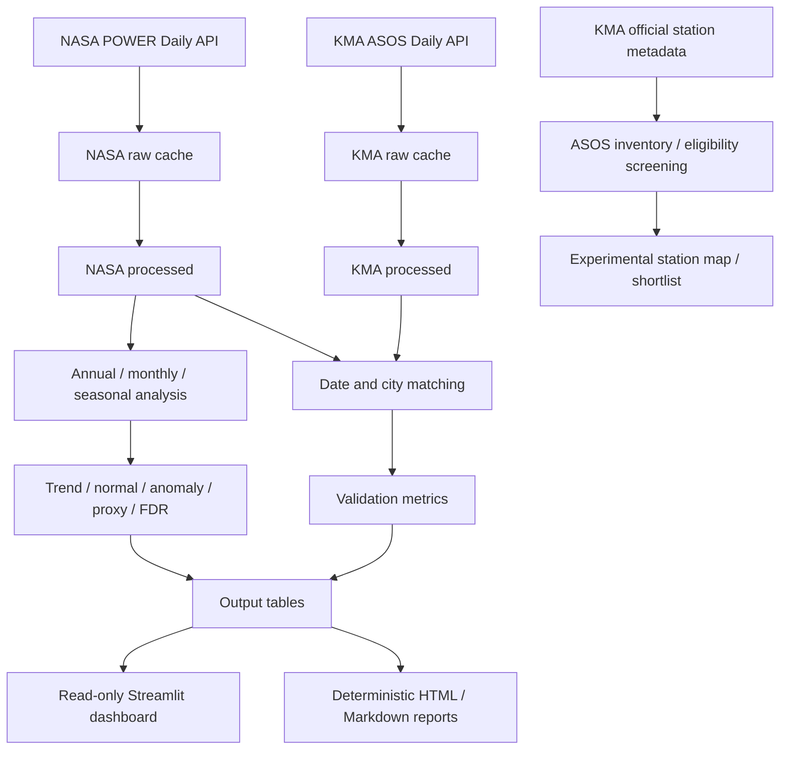

<!-- Historical documentation snapshot before final integration; not current result claims. -->
# NASA POWER Korea Climate Explorer

**Current stable version: v1.0.0** · Python ≥ 3.11 · 1981–2025 · 8 cities · 7 climate variables

NASA POWER 위성·모델 기반 격자형 기후자료와 KMA ASOS 지상관측자료를 이용해
대한민국 주요 8개 도시의 장기 기후변화를 수집·정제·통계검정·교차검증·시각화하고,
읽기 전용 대시보드와 재현 가능한 보고서로 제공하는 Python 기후데이터 분석 시스템이다.

> 이 저장소는 로컬 **v1.0 공개 준비본**이며, 전국 ASOS station 선별은 **v1.1
> experimental**로 분리되어 있다. 코드 라이선스, raw 데이터 포함 여부,
> GitHub 저장소 공개 여부는 아직 사용자가 결정해야 한다.

## Quick Start

### Experimental Nationwide · Stage 16 A+B 공통기간 분석

Tier A-origin45개와 Tier B-origin6개를 모두 **1991–2025 일자료부터 다시 계산**합니다.
Normal은1991–2020, BH-FDR은 source×metric별 전체 공통기간 station family로 새로 계산합니다.
기존 A1981–2025 slope/q를 B 결과와 단순 병합하지 않습니다.

```bash
python main.py --analyze-common-period --dry-run
python main.py --analyze-common-period
python main.py --report-common-period
```

현재51개 KMA station은 공식 native-grid 규격에서 추정한 NASA34개 격자에 대응합니다.
공유14그룹의 전체 일시계열을 검증하고 station을 삭제하지 않습니다.
격자 좌표는 API 반환 metadata가 아니라 공식 규격 기반 추정임을 명시합니다.
완전한 기존 캐시로 NASA/KMA API0회 실행이 가능합니다.
26 CSV·15 charts/maps·HTML/Markdown 보고서와 manifest를 `common_period` namespace에 분리하며,
16번째 읽기 전용 Dashboard를 제공합니다. Stable1.0.0 및 이전 결과는 보존합니다.
방법·단위·재현성·제한: [51-station 공통기간 문서](COMMON_PERIOD_51_STATION_ANALYSIS.md).

### Experimental Nationwide · Stage 15 Tier B 독립 분석

Final Tier B만 1991–2025 공통기간으로 분석합니다. 현재 shortlist는 철원·안동·고산·태백·장수·봉화
6곳이며, ID/개수는 하드코딩하지 않습니다. KMA cache를 재사용하고 NASA 기온 3종만 필요한 경우 받습니다.

```bash
python main.py --analyze-tier-b --dry-run
python main.py --analyze-tier-b
python main.py --report-tier-b
```

연평균·5/10년 이동평균·OLS/MK/modified-MK/Sen·Tier B 내부 BH-FDR,
1991–2020 normal/anomaly·계절·threshold proxy·NASA–KMA 검증을 생성합니다.
기온/오차는 °C, 기울기는 °C/10년, proxy 기울기는 일/10년입니다.
결측은 NaN이며 품질 재검사 실패 시 cohort 통계를 보류합니다.
15 CSV·8 PNG·HTML/Markdown은 `output/*/tier_b/`, manifest는
`output/manifests/tier_b_analysis_manifest.json`에 분리합니다. 대시보드에 독립 읽기 전용 페이지가 있습니다.

**Tier B 1991–2025와 Tier A 1981–2025 추세 크기는 기간 차이 때문에 직접 순위 비교하지 않습니다.**
Stable VERSION 1.0.0 및 기존 산출물은 그대로 유지합니다. 자세한 계산법·선택·캐시·재현성·한계:
[Tier B 분석 문서](TIER_B_1991_2025_ANALYSIS.md).

### Experimental Stage 14.5 · 공간모형 수치 안정성 검토

기존 1–14단계 결과/보고서를 그대로 보존하며 역거리 모형의 spectrum, solver 경계,
p=1/p=2, 단일 cutoff, 행표준화, 동일 seed·station ordering 재현성을 검토했다.
**Primary non-spatial inference는 OLS-HC3**, classical OLS p는 참고용으로 정리한다.
이는 기존 분석값 수정이 아니라 해석 우선순위의 명시다.

```bash
python scripts/review_spatial_numerics.py
python scripts/review_spatial_numerics.py --report-only
```

NASA/KMA API 호출 없음. 새 결과는 `spatial_models_numerical` namespace와 별도 manifest에 저장한다.
기존 대시보드의 "공간보정 모델" 페이지 안에 "수치 안정성" expander를 추가했다.
핵심: full row-standardized IDW p1의 -1은 실제 singular boundary가 아니라
현재 library solver 경계다. Directed KNN4는 main, symmetric KNN4 및 안정적인
p2/cutoff는 sensitivity이며 full IDW p1/raw p1·p2는 현재 specification에서 수치적 비권장이다.
Distance-band의 solver-boundary 근접 행도 주의 대상으로 남긴다.
[14.5단계 방법론과 해석 한계](SPATIAL_MODEL_NUMERICAL_ROBUSTNESS.md)를 참조한다.

### Experimental Nationwide · Stage 14 공간보정 모델

기존 1–13단계 결과를 보존하고 Final Tier A의 KMA TAVG Sen slope(°C/10년),
NASA−KMA Bias/RMSE(°C)를 해안거리(km)·위도(degree)·고도(m)로 설명하는
OLS/HC3/SAR/SEM 비교를 추가했다. NASA/KMA API 및 해안선 재다운로드 없음.
기존 네 공간가중치, residual Moran, LM, VIF/BP/Cook, 표준화, 경도 sensitivity,
LOO와 모형 실패기록을 제공한다. 인과효과·미래예측 분석이 아니다.

```bash
python main.py --analyze-spatial-models --dry-run
python main.py --analyze-spatial-models
python main.py --report-spatial-models
```

신규 결과는 `output/{tables,charts,reports}/spatial_models/`와
`output/manifests/spatial_modeling_manifest.json`에 생성된다.
Streamlit 14번째 페이지는 **공간보정 모델**이다. 작은 표본의 추정불확실성과
실패/경계 모형을 함께 표시하며 실패가 있으면 분석 CLI는 산출물을 보존하고 종료코드 1을 반환한다.
Gaussian AIC/BIC는 분산·공간 모수를 포함해 일관되게 계산하며 SEM filtered 잔차와
structural 잔차를 구분한다. 계산법, 단위, FDR family 및 제한은
[Stage 14 방법론](SPATIAL_DEPENDENCE_ADJUSTED_MODELING.md)을 참조한다.

실제 결과의 주의점: TAVG 해안거리 OLS 계수는 약 +0.001206 °C/10년/km로
13단계와 같지만 HC3 p≈0.112로 비유의다. 기본 가중치에서는 세 outcome의
OLS 잔차 Moran/LM이 모두 비유의다. 역거리 p=1에서 Bias SEM, RMSE SAR/SEM
3개 조합은 경계 추정 또는 수치 실패로 표시된다. 이를 성공값으로 대체하지 않았으며
"모든 공간모형 검증 완료"로 해석하면 안 된다. 정확한 값은 생성된 summary/failure CSV가 기준이다.

### Stable v1.0 실행

```bash
git clone <repository-url>
cd NASA_POWER_Korea_Climate_Explorer

python -m venv .venv
source .venv/bin/activate
python -m pip install -r requirements.txt

python main.py --city Seoul
streamlit run streamlit_app.py
```

KMA validation은 공공데이터포털 인증키가 필요하다. `.env.example`을 복사한 뒤 실제
키는 로컬 `.env`에만 둔다. 보고서와 대시보드는 기존 결과만 읽으므로 API key가 필요 없다.

```bash
cp .env.example .env
# .env의 KMA_API_KEY 값을 로컬에서 설정
python main.py --validate-kma --city Seoul
```

## 1. Project Overview

stable v1.0은 1981-01-01부터 2025-12-31까지 16,436일을 대상으로 NASA POWER 7개 변수와
KMA ASOS 대응 관측을 다룬다. 포함 범위는 API 수집, 캐시, tidy 변환, 연·월·계절 집계,
기후지표 proxy, 선형 및 비모수 추세, FDR, 1991–2020 normal과 anomaly, 교차검증,
Streamlit, HTML/Markdown 보고서 및 테스트다. v1.1 experimental은 공식 metadata로
전국 ASOS inventory와 장기 기온분석 후보만 선별하며, 전국 추세·미래기후 예측은 제외한다.

## 2. Why This Project

- 장기간 기후자료를 실패 복구 가능한 캐시형 pipeline으로 수집한다.
- 8개 도시를 같은 변수·기간·계산식으로 비교한다.
- 단순 그래프를 넘어 MK, Sen's slope, Modified MK와 FDR을 함께 제시한다.
- 격자자료와 지점관측의 systematic difference와 agreement를 정량화한다.
- 동일 결과 CSV를 대시보드와 출처 추적 가능한 보고서에서 재사용한다.

## 3. Key Features

- NASA POWER Daily Point API와 KMA ASOS 일자료 API 연동
- 원본/가공/분석/validation 계층 분리 및 도시별 cache 재사용
- T2M, T2M_MAX, T2M_MIN, 강수, 습도, 풍속, 일사 분석
- Linear Regression, Mann–Kendall, Modified MK, Sen's slope, BH-FDR
- 1991–2020 climate normal, anomaly, 계절분석, threshold·연속일수 proxy
- 8개 도시 × 7개 변수 NASA–KMA 교차검증
- 읽기 전용 Streamlit 9개 stable 페이지와 experimental 전국 ASOS 페이지
- Final Tier A Haversine/KNN Global·Local Moran 공간패턴과 weight sensitivity
- 데이터 품질표, source-addressable Report Fact Layer, 120개 v1.0 + 28개 전국 선별 테스트
- 공식 ASOS station metadata cache, 일자료 probe, completeness·gap·continuity 선별

## 4. Study Area

좌표와 거리는 `output/tables/nasa_kma_station_mapping.csv`의 primary 행 기준이다.

| City | NASA latitude | NASA longitude | KMA station | NASA↔KMA distance |
|---|---:|---:|---|---:|
| Seoul | 37.5665 | 126.9780 | 108 Seoul | 1.21 km |
| Busan | 35.1796 | 129.0756 | 159 Busan | 9.22 km |
| Daejeon | 36.3504 | 127.3845 | 133 Daejeon | 2.65 km |
| Daegu | 35.8714 | 128.6014 | 143 Daegu | 4.70 km |
| Gwangju | 35.1595 | 126.8526 | 156 Gwangju | 3.84 km |
| Gangneung | 37.7519 | 128.8761 | 105 Gangneung | 1.31 km |
| Jeju | 33.4996 | 126.5312 | 184 Jeju | 1.62 km |
| Jeonju | 35.8242 | 127.1480 | 146 Jeonju | 3.34 km |

강릉 104 Bukgangneung은 105와의 중첩기간 검증 전용이며 primary 자료에 연결하지 않는다.

## 5. Data Sources

- [NASA POWER](https://power.larc.nasa.gov/): 위성관측·모델 기반의 격자형 point 자료.
  Daily Point endpoint, community `RE`, time standard `LST`를 사용한다.
- [KMA ASOS 일자료](https://www.data.go.kr/data/15059093/openapi.do): 관측소 지상관측
  일자료. `dataCd=ASOS`, `dateCd=DAY`, `dataType=JSON`을 사용한다.
- [KMA 지상관측 지점정보](https://data.kma.go.kr/tmeta/stn/selectStnList.do?pgmNo=123):
  ASOS station ID, 운영 이력, 좌표, 고도 및 주소의 공식 CSV를 사용한다.

NASA point와 ASOS 관측소는 공간대표성과 생산 방식이 다르므로 KMA를 격자값의 절대적인
참값으로 간주하지 않는다. 출처·인용·재배포 조건은 공개 전 원 제공기관의 최신 안내를 확인한다.

## 6. Climate Variables

| Variable | Description | Unit | Source |
|---|---|---|---|
| T2M / avgTa | 일평균 2 m 기온 | °C | NASA / KMA |
| T2M_MAX / maxTa | 일최고기온 | °C | NASA / KMA |
| T2M_MIN / minTa | 일최저기온 | °C | NASA / KMA |
| PRECTOTCORR / sumRn | 일강수량 | mm/day | NASA / KMA |
| RH2M / avgRhm | 일평균 상대습도 | % | NASA / KMA |
| WS10M / avgWs | 평균 풍속 | m/s | NASA / KMA |
| ALLSKY_SFC_SW_DWN / sumGsr | 일사량 | kWh/m²/day | NASA / KMA¹ |

¹ KMA `sumGsr`의 MJ/m²/day는 3.6으로 나누어 공통 단위로 변환한다.

## 7. Analysis Period

- 분석기간: **1981–2025** (45년, 16,436일)
- Climate Normal: **1991–2020**
- NASA time standard: **LST (Local Solar Time)**, KST와 같다는 뜻이 아니다.
- NASA 일사 유효기간: **1984–2025**. 1981–1983 fill value는 결측으로 유지한다.

## 8. Methodology

- Linear Regression: 연도 대비 연간값의 최소제곱 기울기를 10년당 단위로 표시한다.
- Mann–Kendall: 단조 증가·감소를 검정하는 비모수 검정이다.
- Modified MK: lag-1 자기상관 flag가 있는 계열의 sensitivity analysis다.
- Sen's slope: 모든 시점쌍 기울기의 중앙값과 95% CI를 사용한다.
- Benjamini–Hochberg FDR: 여러 도시·지표 검정의 false-discovery 비율을 제어한다.
- Normal/Anomaly: 1991–2020 평균과 해당 평균 대비 편차다.
- Seasonal: DJF의 12월을 다음 `season_year`에 배정해 DJF/MAM/JJA/SON을 분석한다.

상세 정의와 수식은 [Methodology](METHODOLOGY.md)를 참조한다.

## 9. Climate Indices

`TMAX ≥30°C`, `TMAX ≥33°C`, `TMIN ≥25°C`, 일강수량 `≥30/50 mm`, `<1 mm` 일수와
최대 연속일수를 계산한다. 이는 **NASA POWER 기반 장기변화 분석용 proxy**이며 기상청의
공식 폭염일수·열대야·가뭄 통계가 아니다.

## 10. NASA POWER × KMA ASOS Validation

같은 도시·날짜의 유효 pair에 대해 `Bias = mean(NASA−KMA)`, MAE, RMSE, Pearson r,
Spearman ρ를 계산한다. `RMSE ≥ MAE`, 상관범위 `[-1,1]`, `n_pairs>0`을 검사한다.
강수 wet day는 `≥1 mm/day`이며 POD, FAR, CSI를 추가한다. metric마다 결측이 달라
`n_pairs`가 다를 수 있다. 상관은 정확도 백분율이 아니다.

## 11. Key Findings

아래 값은 코드에 사용되는 상수가 아니라 현재 결과 CSV를 읽어 확인한 v1.0 스냅샷이다.

- 8개 도시 T2M Sen slope는 모두 양수이고 FDR 유의하며 **0.279–0.415°C/10년**이다.
- 서울 T2M은 Sen slope **0.387°C/10년**, NASA–KMA Bias **−1.625°C**,
  RMSE **2.067°C**, Pearson r **0.993**, `n_pairs=16,436`이다.
- T2M RMSE는 제주 **1.585°C**, 전주 **1.603°C**, 대구 **3.589°C** 등 도시별로 다르다.
- T2M_MAX와 T2M_MIN의 8개 도시 Sen slope도 모두 양수이고 FDR 유의하다.
- 부산·제주의 NASA warm-night proxy 평균은 각각 **32.07·35.87일/년**, Sen slope는
  **6.376·6.172일/년/10년**이다. 공식 KMA 열대야 통계가 아니다.
- 연강수합 Sen slope의 FDR 유의는 강릉에서만 확인되었다. 원인이나 미래 지속을 뜻하지 않는다.
- 습도와 풍속 Sen slope는 8개 도시 모두 FDR 유의가 확인되지 않았다.
- 일사는 제주만 FDR 유의한 양의 Sen slope이며, 모든 도시 유효기간은 1984–2025다.
- 강릉 104−105 중첩 6,365 pair의 평균차는 **−1.070°C**, RMSE **1.248°C**,
  Pearson r **0.998**이지만 두 관측소를 하나로 연결하지 않는다.

출처: `city_climate_statistical_trends.csv`, `nasa_kma_validation_metrics.csv`,
`gangneung_station_continuity_validation.csv`. 전체 표는 [Results Summary](RESULTS_SUMMARY.md)에 있다.

8개 도시 연평균 T2M, 1981–2025: `docs/assets/city_temperature_trends_1981_2025.png` (로컬 역사적 그림; 경량 공개 제외)

*1981–2025년 8개 도시의 NASA POWER 연평균 T2M 시계열.*

T2M anomaly heatmap, 1981–2025: `docs/assets/city_temperature_anomaly_heatmap_1981_2025.png` (로컬 역사적 그림; 경량 공개 제외)

*1991–2020 normal 대비 1981–2025년 도시별 T2M anomaly.*

NASA POWER와 KMA ASOS T2M 비교: `docs/assets/nasa_kma_temperature_scatter_1981_2025.png` (로컬 역사적 그림; 경량 공개 제외)

*1981–2025년 유효 일평균 T2M pair의 NASA POWER–KMA ASOS 비교.*

## 12. Architecture



설계 상세: [Architecture](ARCHITECTURE.md) · [Data Pipeline](DATA_PIPELINE.md)

## 13. Project Structure

```text
NASA_POWER_Korea_Climate_Explorer/
├── VERSION, CHANGELOG.md, README.md, requirements.txt, .gitignore
├── config/                 # 도시·KMA 관측소·전국 선별 기준
├── data/                   # NASA/KMA raw·processed 및 전국 station cache
├── src/                    # 수집·정제·분석·검증·시각화
├── dashboard/              # 읽기 전용 Streamlit pages
├── reporting/              # Fact Layer, narrative, template, report validation
├── output/                 # tables, charts, validation, reports
├── docs/                   # 설계·방법론·성과·공개정책·포트폴리오
├── scripts/                # release safety scan
├── tests/                  # 분석·API mock·dashboard·report·release tests
├── main.py
└── streamlit_app.py
```

기존 1–8단계의 상세 파일 목록과 강수 공란 조사 기록은
[Project Technical Reference](PROJECT_TECHNICAL_REFERENCE.md)에 보존했다.

## 14. Installation

Python **3.11 이상**을 대상으로 하며 v1.0 검증 환경은 Python **3.14.6**이다.

```bash
python -m venv .venv
source .venv/bin/activate
python -m pip install --upgrade pip
python -m pip install -r requirements.txt
python -m pip check
```

Windows PowerShell은 활성화 명령을 `.venv\Scripts\Activate.ps1`로 바꾼다.

## 15. Environment Variables

| Name | Required for | Storage rule |
|---|---|---|
| `KMA_API_KEY` | KMA 신규 요청 | `.env` 또는 환경변수, commit 금지 |

`.env`와 `.streamlit/secrets.toml`은 `.gitignore` 대상이다. key를 URL·로그·문서·test에
복사하지 않는다. `.env.example`에는 placeholder만 둔다.

## 16. Usage

```bash
# NASA 분석
python main.py --city Seoul
python main.py --all

# KMA raw 및 validation
python main.py --download-kma --all
python main.py --validate-kma --city Seoul
python main.py --validate-kma --all

# v1.1 experimental 전국 ASOS station screening
python main.py --nationwide-stations
python main.py --nationwide-stations --refresh-stations
python main.py --screen-nationwide-asos --dry-run
python main.py --screen-nationwide-asos --sample-stations
python main.py --screen-nationwide-asos

# v1.2 experimental Final Tier A 전국 기온추세
python main.py --analyze-nationwide-tier-a --dry-run
python main.py --analyze-nationwide-station 108
python main.py --analyze-nationwide-tier-a
python main.py --report-nationwide

# v1.3 experimental Final Tier A 전국 공간패턴
python main.py --analyze-spatial --dry-run
python main.py --analyze-spatial
python main.py --report-spatial

# 보고서
python main.py --report --city Seoul
python main.py --report --all
python main.py --report-comparison

# 대시보드 / 도움말 / 테스트
streamlit run streamlit_app.py
python main.py --help
python -m pytest -q
python scripts/check_release_safety.py
```

기본은 cache를 재사용한다. `--force-download`는 기존 도시 raw에만 적용하며,
`--refresh-stations`는 공식 station metadata에만 적용한다. 전국 상세 cache는 station ID와
기간별로 분리되어 실패 후 재실행할 수 있다. 기준·출력은
[Nationwide ASOS Screening](NATIONWIDE_ASOS_SCREENING.md)에 정리했다.

현재 experimental screening 스냅샷은 공식 ASOS ID 105개(active 97, historical 8),
metadata A/B 후보 67개, 상세검사 67개, final A 45개와 B 6개다. manual review 25개는
자동 shortlist에서 제외했으며 최종 장기분석 후보는 51개다. 숫자는 코드 상수가 아니라
2026-09-05 생성 CSV의 값이다.

### Experimental Nationwide Analysis

13단계 **공간 강건성·해안성**은 기존 1–12단계 결과를 보존하며 저장된 Final Tier A를
13개 spatial weight 설정으로 재검증한다. 공식 국립해양조사원 SHP의 full-resolution
선분까지 최단거리(km), 20/30/50 km sensitivity, 연속거리 연관, Coastal/Inland 분포 비교와
BH-FDR, 탐색적 다변량 OLS를 제공한다. NASA/KMA API 호출은 없다.

```bash
python main.py --analyze-spatial-robustness --dry-run
python main.py --analyze-spatial-robustness
python main.py --report-spatial-robustness
```

기존 CLI와 12개 페이지를 유지하며 **공간 강건성·해안성** 페이지를 추가했다(총 13개).
공식 coastline cache가 검증되지 않으면 coastal만 보류하고 robustness는 정상 표시한다.
Global Moran p는 다중검정 미보정이며 Local Moran은 설정별 BH-FDR을 유지한다.
75% robustness와 20/30/50 km는 학계 표준이 아닌 프로젝트 operational definition이다.
기온/DTR 추세는 °C/10년, threshold proxy는 일/10년, Bias/RMSE는 °C,
연속거리 회귀계수는 해당 단위/km다. Mann–Whitney는 분포 검정이며
효과크기 `2U/(n_C*n_I)-1`의 양수는 Coastal이 더 큰 방향이다. p는 각 threshold의
9개 지표별 BH-FDR로 보정한다. 주기준은 p값과 무관하게 30 km와 양 집단 최소 n=5로 선정한다.
해안거리 연관을 바다의 인과효과로 해석하지 않는다.

새 결과는 `output/tables/robustness/`, `output/tables/coastal/`,
`output/charts/robustness/`, `output/charts/coastal/`, `output/reports/robustness/`와
`output/tables/spatial_robustness_and_coastal_summary.csv`에 저장한다.
출처·checksum·CRS·계산식·재현·제한은
[Spatial Robustness & Coastal Analysis](SPATIAL_ROBUSTNESS_AND_COASTAL_ANALYSIS.md)를 참고한다.

11단계는 shortlist의 Final Tier A 중 `eligible_1981_2025=True`, manual review가 아니며
continuity가 미확정 상태가 아닌 station만 선택한다. 현재 45개이며 Tier B 6개는 공통기간
분석에 섞지 않는다. ASOS station 좌표에서 NASA POWER `T2M/T2M_MAX/T2M_MIN`을 받아
KMA `avgTa/maxTa/minTa`와 1981–2025 날짜별로 맞춘다. Climate Normal은 1991–2020이다.

각 station·source·metric은 연평균, 5/10년 이동평균, OLS, Mann–Kendall, 필요 시
Hamed–Rao modified MK, Sen slope와 95% CI를 계산한다. FDR family는 source×metric별
Tier A station 전체다. `Bias=NASA−KMA`; MAE/RMSE는 °C다. TMAX ≥30/33°C와
TMIN ≥25°C는 공식 KMA 통계가 아닌 동일 threshold analysis proxy다. 지역 요약은
`region_level1` station sample이며 면적가중 지역기후가 아니다.

현재 실제 결과의 KMA TAVG Sen slope 범위는 **+0.168~+0.703°C/10년**, 중앙값은
**+0.389°C/10년**이며 45개 모두 FDR 유의한 증가였다. 이는 과거 station-level 통계로
인과관계나 미래 지속을 뜻하지 않는다. 방법·cache·제한은
[Nationwide Tier-A Analysis](NATIONWIDE_TIER_A_ANALYSIS.md), 실제 표는
`output/tables/nationwide/`, 지도는 `output/charts/nationwide_analysis/`에 있다.

12단계는 이 45개 Stage-11 결과만 읽어 Haversine station distance, directed row-standardized
KNN(k=4), Global/Local Moran, BH-FDR, 위도·경도·고도 연관, Tmax/Tmin contrast, DTR,
계절·threshold·NASA–KMA Bias/RMSE 공간패턴을 계산한다. k=3/4/5 sensitivity를 함께
보존하고 전국 연속면 보간은 하지 않는다. NASA/KMA API 호출은 0건이다. 결과는
`output/tables/spatial/`, `output/charts/spatial/`, `output/reports/spatial/`에만 저장한다.
방법은 [Nationwide Spatial Analysis](NATIONWIDE_SPATIAL_ANALYSIS.md)에 있다.

현재 기본 k=4에서 KMA TAVG Global Moran은 **I=0.1576, permutation p=0.043**이다.
다만 k=3에서는 p=0.098, k=5에서는 p=0.024로 유의성 결론이 일관되지 않아 약한 공간
구조의 탐색 결과로만 해석한다. TMAX·TMIN Global Moran은 각각 p=0.156·0.173으로
유의하지 않았고, TAVG Local Moran의 BH-FDR 유의 High-High/Low-Low cluster는 0개다.
이 결과는 선택한 station network와 weight 정의에 한정되며 원인을 뜻하지 않는다.

공식 후보 coastline은 국립해양조사원 2025 전국 해안선 SHP이며 포털상 이용범위 제한이
없지만, 저장소에 검증된 geometry/CRS/checksum이 포함되지 않아 해안거리와 해안/내륙
비교는 보류했다. 도시명·행정구역으로 수동 분류하지 않는다.

## 17. Dashboard

Streamlit은 저장된 CSV만 읽는다. 기존 분석 페이지 8개(종합현황, 도시별 탐색,
기후변수 비교, 통계적 추세, 극한·Anomaly, 계절 분석, NASA–KMA 검증, 데이터·방법론)와
읽기 전용 보고서 다운로드 페이지 1개에 experimental 전국 ASOS inventory 페이지를
추가한 10단계까지 총 10개 페이지를 유지한다. 11단계에서 별도 **전국 기후추세** 페이지를
추가해 11단계까지 총 **11개 페이지**다. 12단계는 별도 **전국 공간패턴** 페이지를 추가해
총 **12개 페이지**다. 기존 **전국 ASOS 확장**은 inventory/screening 전용이고,
두 전국 분석 페이지는 저장된 Tier A 추세·validation·공간분석 결과만 읽는다.

## 18. Automated Reports

`reporting/`은 기존 결과 CSV만 읽어 도시별 8개와 비교 1개의 self-contained HTML,
동일 내용의 Markdown, PNG 81개와 manifest 9개를 만든다. Fact Layer는 각 핵심값에
source file, row key, column, SHA-256, mtime을 연결한다. LLM·외부 API·새 통계모형을
사용하지 않는다.

## 19. Testing

stable v1.0 회귀는 **120 tests**로 유지한다. experimental 전국 선별의 metadata,
completeness, gap, Tier, cache/resume, NO_DATA 및 key 부재 동작을 확인하는 **28 tests**를 더한다.
API unit test는 mock/sample을 사용하고 network를 차단한다. 11단계에는 Tier A 선택,
NASA cache/좌표, KMA 결측일 NaN 보존, daily matching, annual/seasonal/Sen/FDR/normal,
threshold, validation, summary/ranking/map/manifest를 검증하는 **35 tests**를 추가했다.
12단계는 master, Haversine, 거리행렬, KNN row normalization, Global/Local Moran seed와
재현성, Local FDR, coordinate association, contrast, DTR, 계절, proxy, Bias/RMSE,
manifest, dry-run, no-API, dashboard/report를 검증하는 **44 tests**를 추가했다. 현재 전체는
**227 tests**다.

```bash
python -m pytest -q
python -m pip check
```

## 20. Data Quality & Limitations

- NASA는 격자자료, ASOS는 지점관측이며 station distance와 공간대표성이 다르다.
- NASA 일사 1981–1983의 `-999` fill value는 `NaN`으로 유지한다.
- KMA `sumRn` 공란 의미는 미확정이다. 0으로 바꾸지 않고 강수 validation은 양쪽
  유효 수치 날짜만 사용하며 POD/FAR/CSI도 같은 subset이다.
- 강릉은 105가 primary이고 104는 overlap continuity 전용이다. 임의 연결하지 않는다.
- threshold·연속일수는 분석용 proxy이지 기상청 공식 통계가 아니다.
- 통계적 유의성은 인과관계가 아니고 과거 추세는 미래 예측이 아니다.
- correlation은 정확도 백분율이 아니며 Bias·MAE·RMSE와 함께 해석한다.
- 지표별 도시 순위는 종합 기후위험 순위가 아니다.
- 전국 Tier는 프로젝트의 screening rule이지 KMA 공식 품질등급이 아니다.
- 가까운·이름이 유사한 station은 review 후보일 뿐 자동 연결하지 않는다.
- 전국 shortlist는 자료 적합성 후보이며 전국 공간대표성이나 기후추세 결과가 아니다.
- 전국 Tier A 분석은 45개 station-level 결과이며 spatial coverage가 균등하지 않다.
- 전국 지역·고도 요약은 exploratory station sample이고 인과 또는 면적대표값이 아니다.
- 전국 공간분석은 KNN 정의에 민감할 수 있고 Local Moran은 multiple testing을 고려해야 한다.
- 공간관계는 causality가 아니며 station point를 전국 연속 surface로 해석하지 않는다.
- 해안/내륙 분석은 공식 coastline geometry의 재현 가능한 local provenance 검증까지 보류한다.

## 21. Reproducibility

원본은 불변 raw cache, 변환은 processed, 분석은 output tables, 관측 대조는 validation에
분리한다. 대시보드와 보고서는 저장된 결과만 소비한다. 실패한 도시만 다시 시작할 수 있고
완료 cache는 재사용한다. 상세 흐름은 [Data Pipeline](DATA_PIPELINE.md)에 있다.

## 22. Roadmap

- **v1.0 완료:** 8-city validated version
- **v1.1 experimental:** 전국 ASOS metadata inventory와 장기 기온 적합성 screening
- **v1.2 experimental 완료:** Final Tier A 1981–2025 전국 station 기온추세
- **v1.3 experimental 완료:** Final Tier A 전국 공간 기후패턴과 Moran sensitivity
- **v1.4:** continuity 심화와 공식 coastline 기반 operational 해안거리
- **v1.5:** 권역별 비교
- **v2.0 후보:** 태양광·기후응용 또는 근거가 확보된 미래기후 시나리오

상세: [Roadmap](ROADMAP.md)

## 23. License / Data License

현재 `LICENSE` 파일이 없으므로 **코드 라이선스는 미결정**이며 무단 사용 허가를
암시하지 않는다. 공개 전 사용자가 라이선스를 선택해야 한다. NASA POWER는 공식
[Referencing Guide](https://power.larc.nasa.gov/docs/referencing/)의 인용·재배포 안내를
확인해야 한다. KMA ASOS API 페이지에는 공공저작물 **출처표시 제1유형**으로 표시되지만,
원자료 포함·재배포 전 최신 제공조건과 출처표시를 다시 확인한다.

데이터 공개 크기와 권장 추적 범위는 [GitHub Data Policy](GITHUB_DATA_POLICY.md),
공개 점검은 [Release Checklist](RELEASE_CHECKLIST.md)를 참조한다.

## Documentation Index

### Stage17: 51개 공통기간 공간 재분석

기존 1–16단계 결과를 보존하고 1991–2025의 ASOS 51개 관측소와 NASA 34개 추정
native 격자를 분리하여 공간통계를 계산합니다. 저장된 CSV만 사용하며 NASA/KMA API는
호출하지 않습니다. stable VERSION은 1.0.0입니다.

```bash
python main.py --analyze-common-period-spatial --dry-run
python main.py --analyze-common-period-spatial
python main.py --report-common-period-spatial
python scripts/verify_common_period_spatial.py
```

주 분석은 directed KNN k=4입니다. K3/K5/K6, symmetric K4, row IDW p2,
권고 cutoff IDW p1/p2와 connected distance-band를 민감도로 사용합니다.
999회 permutation과 기존 seed를 유지하고, Local Moran은 weight별 BH-FDR,
해안/내륙은 20/30/50 km별 9변수 BH-FDR을 적용합니다. Global/연관 p는 탐색적 raw p입니다.

NASA-only 값은 station-linked와 unique-grid를 비교합니다. ΔI는 unique−station이며
부호 변경은 HIGH, 같은 부호에서 유의성 변경 또는 |ΔI|>0.10은 MODERATE, 나머지는 LOW라는
프로젝트 규칙입니다. ASOS별 Bias/RMSE는 grid로 합치지 않습니다. 공유 grid의 일별 기온과
파생 NASA 기울기가 일치하지 않으면 중단합니다. 좌표는 공식 격자 규격 기반 추정이며
API 반환 metadata가 아닙니다. 45/1981→45/1991→51/1991 비교는 기간/구성 변경과 연관된
민감도이지 인과분해가 아닙니다.

TAVG/TMAX/TMIN·contrast·DTR 추세 단위는 °C/decade, 33/25°C proxy는 days/decade,
Bias/RMSE는 °C, 해안거리는 km입니다. DTR은 연도별 Tmax−Tmin에 Sen을 다시 적합하며,
두 기울기의 차이로 대체하지 않습니다. 30 km 주 해안 기준과 기존 고도 band를 유지합니다.

산출물은 `output/{tables,charts,reports}/common_period_spatial/`의 CSV 26개,
HTML 지도 18개, PNG 9개, 보고서 HTML/Markdown입니다. manifest는
`output/manifests/common_period_spatial_reanalysis_manifest.json`이며
17번째 Dashboard **51개 공간 재분석**에서 저장 결과를 확인할 수 있습니다.

전체 방법·검증·계산식·한계: [Stage17 공간 재분석](COMMON_PERIOD_51_STATION_SPATIAL_REANALYSIS.md).

## 18단계: Trend Period Sensitivity & Start-Year Robustness

Final Tier A **45개 관측소를 고정**하고 시작연도 1981/1986/1991/1996/2001,
종료연도 2025의 45/40/35/30/25년 window를 비교합니다. 저장된 일자료만 사용하며 API 호출은 없습니다.
기존 1–17단계 결과와 VERSION 1.0.0을 유지합니다.

```bash
python main.py --analyze-period-sensitivity --dry-run
python main.py --analyze-period-sensitivity
python main.py --report-period-sensitivity
python scripts/verify_period_sensitivity.py
```

각 window에서 TAVG/TMAX/TMIN, DTR, 계절 TAVG, 고온일수 proxy를 다시 집계·적합합니다.
Sen/OLS 단위는 °C/decade, proxy는 days/decade, Bias/MAE/RMSE는 °C입니다.
BH-FDR은 **window×source×metric** 내 45개 original MK raw p로 새로 계산하며,
계절·proxy는 각각 별도 family입니다. `slope_range`는 5기간 최대−최소 기울기이며 합성 점수가 아닙니다.
DTR은 연평균 Tmax−Tmin 시계열 자체를 적합합니다. 결측 보간·0 치환은 하지 않습니다.

동일한 directed K4 주 공간가중행렬과 K3/K5/symmetric K4/row-IDW p2 민감도를 모든 window에
재사용합니다. NASA-only 공간통계는 45 station-linked와 33 unique-grid를 분리합니다.
매 window 공유 grid의 3변수 전체 일자료 동일성을 재검증합니다.
해안 기준은 30km 고정, 20/50km는 1981/1991/2001만 확인합니다.

새 daily subset은 `data/period_sensitivity/`, CSV·PNG·HTML은
`output/{tables,charts,reports}/period_sensitivity/`에만 저장합니다.
manifest는 `output/manifests/period_sensitivity_manifest.json`입니다.
18번째 Dashboard **기간 민감성**에서 Window A/B를 비교하며 화면은 저장 결과만 읽습니다.

**시작연도와 기간 길이가 함께 바뀌고 window가 중첩되므로 독립 검증이나 가속화 증명이 아닙니다.**
후기 window의 추세 크기 차이는 기간 민감성으로 해석합니다. 관측소 중앙값은 면적가중 전국 평균이 아닙니다.
방법·계산식·출력·한계·재현 절차: [Stage18 기간 민감성](TREND_PERIOD_SENSITIVITY_ANALYSIS.md).

실제 검증(2026-09-10): 기존569+신규84=**653 tests passed**, pip check 정상,
294개 생성물 재현, 18개 화면 정상, 과거1,776개 파일 SHA256·수정시각 보존,
NASA/KMA 요청0. 자세한 실행 증거는 새 reports 폴더의 `period_sensitivity_verification.json`에 있습니다.

### 기존 문서

- [Architecture](ARCHITECTURE.md) · [Data Pipeline](DATA_PIPELINE.md)
- [Methodology](METHODOLOGY.md) · [Results Summary](RESULTS_SUMMARY.md)
- [GitHub Data Policy](GITHUB_DATA_POLICY.md)
- [Portfolio](PORTFOLIO.md) · [Portfolio Summary](PORTFOLIO_SUMMARY.md)
- [Resume Bullets](RESUME_BULLETS.md) · [Interview Notes](INTERVIEW_NOTES.md)
- [Roadmap](ROADMAP.md) · [v1.0 Status](V1_STATUS.md)
- [Nationwide ASOS Screening](NATIONWIDE_ASOS_SCREENING.md)
- [Nationwide Tier-A Analysis](NATIONWIDE_TIER_A_ANALYSIS.md)
- [Nationwide Spatial Analysis](NATIONWIDE_SPATIAL_ANALYSIS.md)
- [Changelog](../CHANGELOG.md)
