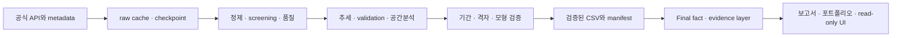

# Technical Portfolio Summary

## 범위

공식 inventory 105 <!-- fact:inventory_n -->개, Tier A 45 <!-- fact:tier_a -->개, Tier B 6 <!-- fact:tier_b -->개, 공통기간 51 <!-- fact:common_n -->개 지점 및 NASA 고유 격자 34 <!-- fact:grid_n -->개. 장기 1981-01-01~2025-12-31 <!-- fact:long_period -->, 공통기간 1991-01-01–2025-12-31 <!-- fact:common_period -->, normal 1991–2020 <!-- fact:normal -->.

## Stack

Python, pandas, NumPy, SciPy, statsmodels, pymannkendall로 정제·기술통계·검정을 구성하고 requests로 API cache/retry/오류 응답을 처리했습니다. Shapely·PyProj·PyShp와 libpysal/spreg는 해안거리 및 공간 진단에, matplotlib·Plotly는 저장 차트에, Streamlit은 읽기 전용 UI에 사용됩니다. pytest mock, SHA256, mtime, manifest, deterministic fact layer로 재현성과 변경 탐지를 분리합니다.

## 공통 파이프라인

최종 통합 경로는 저장된 CSV에서 시작합니다. 앞 단계 API·추정 경로는 다시 실행하지 않습니다.

## API와 실패 복구

도시/지점 설정과 공통 downloader, raw cache·chunk checkpoint, timeout·재시도·호출 제한을 분리합니다. 인증정보는 .env로 제한하고 실제 키를 로그에 출력하지 않습니다. 최종 통합은 API 접근 자체를 차단합니다.

## 검정과 추론

자료 품질: 일력·중복·결측·이상범위·연 completeness·관측소 이력을 점검한 기존 screening을 사용합니다. Tier B는 짧은 자료를 장기 Tier A에 접합하지 않고 공통기간에서만 결합합니다. 결측을 임의로 보간하거나 영으로 채우지 않습니다.

효과크기와 검정: Sen slope는 연간 값의 시점쌍 기울기 중앙값이며 °C/decade로 환산된 저장값을 사용합니다. Mann–Kendall은 단조 추세 검정입니다. 원 MK의 raw p에 설정된 비교군별 BH-FDR가 주 추론이고, 자기상관 진단과 Hamed–Rao modified MK는 보조 결과입니다. 표본·기간 변경 때 비교군도 함께 확인합니다.

TMIN/TMAX contrast와 DTR: contrast는 저장된 TMIN Sen 기울기에서 TMAX Sen 기울기를 뺀 값입니다. DTR은 각 지점·자료원·연도의 연평균 TMAX에서 연평균 TMIN을 뺀 연간 시계열에 적합했던 Sen 기울기입니다. 두 기온 Sen 기울기의 차이와 DTR Sen은 같은 연산이 아니므로 서로 대체하지 않습니다. 지점별 contrast의 중앙값도 두 전국 지점 중앙값을 뺀 값과 일반적으로 다릅니다. 단위는 모두 °C/decade입니다.

Normal·계절·proxy: Climate Normal 1991–2020 <!-- fact:normal --> 대비 anomaly를 사용합니다. 계절은 DJF/MAM/JJA/SON이며 겨울 연도 귀속과 completeness는 기존 방법 문서에 따릅니다. TMAX ≥ 33°C와 TMIN ≥ 25°C 일수는 유효한 matched daily pair의 proxy입니다. 공식 폭염·열대야 정의나 관측시간 조건을 대체하지 않습니다.

교차검증: 차이를 NASA−KMA로 정의합니다. Bias는 차이 평균, MAE는 절대차 평균, RMSE는 제곱차 평균의 제곱근입니다. Pearson과 Spearman은 각각 선형·순위 동조성을 나타냅니다. 모든 pair는 양쪽 유효일을 기준으로 합니다. 최종 표의 중앙값은 지점별 지표의 중앙값으로, 전체 일자료를 합친 pooled 오차가 아닙니다.

공간 통계: Global Moran I는 저장된 순열검정 결과, Local Moran은 다중검정 보정과 패턴 안정성을 함께 읽습니다. 대표 directed KNN과 대칭 KNN·거리 가중치 민감도를 구분합니다. Global/해안 상관의 탐색적 raw p를 지점 추세의 FDR q와 혼용하지 않습니다. 추정 NASA native 중심과 동일 일시계열 검증으로 격자 중복을 점검했습니다.

해안·모형 진단: 공식 KHOA 해안선으로 계산된 거리와 연속 상관·해안/내륙 구분을 읽습니다. OLS classical p보다 HC3 추론을 우선하고, HC3가 공간상관까지 보정하는 것은 아님을 명시합니다. SAR/SEM은 수렴·경계·스펙트럼·정렬·solver 진단을 통과한 범위에서만 보조 해석합니다. 수치적 실패나 비유의를 삭제하거나 다른 specification의 유의성으로 덮지 않습니다.

기간 민감성: 동일 Tier A 집합, 고정 종료연도에서 저장된 시작기간을 비교합니다. 기간들은 중첩되고 시작연도와 길이가 함께 변합니다. 유의 기간 수는 독립 반복실험의 확률이 아닙니다. 최종 통합에서는 저장 추정치의 중앙값·건수만 집계하고 새 기울기·검정·회귀를 계산하지 않습니다.

## 공간 진단

KNN·거리 기반 가중치, Global/Local Moran, 격자 중복, HC3 및 SAR/SEM 수치 검토를 하나의 유의성으로 합치지 않습니다. 원본 추정치와 실패기록을 모두 유지합니다.

## 테스트·재현성

입력 schema·결측·일력·통계 known-answer·API mock·Dashboard·보안·provenance 테스트를 구분합니다. 실제 실행 수는 output/final/final_test_summary.csv, 전체 gate는 final_integration_manifest.json에 기록합니다.

## 품질 기준

코드 줄 수나 유의한 결과 수를 품질 성과로 내세우지 않습니다. 결과의 적용 범위와 실패 복구 가능성을 기준으로 설명합니다.

## Public deployment

[공개 대시보드](https://korea-climate-explorer.streamlit.app/)를 Streamlit Community Cloud에 배포했습니다. public/demo mode의 7개 view는 검증된 precomputed CSV·PNG·자체 포함형 HTML 보고서만 읽으며 runtime에 API 키나 raw cache를 요구하지 않습니다.

공개 파일만 복사한 Python 3.13 clean-room 환경에서 설치·import·화면·다운로드를 검증했습니다. 경량 의존성(Streamlit/pandas)과 안전한 기본 public mode를 사용하며, 기존 연구 의존성과 18-page full/research mode는 분리·유지합니다. 데모 재현 검증과 원자료부터의 전체 연구 재현은 구분합니다.

[공개 링크 패키지](PUBLIC_PORTFOLIO_LINKS.md) · [배포 설정과 검증 범위](PUBLIC_DEMO_DEPLOYMENT.md).
